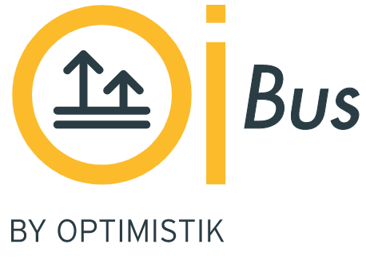

## OIBus
OIBus is a software application that can be run on Windows, Linux, and Mac operating systems. It is designed to extract 
data from industrial sources by utilizing multiple protocols, such as OPCUA-HA, OPCHDA, Modbus, MQTT and many more. 
It can also retrieve data by scanning folders. Once the data is collected, OIBus can transmit it to your enterprise applications.

[**Optimistik**](https://optimistik.io) is using **OIBus** on many industrial sites to send data to its **OIAnalytics** 
solution to query from 10 to over 10.000 points with sampling rate at the second level.

OIBus [can be installed](https://oibus.optimistik.com/docs/guide/installation) and configured in minutes and does not 
need development skills.

## Introduction
OIBus is intended to simplify the data collection. We, at Optimistik, felt we had a missing piece between NodeRed and 
proprietary products for a tool able to solve most of the common requirements for industrial communications and very 
fast to set up.
 
OIBus is composed of 3 layers. 
- The **Engine** that orchestrates everything and is configured through an admin interface
- Several **South** connectors that will retrieve data from a given technology (SQL, OPCUA, MQTT, Modbus...)
- Several **North** connectors that will be able to transfer the data to application such as OIAnalytics, Rest API,
Timeseries databases, MQTT broker... 

You can learn more about OIBus by reading [our documentation](https://oibus.optimistik.com/).

## Build and deploy step
* **Fork** the OIBus repository and clone it. Be sure to have NodeJS and npm installed (LTS versions).
* **Backend**: open a terminal in the backend folder `cd backend`
  * Install the node dependencies: `npm install`
  * Run the backend: `npm start`
* **Frontend**: open a terminal in the frontend folder `cd frontend`
  * Install the node dependencies : `npm install`
  * Run the frontend: `npm start`
  * Access the application on `http://localhost:2223` (default port)
* You can compile OIBus on your appropriate distribution. To do that:
  * In the frontend folder, run `npm install` and `npm run build`
  * In the backend folder, run the command associated to the distribution you want to build OIBus: `npm run build:win`, `npm run build:linux`, `npm run build:macos`, `npm run build:macos-arm64`
  * You can now start OIBus from its binaries with `npm run start:win`, `npm run start:linux`, `npm run start:macos` or `npm run start:macos-arm64`

A more complete developer guide is accessible on [our developer documentation](https://oibus.optimistik.com/docs/developer/).
