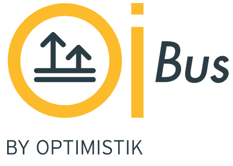

<p align="center">
  
</p>

# OIBus - Industrial Data Integration Platform

OIBus is a cross-platform industrial data integration solution that simplifies data collection from various industrial
sources and transmits it to enterprise applications.

## 🌍 Platform Support

✅ Windows | ✅ Linux | ✅ macOS

## 🔗 Key Features

| Feature                    | Description                                                       |
|----------------------------|-------------------------------------------------------------------|
| **Multi-protocol Support** | OPC UA, OPC Classic, Modbus, MQTT, SQL, Folder Scanning, and more |
| **Cross-platform**         | Runs on Windows, Linux, and macOS                                 |
| **High Performance**       | Handles 10 to 10,000+ data points with second-level sampling      |
| **No-code Configuration**  | Set up in minutes without development skills                      |
| **Enterprise Integration** | Seamless connection to applications like OIAnalytics              |

## 🏗 Architecture

OIBus follows a modular 3-layer architecture:

1. **Engine Layer**
    - Core orchestration system
    - Web-based administration interface
    - Configuration management

2. **South Connectors**
    - Protocol-specific data collection modules
    - Supported protocols: OPC UA, OPC Classic, Modbus, MQTT, SQL, Folder Scanning, etc.
    - Extensible architecture for new protocols

3. **North Connectors**
    - Data transmission to enterprise systems
    - Supported destinations: OIAnalytics, folders, databases, APIs
    - Customizable output formats

## 🚀 Getting Started

Download and install OIBus for your platform by following the
[installation guide](https://oibus.optimistik.com/docs/guide/installation). The full user
documentation is available at [oibus.optimistik.com](https://oibus.optimistik.com).

## 🛠 Development Setup

For prerequisites, cloning, and running the backend and frontend from source, see the
[Developer Handbook](https://oibus.optimistik.com/docs/developer).

### Local Test Stack

The repository ships a `docker-compose.yml` at its root that spins up a complete set of protocol
servers and a data simulator (OPC UA, Modbus, MQTT, PostgreSQL, FTP/SFTP) so you can develop and
test OIBus connectors without access to real industrial equipment.

```bash
# Start the recommended development stack (IoT servers + simulator + database)
cd backend
npm run docker:dev
```

For the full reference — services, register maps, MQTT topics, profiles, and credentials — see the
[Local Test Stack](https://oibus.optimistik.com/docs/developer/local-test-stack) developer guide.

### Extending OIBus

OIBus is designed to be extended with new connectors. The
[developer documentation](https://oibus.optimistik.com/docs/developer) covers the connector API,
project structure, and contribution guidelines.

## 🤝 Community and Support

- **Documentation**: [oibus.optimistik.com](https://oibus.optimistik.com)
- **Issues**: Report bugs on [GitHub Issues](https://github.com/OptimistikSAS/OIBus/issues)
- **Discussions**: Join the conversation on [GitHub Discussions](https://github.com/OptimistikSAS/OIBus/discussions)
- **Professional Support**: Contact [Optimistik](https://optimistik.io)
