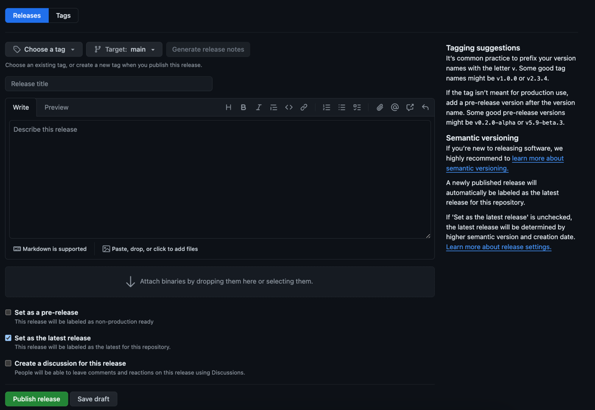

# GitHub Release
OIBus uses [release-please](https://github.com/googleapis/release-please) and GitHub Action to automate release on push 
on the `stable` branch. It will release patch, minor or major version following the [conventional commit standard](https://www.conventionalcommits.org/en/v1.0.0/). 
Simply merge the release branch to create a release.

:::info Enable GitHub Action
You may need to activate GitHub Actions on your fork to enable this feature.
:::

## Create a pre-release for OIBus
On your fork, go to the GitHub release list, and click on `Draft a new release`.

  

    

  

Then simply follow these steps:
- Choose a new tag name for your release
- Select a target branch
- Choose release title
- Set as a pre-release
- **Do not set as the latest release**

