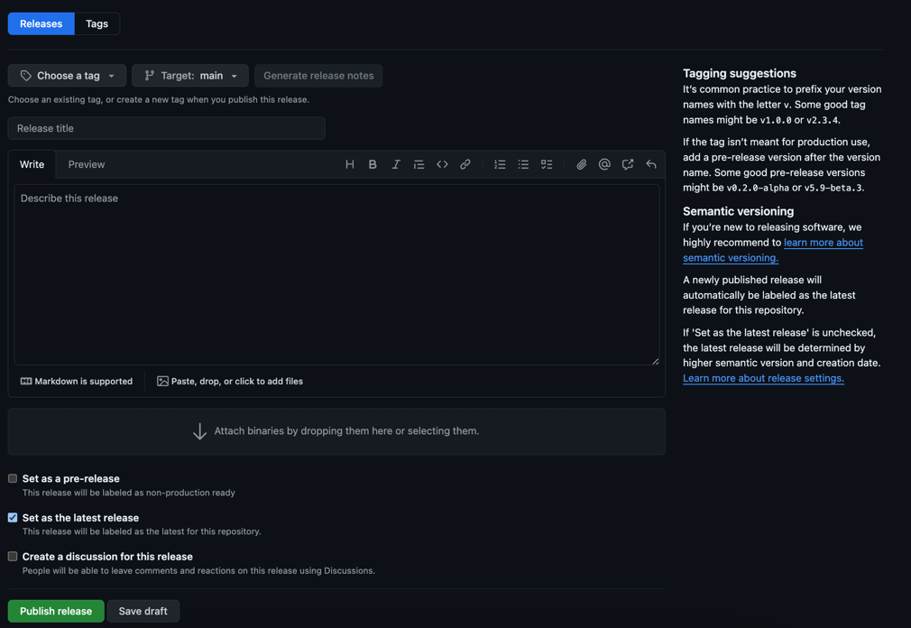

# GitHub Release Process

OIBus releases are automated end-to-end by GitHub Actions: contributors only land Conventional-Commits
PRs, and the rest — version bumping, changelog, multi-platform binaries, Docker images, documentation
deployment — runs from a single push to the `stable` branch.

This page explains the moving parts so you can either trace a release that's in flight, prepare a
pre-release for testing, or update the pipeline itself.

:::info Releases are maintained by the Optimistik team
Official releases of OIBus — both stable and pre-release — are cut **only** by the Optimistik team, on
the `OptimistikSAS/OIBus` repository. The team owns the release schedule, the signing keys, and the
publishing channels (GitHub Releases, `ghcr.io`, the documentation site). External contributors
don't trigger releases directly: your change ships when the maintainers next promote `main` to
`stable`. This page is reference material — for understanding what happens after your PR lands, or for
maintainers operating the pipeline.
:::

## Branching model

| Branch   | Purpose                                                                               |
| -------- | ------------------------------------------------------------------------------------- |
| `main`   | Day-to-day work — every PR squash-merges here. Always green; never released directly. |
| `stable` | Release branch — receives `main` periodically, triggers the release workflow on push. |

A release is initiated by **fast-forwarding `stable` to `main`** (typically via a PR from `main`). No
other manual step is required — the rest happens via Actions.

## The pipeline at a glance

```
  ◇ PR squash-merged to main      ← daily contributions (Conventional Commits)
            │
  ◇ main fast-forwarded to stable ← release trigger (manual)
            │
            ▼
  .github/workflows/new_release.yml
    └── googleapis/release-please-action
          │
          ├─ Opens a "release PR" against stable
          │  (bumps every package.json + lockfile + openapi.json,
          │   regenerates the CHANGELOG)
          │
          └─ When that PR is merged → publishes a GitHub Release
                                    + deploys documentation
            │
            ▼
  .github/workflows/build.yml  (on: release: types: [published])
    └── 5-platform matrix builds, signs, packages, uploads artefacts
            │
            ▼
  .github/workflows/docker.yml
    └── Builds & pushes multi-arch image to ghcr.io
            │
            ▼
  Slack notification → #oibus-ci
```

All files referenced live under `.github/`:

- [`workflows/new_release.yml`](https://github.com/OptimistikSAS/OIBus/blob/main/.github/workflows/new_release.yml)
- [`workflows/build.yml`](https://github.com/OptimistikSAS/OIBus/blob/main/.github/workflows/build.yml)
- [`workflows/docker.yml`](https://github.com/OptimistikSAS/OIBus/blob/main/.github/workflows/docker.yml)
- [`release-please-config.json`](https://github.com/OptimistikSAS/OIBus/blob/main/.github/release-please-config.json)
- [`release-please-manifest.json`](https://github.com/OptimistikSAS/OIBus/blob/main/.github/release-please-manifest.json)

## 📦 release-please

[release-please](https://github.com/googleapis/release-please) is the only thing that ever changes the
version number. It reads commits since the last tag, decides the bump, and writes the changes into a PR
for the maintainers to review.

### Version-bump rules

Driven entirely by commit type — same as
[Conventional Commits](https://www.conventionalcommits.org/):

| Commit type                           | Version bump    | Example                              |
| ------------------------------------- | --------------- | ------------------------------------ |
| `fix:`                                | Patch — `0.0.x` | `fix(cache): correct chunk write`    |
| `feat:`                               | Minor — `0.x.0` | `feat(north): add SFTP retry`        |
| `feat!:` or footer `BREAKING CHANGE:` | Major — `x.0.0` | `feat(north)!: replace handleValues` |

Other types (`docs`, `chore`, `refactor`, `perf`, `test`, `style`, `build`, `ci`) **do not** bump the
version — they're recorded in the changelog under the relevant section without causing a release.

### What release-please rewrites

When a release PR lands, release-please updates the version field in:

| File                                  | Field                              |
| ------------------------------------- | ---------------------------------- |
| `backend/package.json`                | `version`                          |
| `backend/package-lock.json`           | `version` + `packages[""].version` |
| `frontend/package.json`               | `version`                          |
| `frontend/package-lock.json`          | `version` + `packages[""].version` |
| `launcher/package.json`               | `version`                          |
| `launcher/package-lock.json`          | `version` + `packages[""].version` |
| `documentation/package.json`          | `version`                          |
| `documentation/package-lock.json`     | `version` + `packages[""].version` |
| `documentation/docs/api/openapi.json` | `info.version`                     |
| `CHANGELOG.md`                        | new entry prepended                |

The exact rules are in [`release-please-config.json`](https://github.com/OptimistikSAS/OIBus/blob/main/.github/release-please-config.json)
under `extra-files`. If you add a new package or another file that should track the release version,
extend that file.

## 🛠 What the release workflow actually produces

`build.yml` runs on `release: types: [published]` — i.e. **only after release-please's release PR has
been merged and the GitHub Release object is created.** It runs once per row of the matrix:

| Friendly name | OS runner          | Platform target |
| ------------- | ------------------ | --------------- |
| macOS arm64   | `macos-15`         | `macos-arm64`   |
| macOS x64     | `macos-15-intel`   | `macos-x64`     |
| Windows x64   | `windows-2025`     | `win-x64`       |
| Linux x64     | `ubuntu-24.04`     | `linux-x64`     |
| Linux arm64   | `ubuntu-24.04-arm` | `linux-arm64`   |

Each matrix row:

1. **Builds** the frontend, the launcher, and the backend for its platform.
2. **Signs** the Windows binaries (`oibus.exe`, `oibus-launcher.exe`) via Google Cloud KMS + Sectigo
   timestamping (runs only on the Windows row).
3. **Sanity-checks** the runtime by invoking `oibus-launcher --version true`.
4. **Uploads** the per-platform SBOM (`sbom-oibus-<platform>-<tag>.json`) — only for non-prereleases.
5. **Packages** a zip (`oibus-<platform>-<tag>.zip`) and uploads it to the GitHub release.
6. **Monitors the SBOM with Snyk** — only for non-prereleases.
7. **Windows only**: builds the Inno Setup installer (`oibus-win_x64-setup-<tag>.exe`) and uploads it.

When all five rows are done, `docker.yml` builds a multi-arch Docker image and pushes it to
`ghcr.io/optimistiksas/oibus`:

- **Stable releases** get the `latest` tag and the version tag.
- **Pre-releases** get the `beta` tag and the version tag.

Finally, a Slack notification fires into `#oibus-ci`.

## 🆕 Creating a pre-release

Pre-releases are useful when you need to publish artefacts for testing _before_ cutting a stable
release — typically reserved for the maintainers (operators of `OptimistikSAS/OIBus`).

A pre-release runs the **same** `build.yml` matrix but skips the SBOM upload and the Snyk monitoring,
and the Docker image gets the `beta` tag instead of `latest`.

### Steps

1. On [GitHub → Releases](https://github.com/OptimistikSAS/OIBus/releases), click **Draft a new release**.

   <div style={{ textAlign: 'center' }}>
     <div></div>
   </div>

2. Fill in the form:
   - **Tag**: `vX.Y.Z-<suffix>.N` (semver pre-release suffix — `alpha.1`, `beta.1`, `rc.1`).
   - **Target**: the branch or commit you want to build from (usually `main`).
   - **Title**: `vX.Y.Z-<suffix>.N (Pre-release)`.
   - **Description**: what changed since the last (pre-)release, known issues, and testing instructions
     for the people who will pick it up.
   - **Set as a pre-release**: ✅ **check it.**
   - **Set as the latest release**: ❌ leave it unchecked — pre-releases must not become the default
     download.

3. Click **Publish release**. The publish event fires `build.yml`; binaries and the `beta`-tagged Docker
   image will be available a few minutes later, alongside a Slack notification.

:::tip Pre-release naming
Stick to the standard semver suffixes (`-alpha`, `-beta`, `-rc`) and a numeric counter. They sort
correctly against future stable releases (`v3.8.0-rc.1` < `v3.8.0`) and the Docker `beta` tag picks them
up automatically.
:::

## Troubleshooting

| Symptom                                         | What to check                                                                                                                                                         |
| ----------------------------------------------- | --------------------------------------------------------------------------------------------------------------------------------------------------------------------- |
| No release PR appears after pushing to `stable` | release-please only opens a PR when there are bumping commits since the last tag. `chore:` / `docs:` alone don't bump.                                                |
| Release PR opened but with the wrong version    | Inspect the commit subjects — a `feat!:` anywhere drives a major bump. Edit `release-please-manifest.json` if you need to correct the next version manually.          |
| `build.yml` doesn't fire                        | Confirm a GitHub **Release** object was actually created (not just a tag). `build.yml` listens on `release: types: [published]`.                                      |
| Windows binaries unsigned                       | The KMS auth step needs the `GCP_SERVICE_ACCOUNT_JSON` and `CERT` secrets configured for the running repository / fork — these aren't available on contributor forks. |
| Docker image not tagged `latest`                | The release was marked as pre-release. Stable releases get `latest`; pre-releases get `beta`. See `docker.yml`.                                                       |
| Documentation site didn't update                | `new_release.yml` only redeploys docs when `steps.release.outputs.release_created == true` — i.e. on an actual release, not on the intermediate release PR.           |

:::info Running on a fork
The release workflow needs `REPO_ACCESS_TOKEN`, `GCP_SERVICE_ACCOUNT_JSON`, `CERT`, `SNYK_TOKEN`, and
`SLACK_BOT_TOKEN` secrets. Forks won't have those by default; the workflow will skip the parts it can't
authenticate, but you'll get an incomplete artefact set. The pipeline is designed to be run from
`OptimistikSAS/OIBus` itself.
:::
