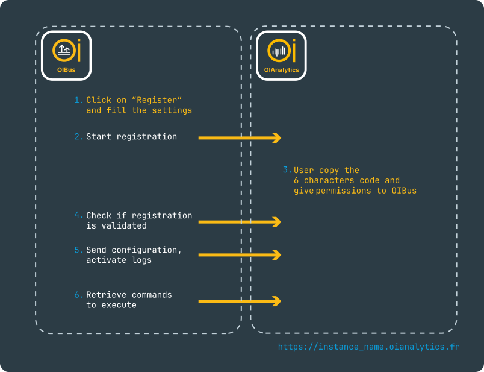

# OIAnalytics registration

The OIAnalytics Registration is accessible through the OIBus Engine page by clicking on the **OIAnalytics** button.

## Registration process

1. Click on **Register** and complete the settings.
2. Validate the registration. It will start the registration on OIAnalytics.
3. Navigate to your OIAnalytics application, access the configuration page, and locate the OIBus section. Proceed to the
registrations page, complete the registration by copying the 6 characters code and give the appropriate permissions.
**OIBus needs API access**.
4. OIBus regularly checks if the registration is completed on OIAnalytics.
5. On completion, OIBus sends the full configuration to OIAnalytics and activate the logs (if enabled in
the [engine settings](../engine/engine-settings.md#logging-parameters)).
6. OIBus regularly retrieves [commands from OIAnalytics](#commands).

  

## Registration settings

### Network

- **Host**: The address of the OIAnalytics instance
- **Accept unauthorized**: Discard HTTPS certificate verification. Useful when behind a proxy that alters the HTTPS
headers.
- **Use proxy**: Choose whether to route the request through a proxy.
- **Proxy URL**: The URL of the proxy server to pass through.
- **Proxy username**: The username associated with the proxy.
- **Proxy password**: The password linked to the proxy.

### Timing

- Command retrieval interval (from OIAnalytics): Specifies the time OIBus waits between two HTTPS requests to fetch the
[commands](#commands) to execute.
- Command retry interval (from OIAnalytics): In case of a network failure, defines the time OIBus waits before
attempting to retry the request.
- Message retry interval (to OIAnalytics): OIBus sends messages to OIAnalytics when specific events occur (e.g.,
configuration changes). If a network failure happens, this interval determines how long OIBus waits before retrying
the message delivery.

### Commands permission

OIBus retrieves all commands created in OIAnalytics but executes only those that are permitted. You can view the full
list of available commands [here](#commands).

## OIAnalytics logs

If configured within the logging parameters section of
the [OIBus Engine settings](../engine/engine-settings.md#logging-parameters), logs have the capability to be transmitted via
HTTPS to OIAnalytics, allowing access to them on the OIAnalytics OIBus log page.

## Commands

OIBus periodically checks for commands on OIAnalytics (see [registration settings](#registration-settings)). Upon
execution, OIBus promptly sends acknowledgments back to OIAnalytics.

### Upgrade version

An OIAnalytics user has the ability to initiate an upgrade command by selecting the desired version for upgrading OIBus
to a newer release.

Initially, OIBus retrieves the upgrade command and then requests OIAnalytics to download the corresponding binary from
GitHub. Upon download completion, the zip file is unpacked in the designated update folder, inside the installation
directory of OIBus. Subsequently, the data folder is backed up, and OIBus is exited.

The launcher actively monitors the process exit and checks the update folder for the presence of a new version. If a
new version is found, the launcher proceeds to copy the new binaries into the binary folder and run the OIBus process.

In the event of a failure during the upgrade process, the previous version and its associated data folder are restored
to ensure system stability and continuity.

### Restart

The restart command kills the current process of OIBus. The OIBus launcher then restart the binary.

### Update engine settings

Apply the settings set on OIAnalytics for the [engine settings](../engine/engine-settings.md).

### Regenerate cipher keys

To ensure the secure exchange of secrets, OIBus employs asymmetric encryption (RSA-OAEP) to encrypt secrets entered in
OIAnalytics. Keys can be regenerated using the Regenerate Cipher Keys command. For more information about the security
of OIAnalytics registration, refer to [this section](#security-concerns).

### Update registration settings

Update [timing settings](#timing) of OIAnalytics registration.

### Scan mode

Create, update or delete scan modes.

### North connector

Create, update or delete north connectors.

### South connector

Create, update or delete south connectors.

## Messages

Messages are payloads sent by OIBus to OIAnalytics, in order to update configuration of OIBus in OIAnalytics.

## Security concerns

### Network consideration

OIBus always initiates communication, while OIAnalytics never connects to OIBus directly.

Specifically, OIBus sends logs, data, and messages to OIAnalytics in response to event triggers. Additionally, OIBus
retrieves commands by making HTTPS requests to OIAnalytics.

:::info HTTPS is bidirectional
HTTPS operates over TCP, which is a bidirectional protocol. OIBus always initiates the connection, using HTTPS to
retrieve payloads.

For firewall configuration, outbound connections from OIBus to OIAnalytics must be permitted.
:::

### Secrets management

When OIBus sends messages to OIAnalytics, all secrets are filtered out and never leave OIBus. For more details on local
secret management, refer to [this page](./oibus-security.md).

OIAnalytics allows users to create or update south or north connectors, which may involve entering secrets. When a
secret is provided, it is encrypted using a public key. Plain text secrets are never stored on OIAnalytics. Only the
private key, securely stored in OIBus, can decrypt the secrets.

The public/private key pair is generated during OIBus registration or when executing
a [Regenerate Cipher Keys](#regenerate-cipher-keys) command.