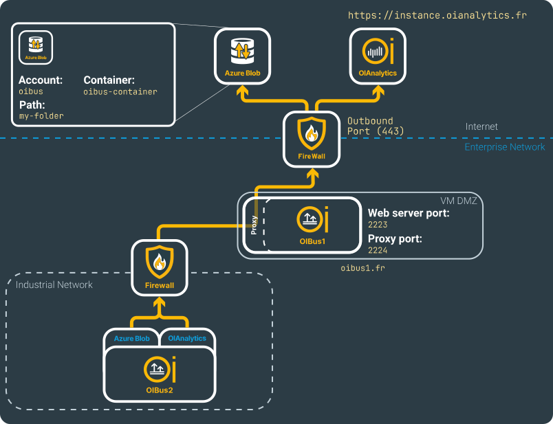
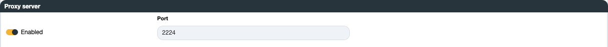
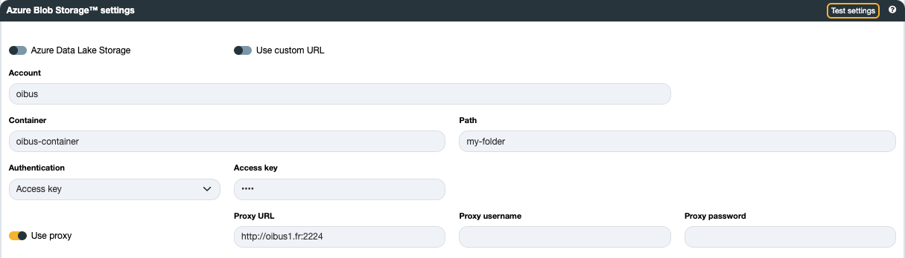

# Engine settings

## OIBus port

The default port for accessing OIBus settings through a web interface is 2223, and it is accessible at `http://localhost:2223`. You have the
option to modify this port in the event of conflicts or for security purposes.

## OIBus Proxy Server Configuration

OIBus can act as a proxy server by enabling the proxy option and configuring the listening port. This allows OIBus to forward HTTP(S)
requests to the targeted host specified in the request.

The proxy server functionality is particularly useful when two OIBus instances are deployed in separate networks:

- `OIBus1`: Installed in a network with internet access.
- `OIBus2`: Installed in a network without internet access. By configuring OIBus1 as a proxy server, OIBus2 can send data to the internet
  via OIBus1, provided the North connector allows it.

To ensure proper operation:

1. Firewall Configuration: If you have a firewall between `OIBus1` and `OIBus2`, make sure your firewall allows inbound connections (from
   `OIBus2` machine) on the specified proxy port for the `OIBus1` machine.
2. IP Filter: Ensure the IP address of the source system (`OIBus2`) is authorized in the [IP Filter](./ip-filters.md) section of `OIBus1`.

### Configuration Steps

1. On `OIBus1` (Proxy Server):

- Enable the proxy server option.
- Set the listening port (e.g., 2224).
- Ensure the firewall allows inbound connections on this port.
- Authorize the IP address of `OIBus2` in the IP Filter section.

2. On `OIBus2` (Proxy Client):

- Configure the North connector or OIAnalytics registration settings to use the proxy server.
- Specify the address and port of OIBus1’s proxy server (e.g., http://oibus1.fr:2224).

### Example: Azure Blob North Connector

Here’s a practical example using an Azure Blob North Connector configured on `OIBus2.

#### Scenario

- OIBus1:
- Acts as a proxy server.
- Listens on port 2224.
- Accessible at http://oibus1.fr.
- OIBus2:
- Configured with an [Azure Blob North Connector](../north-connectors/azure-blob.md) and an
  [OIAnalytics North Connector](../north-connectors/oianalytics.md).
- Sends data to Azure and OIAnalytics through the proxy server of `OIBus1`.

#### Configuration

1. On `OIBus1`:

- Enable the proxy server and set it to listen on port 2224.
- Authorize `OIBus2`'s IP address in the IP Filter.

2. On `OIBus2`:

- In the Azure Blob North Connector settings, specify the proxy server:
- Proxy URL: http://oibus1.fr:2224

This setup allows `OIBus2` to send data to Azure using `OIBus1` as an intermediary, even if `OIBus2`'s network lacks direct internet access.

:::tip OIAnalytics
If you use a [North OIAnalytics](../north-connectors/oianalytics.md) with
[OIAnalytics registration](../advanced/oianalytics-registration.mdx), the proxy client settings are located in the registration settings.
:::

## Logging parameters

OIBus logs encompass six levels, ranging from the most critical to the least:

- None (deactivates the logs)
- Error
- Warning
- Info
- Debug
- Trace

Activating **Info** logs will automatically enable **Warning** and **Error** logs. Enabling **Error** logs will exclusively display Error
logs. It's worth noting that activating **Trace** logs will generate highly detailed and verbose logs, primarily intended for advanced
troubleshooting. Therefore, it's advisable to use **Trace** and **Debug** log levels specifically for troubleshooting purposes.

### Console

This section displays logs in the Console, alongside values if a [North Console connector ](../../guide/north-connectors/console) is used.
To access these logs, execute OIBus from a terminal.

### File

To store logs in one or more files, you can configure the maximum file size and specify the number of files for log rotation.

### SQLite

To save logs in a local SQLite database for viewing in the **Logs tab** of OIBus, you can set a **maximum number of logs ** to prevent the
database from becoming overly large. Older entries will be automatically purged.

### Loki

To transmit logs to a remote **Loki** instance, the logs are sent to the designated host in batches at a configurable time interval (default
is 60 seconds). You have the flexibility to adjust this interval to control the batch size.

Loki can be accessed directly using Basic Auth, where you provide a **username** and **password**.

:::caution Loki logs with multiple OIBus
Logs sent to Loki are identified by the OIBus ID. The name is sent alongside the ID. Ensure that
you update this name correctly to locate your OIBus logs within your Loki instance, specially if you have several OIBus.
:::

### OIAnalytics

If OIBus [is registered](../advanced/oianalytics-registration.mdx), logs can be forwarded to OIAnalytics. Otherwise, these settings will be
disregarded.
