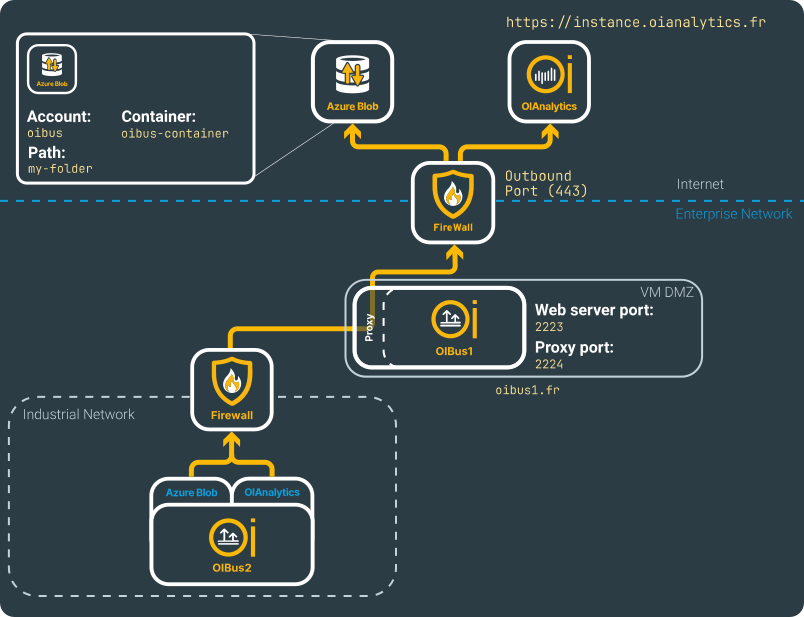
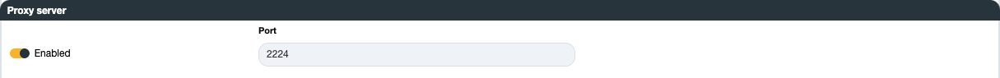
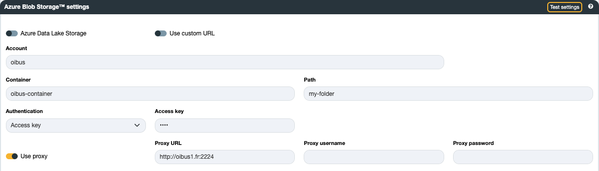

# Engine Settings

## OIBus Name {#oibus-name}

Naming your OIBus instance is important, especially when managing multiple instances. A clear name helps identify each OIBus in logs, dashboards, and monitoring tools.

## Web Server {#web-server}

### Port {#port}

The default port for accessing OIBus settings via the web interface is **2223** (`http://localhost:2223`).
You can change this port if needed—for example, to resolve conflicts or improve security.

### Authentication Duration {#authentication-duration}

The **Authentication duration** setting controls how long a login session stays valid before the user must log
in again. Available values are **1 hour**, **6 hours**, **1 day**, **3 days**, **7 days** (default), **14 days**,
and **30 days**.

## Proxy Server {#proxy-server}

OIBus can act as a **proxy server**, enabling it to forward HTTP(S) requests to a target host. This feature is especially useful when two OIBus instances are deployed in separate networks:

- **OIBus1**: Installed in a network with internet access.
- **OIBus2**: Installed in a network without internet access.

By configuring **OIBus1** as a proxy server, **OIBus2** can send data to the internet through **OIBus1**, provided the North connector allows it.

### Prerequisites {#prerequisites}

1. **Firewall Configuration**: Ensure your firewall allows inbound connections from **OIBus2** to **OIBus1** on the specified proxy port.
2. **IP Filter**: Authorize the IP address of **OIBus2** in the [IP Filter](./ip-filters.mdx) section of **OIBus1**.

### Configuration Steps {#configuration-steps}

#### On OIBus1 (Proxy Server) {#on-oibus1-proxy-server}

1. Enable the **proxy server** option.
2. Set the **listening port** (e.g., `2224`).
3. Optionally, set a **Username** and **Password** to require clients to authenticate before using the proxy (see [Authentication](#authentication) below).
4. Ensure the firewall allows inbound connections on this port.
5. Authorize the IP address of **OIBus2** in the **IP Filter** section.

#### On OIBus2 (Proxy Client) {#on-oibus2-proxy-client}

1. Configure the **North connector** or **OIAnalytics registration settings** to use the proxy server.
2. Specify the address and port of **OIBus1**’s proxy server (e.g., `http://oibus1.fr:2224`).
3. If **OIBus1**'s proxy server requires authentication, provide the same **Username** and **Password** in the North connector's or registration's proxy settings.

### Authentication {#authentication}

The proxy server can require clients to authenticate with a **Username** and **Password** (HTTP Basic authentication) before it will forward any request. Leave these fields empty to allow anonymous access.

:::tip
IP filtering is checked before authentication: a request from a non-authorized host is rejected before its credentials are even checked. Both can be used together for defense in depth: the IP filter limits which hosts may reach the proxy, and authentication controls who may use it from those hosts.
:::

### Forward to an Upstream Proxy {#forward-to-an-upstream-proxy}

If **OIBus1** itself has no direct access to the internet (for example, it must go through a corporate proxy), it can be configured to forward every request it receives to an **upstream proxy** instead of contacting the target host directly:

```
OIBus2 → OIBus1 (proxy server) → Upstream proxy → Internet
```

To configure it, enable **Forward to upstream proxy** in **OIBus1**'s proxy server settings and provide:

- **URL**: the address of the upstream proxy (e.g., `http://corporate-proxy.company.com:8080`).
- **Username** / **Password**: credentials for the upstream proxy, if it requires authentication.

This is independent from the [Authentication](#authentication) settings above: the upstream credentials are used by **OIBus1** to reach the upstream proxy, while the proxy server's own username/password (if set) still controls which clients (e.g., **OIBus2**) may use **OIBus1** as a proxy.

### Example {#example}

#### Scenario {#scenario}

- **OIBus1**:
- Acts as a proxy server.
- Listens on port `2224`.
- Accessible at `http://oibus1.fr`.
- **OIBus2**:
- Configured with an [Azure Blob North Connector](../north-connectors/azure-blob.md) and an [OIAnalytics North Connector](../north-connectors/oianalytics.md).
- Sends data to Azure and OIAnalytics via **OIBus1**’s proxy server.

<div style={{ textAlign: 'center' }}></div>

#### Configuration {#configuration}

1. **On OIBus1**:

- Enable the proxy server and set it to listen on port `2224`.
- Authorize **OIBus2**’s IP address in the **IP Filter**.

<div style={{ textAlign: 'center' }}></div>

2. **On OIBus2**:

- In the **Azure Blob North Connector** settings, specify the proxy server:
- **Proxy URL**: `http://oibus1.fr:2224`

<div style={{ textAlign: 'center' }}></div>

:::tip
If you use a [North OIAnalytics](../north-connectors/oianalytics.md) with [OIAnalytics registration](../installation/oianalytics.mdx), configure the proxy client settings in the **registration settings**.
:::

---

## Logging Parameters {#logging-parameters}

### Audit Log Retention {#audit-log-retention}

**Audit log retention** sets the number of days [audit trail](./audit-trail.mdx) entries are kept before
being automatically pruned. Set it to `0` to keep audit log entries forever.

:::warning
Keeping audit log entries forever (`0`) lets the configuration database grow without bound on a
busy instance, which can affect its size and performance over time. Prefer a bounded retention period
unless you have a specific compliance or auditing reason to keep everything.
:::

### Log Levels {#log-levels}

OIBus supports six log levels, from most to least critical:

| Log Level | Description                                                                  |
| --------- | ---------------------------------------------------------------------------- |
| Silent    | Deactivates all logs.                                                        |
| Error     | Logs only errors.                                                            |
| Warning   | Logs warnings and errors.                                                    |
| Info      | Logs informational messages, warnings, and errors.                           |
| Debug     | Logs detailed information for debugging, plus all above levels.              |
| Trace     | Logs highly detailed and verbose information, primarily for troubleshooting. |

:::caution
Use **Trace** and **Debug** log levels only for troubleshooting, as they generate large volumes of data.
:::

### Log Output Options {#log-output-options}

#### OIAnalytics {#oianalytics}

If OIBus is [registered with OIAnalytics](../installation/oianalytics.mdx), logs can be forwarded to OIAnalytics. These settings are ignored if
OIBus is not registered.

#### Database {#database}

Save logs in a local **SQLite database**. View logs in the **Logs tab** of OIBus. Set a **maximum number of logs** to
prevent the database from growing too large. Older logs are automatically purged.

#### File {#file}

Store logs in one or more files. Configure:

- **Maximum file size** (in MB)
- **Number of files** for log rotation

#### Loki {#loki}

Send logs to a remote **Loki** instance in batches. Configure:

- **URL**
- **Batch interval** (default: 60 seconds)
- **Basic Auth credentials** (username and password)

:::caution
Logs sent to Loki are identified by the **OIBus ID** and name. Ensure the name is correctly set to locate your logs, especially if you have multiple OIBus instances.
:::

#### Syslog {#syslog}

Send logs to a remote **Syslog** server (RFC 5424). Configure:

- **Host**
- **Port** (default: 514)
- **Protocol**: UDP or TCP

#### Console {#console}

Displays logs in the **Console**. Accessible by running OIBus from a terminal.
