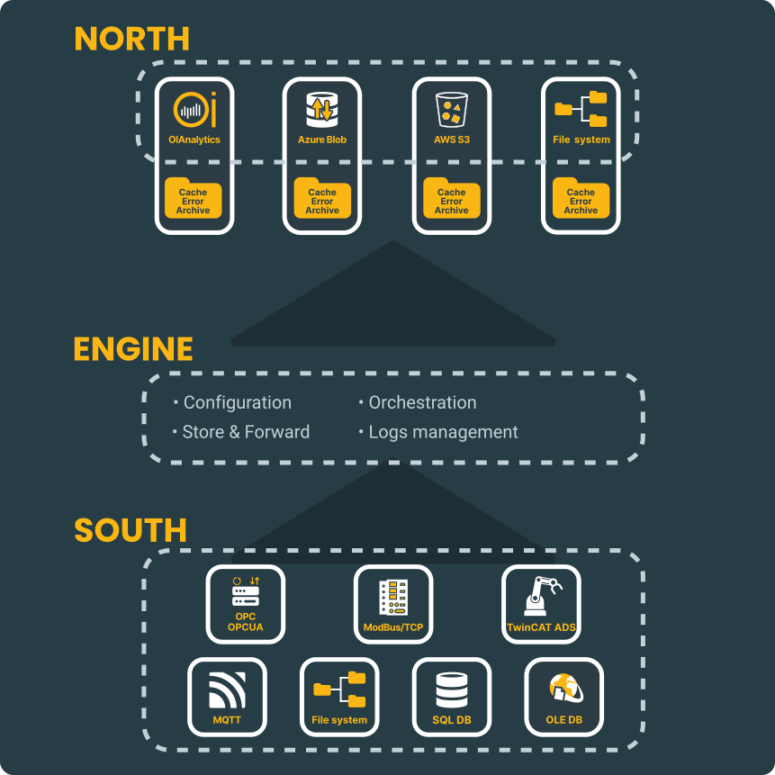

# Main Concepts

## Open-source, Scalable, and Flexible

OIBus is a lightweight, open-source solution designed to simplify data collection in industrial environments. It seamlessly gathers data
from diverse sources and transmits it to target applications—whether on-premises or in the cloud.

Originally developed to power **OIAnalytics®**, OIBus has been maintained by Optimistik since 2020 under the
[European Union Public Licence (EU-PL)](https://ec.europa.eu/info/european-union-public-licence_en). As an open-source project, it offers
unparalleled flexibility to address a wide range of use cases. Many solution providers have adopted OIBus to overcome data collection
challenges and accelerate industrial digitization.

## A Modular, Streaming Solution

OIBus is built with a modular architecture, consisting of three core components:

- **South**: Collects data from source systems.
- **North**: Caches and transmits data to target systems.
- **Engine**: Manages configuration, orchestration, and logging.

  

    

  

:::info
This modular design simplifies scalability by centralizing complexity in the Engine, making it easier to
[develop and integrate](../developer/create-connector/presentation.md) new North or South modules.
:::

## Advanced Capabilities

### Supported Data Sources

OIBus supports a wide range of industrial and business data sources, and its open-source nature allows for continuous expansion:

- **Industrial Systems**: PLCs, supervisory systems, and historians using protocols like OPC UA™, OPC Classic™, TwinCAT® ADS, and Modbus.
- **Business Systems**: Access to databases (Oracle Database™, Microsoft SQL Server™, PostgreSQL, MySQL®, MariaDB™, SQLite™) and file
  retrieval (e.g., Excel, CSV).
- **IoT Sensors**: Integration with IoT messaging services (MQTT, APIs, etc.).

| Protocol/Type        | Historian Capabilities | Direct Access      | Typical Use Cases                     |
| -------------------- | ---------------------- | ------------------ | ------------------------------------- |
| OPC UA™             | Yes                    | Yes                | PLCs, supervisory systems, historians |
| OPC Classic™        | Yes                    | Yes                | Legacy industrial systems             |
| TwinCAT® ADS        | No                     | Yes                | Beckhoff PLCs                         |
| Modbus               | No                     | Yes                | PLCs, sensors, devices                |
| MQTT                 | Limited                | Yes                | IoT sensors, messaging services       |
| REST API             | Depends on the API     | Depends on the API | Web services, cloud applications      |
| SQL Databases        | Yes                    | No                 | Oracle, SQL Server, PostgreSQL, etc.  |
| File Retrieval, SFTP | No                     | Yes                | Excel, CSV, logs                      |

### Target Applications

OIBus transmits data to various destinations, including:

- **SaaS Applications**: OIAnalytics®, Amazon S3™, Azure Blob Storage™, REST APIs, and more.
- **IoT Platforms**: MQTT, APIs, and other IoT messaging services.
- **Industrial Systems**: OPC UA™ and Modbus.

### Performance and Reliability

OIBus is engineered to handle high-volume data streams, with deployments ranging from **10 to 10,000 data points per second**. Key features
include:

- **Reliable and secure communications** (HTTPS, tunneling, proxy management).
- **Store-and-forward functionality** to ensure no data is lost.
- **Data compression** for optimized transmission.
