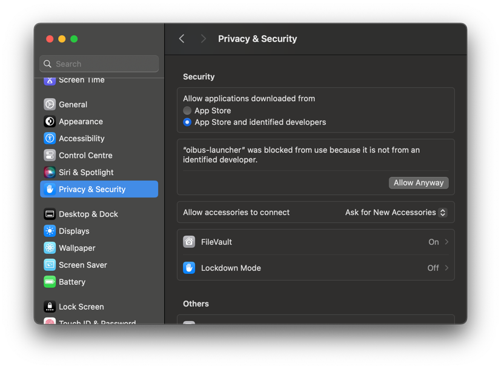

import DownloadButton from '../../../src/components/DownloadButton';
import packageInfo from '../../../package.json';

<h2 id="download-macos">Download</h2>

<div style={{ display: 'flex', justifyContent: 'space-around' }}>
  <DownloadButton
    link={`https://github.com/OptimistikSAS/OIBus/releases/download/v${packageInfo.version}/oibus-macos_x64-v${packageInfo.version}.zip`}
  >
    <div>
      <div>{`OIBus v${packageInfo.version}`}</div>
      <div>macOS (Intel)</div>
    </div>
  </DownloadButton>
  <DownloadButton
    link={`https://github.com/OptimistikSAS/OIBus/releases/download/v${packageInfo.version}/oibus-macos_arm64-v${packageInfo.version}.zip`}
  >
    <div>
      <div>{`OIBus v${packageInfo.version}`}</div>
      <div>macOS (Apple Silicon)</div>
    </div>
  </DownloadButton>
</div>

:::info
macOS support is intended for development and testing. For production deployments, use Linux or Windows where OIBus can be installed as a system service.
:::

## Run OIBus

1. Extract the downloaded archive to a location of your choice.

2. Open **Terminal** and navigate to the extracted folder.

3. Launch OIBus:

```bash
./oibus-launcher --config ~/oibus-data
```

Replace `~/oibus-data` with the path where you want to store OIBus configuration and cache files.

:::note

- Administrator permissions are required to run the binary.
- The binary must be executed from its own folder.
  :::

## Allow App Execution

macOS Gatekeeper will block unsigned binaries on first launch. You need to allow both `oibus-launcher`
and `oibus` (which the launcher starts as a child process):

1. Run `./oibus-launcher` — macOS will display a security warning and block execution.
2. Go to **System Settings → Privacy & Security**.
3. In the **Security** section, click **Allow Anyway** next to the blocked binary.
4. Repeat for the second binary when it is blocked.

<div style={{ textAlign: 'center' }}></div>

## Access OIBus

Once OIBus is running, open `http://localhost:2223` in a browser and follow the
[first access guide](./first-access.mdx).
