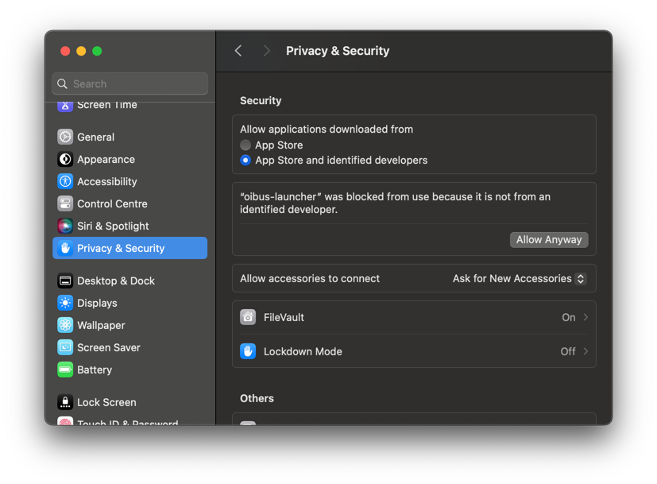

import CodeBlock from '@theme/CodeBlock';
import DownloadButton from '../../../src/components/DownloadButton';
import packageInfo from '../../../package.json';

## Download

<div style={{ display: 'flex', justifyContent: 'space-around' }}>
  <DownloadButton
    link={`https://github.com/OptimistikSAS/OIBus/releases/download/v${packageInfo.version}/oibus-macos_x64-v${packageInfo.version}.zip`}
  >
    <div>
      <div>{`OIBus v${packageInfo.version}`}</div>
      <div>MacOS (Intel chip)</div>
    </div>
  </DownloadButton>
  <DownloadButton
    link={`https://github.com/OptimistikSAS/OIBus/releases/download/v${packageInfo.version}/oibus-macos_arm64-v${packageInfo.version}.zip`}
  >
    <div>
      <div>{`OIBus v${packageInfo.version}`}</div>
      <div>MacOS (ARM 64)</div>
    </div>
  </DownloadButton>
</div>

## Run OIBus on macOS

1. **Extract the downloaded archive** to a location of your choice

2. **Open Terminal** and navigate to the folder containing the OIBus binary

3. **Run OIBus** with the following command:

```bash
./oibus-launcher --config [your-data-folder-path]
```

Replace `[your-data-folder-path]` with the path where you want to store OIBus configuration and cache files.

**Example:**

```bash
./oibus-launcher --config ~/oibus-data
```

:::important Requirements

- You need **admin permissions** to run the binary
- The binary must be run from its own folder

:::

## Allow App Execution

On macOS, you may need to manually allow the execution of the OIBus binary:

1. When first running OIBus, you'll see a security warning
2. Go to **System Settings > Privacy & Security**
3. In the Security section, click **Allow Anyway** for:

- `oibus-launcher`
- `oibus` (which is run by the launcher)

<div style={{ textAlign: 'center' }}></div>

:::note
You'll need to perform this operation twice - once for each binary.
:::

## Access OIBus

After successfully launching OIBus, access the interface at: http://localhost:2223/

Get familiar with the OIBus interface on the [first access page](./first-access.mdx).
