import DownloadButton from '../../../src/components/DownloadButton';
import packageInfo from '../../../package.json';
import Tabs from '@theme/Tabs';
import TabItem from '@theme/TabItem';

**Choose the installation method that best fits your needs:**

- Use the **Installer** for a guided, user-friendly setup. It also supports running multiple OIBus
  instances side by side on the same machine.
- Use the **Scripts** method for advanced users, or for scripted/unattended deployments (see
  [Automated Installation](./disk-image.mdx)).

<Tabs>
  <TabItem value="windows-installer" label="Installer" default>
    <h2 id="download-windows-installer">Download</h2>
    <div style={{ display: "flex", justifyContent: "space-around" }}>
      <DownloadButton
        link={`https://github.com/OptimistikSAS/OIBus/releases/download/v${packageInfo.version}/oibus-win_x64-setup-v${packageInfo.version}.exe`}>
        <div>
          <div>{`OIBus v${packageInfo.version} (x64 installer)`}</div>
          <div>Windows (x64)</div>
        </div>
      </DownloadButton>
    </div>

    <h2 id="installation-steps-windows-installer">Installation Steps</h2>

    1. **Run the Installer**

    Launch the downloaded installer. You will see the welcome screen:
    <div style={{ textAlign: 'center' }}>
      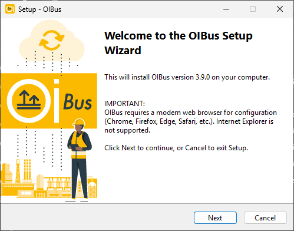
    </div>

    2. **Accept the License**

    Read and accept the **EU-PL license** to proceed.
    <div style={{ textAlign: 'center' }}>
      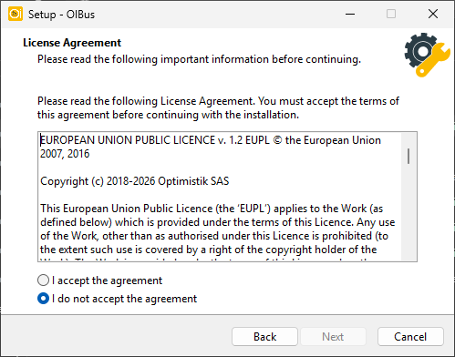
    </div>

    3. **Choose the service name and set Data Directory**

    The **Service Name** identifies this OIBus installation as a Windows service. Keep the default
    (`OIBus`) for a single installation, or give it a unique name (letters, digits, spaces, dots,
    hyphens and underscores only) to run several OIBus instances side by side on the same machine.
    The **Data Directory** is where its configuration, cache, and logs are stored:
    <div style={{ textAlign: 'center' }}>
      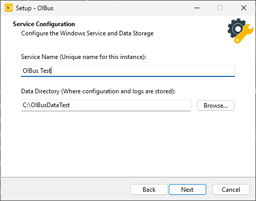
    </div>

    :::tip
    For data safety, consider placing the data folder on a **separate disk** (e.g., `D:\OIBusData`). This helps prevent
    disk space issues on the system drive and improves reliability.
    :::

    :::info
    Every OIBus instance needs its own installation folder and its own data directory. If either one
    is already used by another instance, the installer stops with an error and asks you to choose a
    different value here (or on the installation path page below).
    :::

    4. **Set initial variables**

    Set the initial admin username, password, and the port OIBus will listen on. Each instance has
    its own independent credentials, so the **port** is usually the value you need to change here
    when installing a second instance alongside an existing one (they can't share the same port):
    <div style={{ textAlign: 'center' }}>
      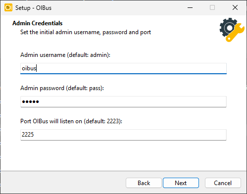
    </div>

    5. **Choose Installation Path**

    Select the directory where OIBus binaries will be installed. This is pre-filled with a suggestion
    based on the service name from step 3 (`OIBus` for the default name, `OIBus - <name>` otherwise),
    but you can still change it — it just needs to be a folder no other instance already uses:
    <div style={{ textAlign: 'center' }}>
      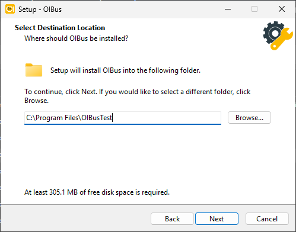
    </div>

    6. **Confirm and Install**

    Review your settings and confirm to begin the installation:
    <div style={{ textAlign: 'center' }}>
      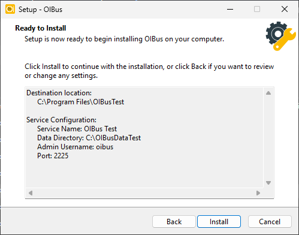
    </div>

    7. **Complete Installation**

    Once the installation is complete, you'll see a confirmation screen.

    <div style={{ textAlign: 'center' }}>
      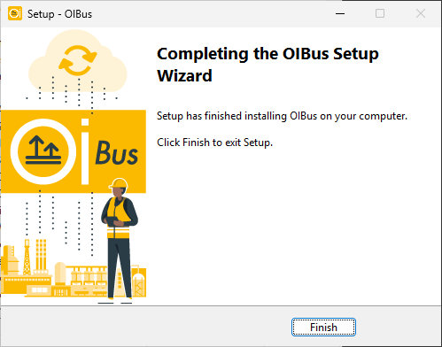
    </div>

    You can verify that OIBus is running properly as a Windows service.
    <div style={{ textAlign: 'center' }}>
      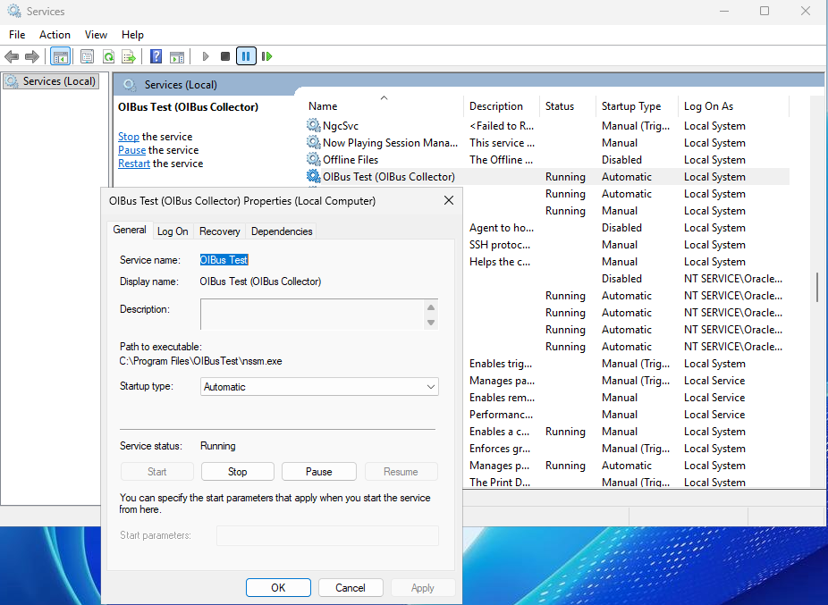
    </div>

    The binary folder looks like this:
    <div style={{ textAlign: 'center' }}>
      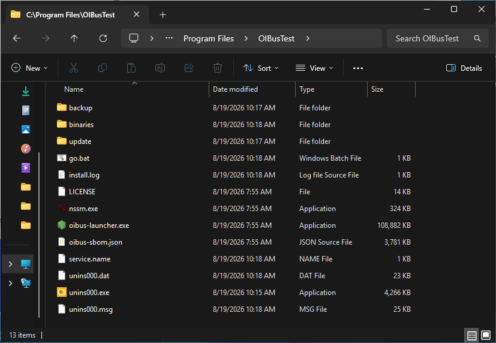
    </div>

    And the data folder looks like this:
    <div style={{ textAlign: 'center' }}>
      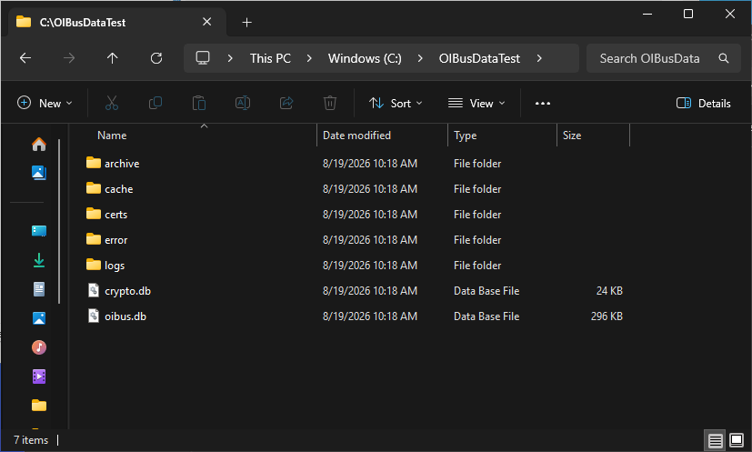
    </div>

    Proceed to the [first access guide](./first-access.mdx) to configure OIBus.

    <h2 id="update-oibus-windows-installer">Update OIBus</h2>

    - Use the **OIBus Windows Installer** to update.
    - Use the **same Service Name** as the existing installation you want to upgrade — a different
      name installs a new, additional instance instead of updating the existing one.
    - Specify the current executable and configuration paths.
    - Choose to **keep** or **replace** your existing configuration.
    - The OIBus service will briefly stop during the update.
    - On first startup after the update, the `oibus.db` configuration database will be automatically upgraded.

    <h2 id="uninstall-oibus-windows-installer">Uninstall OIBus</h2>

    1. Navigate to the OIBus binary folder.
    2. Run `unin000.exe` as an administrator and confirm removal:
    <div style={{ textAlign: 'center' }}>
      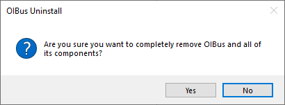
    </div>
    3. You will be asked whether to remove all data (cache, error, archive, logs, certs, and the
       configuration/credentials databases) for this instance. Answering anything other than **Yes**
       leaves the data folder untouched:
    <div style={{ textAlign: 'center' }}>
      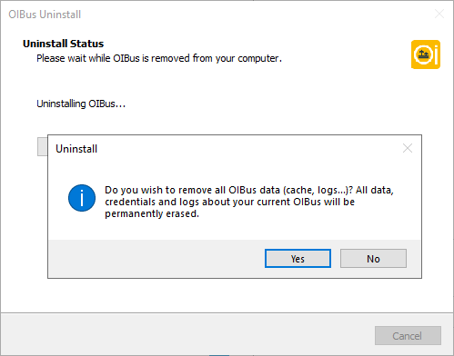
    </div>

    :::caution
    Choosing to remove all data permanently deletes your configuration, credentials, and logs.
    :::

    :::info Uninstalling a shared installation folder
    If several OIBus instances were installed into the same binaries folder, uninstalling removes the
    files all of them depend on. In that case, a warning listing every affected instance appears
    before anything is touched, and each one is stopped and offered for data removal in turn.
    :::

  </TabItem>

  <TabItem value="windows-scripts" label="Scripts">
    <h2 id="download-windows-scripts">Download</h2>

    <div style={{ display: "flex", justifyContent: "space-around" }}>
      <DownloadButton
        link={`https://github.com/OptimistikSAS/OIBus/releases/download/v${packageInfo.version}/oibus-win_x64-v${packageInfo.version}.zip`}>
        <div>
          <div>{`OIBus v${packageInfo.version} (zip)`}</div>
          <div>Windows (x64)</div>
        </div>
      </DownloadButton>
    </div>

    <h2 id="installation-steps-windows-scripts">Installation Steps</h2>

    1. **Extract the Zip Archive**

    Unzip the downloaded file into the directory where you want to install OIBus (e.g., `C:\Program Files\OIBus`).

    2. **Run the Installation Script**
    Open an **administrator terminal** in the extracted folder and run:
    ``` commandline title="Usage"
    install.bat -c "[your-data-folder-path]"
    ```

    | Flag | Description | Default |
    |------|-------------|---------|
    | `-c` | Path to the OIBus data folder (cache, logs, configuration) | prompted if omitted |
    | `-n` | Windows service name — use a unique name to run multiple OIBus instances on the same machine | `OIBus` |
    | `-u` | Admin username written to `oibus.init.json` on first install | omitted (OIBus default applies) |
    | `-p` | Admin password written to `oibus.init.json` on first install | omitted (OIBus default applies) |
    | `-port` | Port OIBus listens on, written to `oibus.init.json` on first install | omitted (OIBus default applies) |

    :::info
    `-u`, `-p`, and `-port` are only used when `oibus.db` does not yet exist (i.e. on the very first install).
    They are written to an `oibus.init.json` file in the data folder and applied by OIBus on first startup.
    Omitted flags are not written to the file — OIBus will use its built-in defaults for those values.
    On subsequent installs or updates the file is not recreated, so these flags have no effect.
    :::

    :::tip
    - If you omit the `-c` argument, the script will prompt you for the data path.
    - For data safety, consider placing the data folder on a **separate disk** (e.g., `D:\OIBusData`). This helps
    prevent disk space issues on the system drive and improves reliability.
    :::

    :::info
    Every OIBus instance needs its own installation folder and its own data directory. `install.bat`
    checks this before installing anything and exits with an error if either one already belongs to a
    different instance.
    :::

    **Example:**
    ``` commandline title="Example with terminal outputs"
    install.bat -c "D:\OIBusData" -u "admin" -p "password" -port 2223
    > Administrator permissions required. Detecting permission...
    > Stopping OIBus service...
    > Installing OIBus as Windows service...
    > The "OIBus" service has been successfully installed!
    > Configuration of the "AppDirectory" parameter value for the "OIBus" service.
    > nssm set OIBus AppNoConsole 1
    > Starting OIBus service...
    > OIBus: START: Operation successful.
    > Creating go.bat
    > echo Stopping OIBus service... You can restart it from the Windows Service Manager
    > nssm.exe stop OIBus
    > "C:\Users\Administrator\Downloads\oibus-win_x64\oibus-launcher.exe" --config "D:\OIBusData"
    ```

    Proceed to the [first access guide](./first-access.mdx) to configure OIBus.

    <h2 id="update-oibus-windows-scripts">Update OIBus</h2>

    1. Extract the new files from the zip archive.
    2. Open the **Windows Service Manager** and stop the OIBus service.
    3. Replace the old files in the OIBus executable directory with the new ones.
    4. Restart the OIBus service.
    5. On first startup, the `oibus.db` configuration database will be automatically upgraded.

    :::info
    If you re-run `install.bat` instead to update, use the **same `-n`** value as the existing
    instance — a different name installs a new, additional instance rather than updating it.
    :::

    <h2 id="uninstall-oibus-windows-scripts">Uninstall OIBus</h2>

    Run the following command in an **administrator terminal**:
    ```` commandline title="Example with terminal outputs"
    uninstall.bat -n "OIBus"
    > Administrator permissions required. Detecting permission...
    > Stopping OIBus service...
    > Do you wish to remove all data for service OIBus (cache, logs...)? (y/N)
    > Removing OIBus service...
    ````

    You will be asked whether to remove all data (cache, error, archive, logs, certs, and the
    configuration/credentials databases). Answering anything other than `Y`/`y` leaves the data
    folder untouched.

    :::caution
    Choosing to remove all data permanently deletes your configuration, credentials, and logs.
    :::

  </TabItem>
</Tabs>
