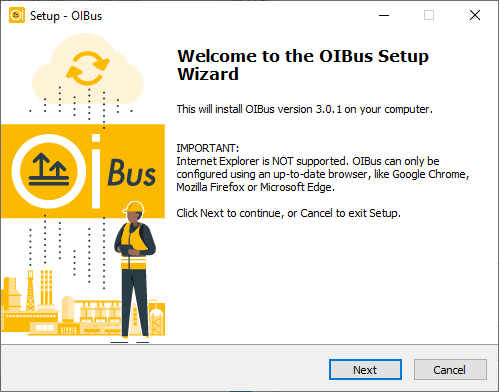

import DownloadButton from '../../../src/components/DownloadButton';
import packageInfo from '../../../package.json';
import Tabs from '@theme/Tabs';
import TabItem from '@theme/TabItem';

**Choose the installation method that best fits your needs:**

- Use the **Installer** for a guided, user-friendly setup.
- Use the **Scripts** method for advanced users or to install multiple OIBus services.

<Tabs>
  <TabItem value="windows-installer" label="Installer" default>
    ## Download
    <div style={{ display: "flex", justifyContent: "space-around" }}>
      <DownloadButton
        link={`https://github.com/OptimistikSAS/OIBus/releases/download/v${packageInfo.version}/oibus-win_x64-setup-v${packageInfo.version}.exe`}>
        <div>
          <div>{`OIBus v${packageInfo.version} (x64 installer)`}</div>
          <div>Windows (x64)</div>
        </div>
      </DownloadButton>
    </div>

    ## Installation Steps
    1. **Run the Installer**
    Launch the downloaded installer. You will see the welcome screen:
    <div style={{ textAlign: 'center' }}>
      
    </div>

    2. **Accept the License**
    Read and accept the **EU-PL license** to proceed.

    3. **Choose Installation Path**
    Select the directory where OIBus binaries will be installed:
    <div style={{ textAlign: 'center' }}>
      
    </div>

    4. **Set Data Directory**
    Choose where to store cache, logs, and configuration files:
    <div style={{ textAlign: 'center' }}>
      
    </div>
    :::tip
    For data safety, consider placing the data folder on a **separate disk** (e.g., `D:\OIBusData`). This helps prevent
    disk space issues on the system drive and improves reliability.
    :::

    5. **Confirm and Install**
    Review your settings and confirm to begin the installation:
    <div style={{ textAlign: 'center' }}>
      
    </div>

    6. **Complete Installation**
    Once the installation is complete, you'll see a confirmation screen.
    Proceed to the [first access guide](./first-access.mdx) to configure OIBus.

    ## Update OIBus
    - Use the **OIBus Windows Installer** to update.
    - Specify the current executable and configuration paths.
    - Choose to **keep** or **replace** your existing configuration.
    - The OIBus service will briefly stop during the update.
    - On first startup after the update, the `oibus.db` configuration database will be automatically upgraded.

    ## Uninstall OIBus
    1. Navigate to the OIBus binary folder.
    2. Run `unin000.exe` as an administrator:
    <div style={{ textAlign: 'center' }}>
      
    </div>
    3. Follow the prompts to remove OIBus:
    <div style={{ textAlign: 'center' }}>
      
    </div>

  </TabItem>

  <TabItem value="windows-scripts" label="Scripts">
    ## Download

    <div style={{ display: "flex", justifyContent: "space-around" }}>
      <DownloadButton
        link={`https://github.com/OptimistikSAS/OIBus/releases/download/v${packageInfo.version}/oibus-win_x64-v${packageInfo.version}.zip`}>
        <div>
          <div>{`OIBus v${packageInfo.version} (zip)`}</div>
          <div>Windows (x64)</div>
        </div>
      </DownloadButton>
    </div>

    ## Installation Steps

    1. **Extract the Zip Archive**

    Unzip the downloaded file into the directory where you want to install OIBus (e.g., `C:\Program Files\OIBus`).

    2. **Run the Installation Script**
    Open an **administrator terminal** in the extracted folder and run:
    ``` commandline title="Usage"
    install.bat -c "[your-data-folder-path]"
    ```
    Replace `[your-data-folder-path]` with the actual path where you want to store OIBus data (e.g., C:\OIBusData or
    D:\OIBusData).

    :::tip
    - If you omit the `-c` argument, the script will prompt you for the data path.
    - For data safety, consider placing the data folder on a **separate disk** (e.g., `D:\OIBusData`). This helps
    prevent disk space issues on the system drive and improves reliability.
    :::

    **Example:**
    ``` commandline title="Example with terminal outputs"
    install.bat -c "D:\OIBusData"
    > Administrator permissions required. Detecting permission...
    > Stopping OIBus service...
    > Installing OIBus as Windows service...
    > The "OIBus" service has been successfully installed!
    > Configuration of the "AppDirectory" parameter value for the "OIBus" service.
    > nssm set OIBus AppNoConsole 1
    > Starting OIBus service...
    > OIBus: START: Operation successful.
    > Creating go.bat
    > echo Stopping OIBus service... You can restart it from the Windows Service Manager
    > nssm.exe stop OIBus
    > "C:\Users\Administrator\Downloads\oibus-win_x64\oibus.exe" --config "D:\OIBusData"
    ```

    :::tip
    Use `-n "Service Name"` to customize the OIBus service name. This method is useful if you need to **run multiple
    OIBus services on the same machine**.

    By default, the service name is OIBus.
    :::

    Proceed to the [first access guide](./first-access.mdx) to configure OIBus.

    ## Update OIBus
    1. Extract the new files from the zip archive.
    2. Open the **Windows Service Manager** and stop the OIBus service.
    3. Replace the old files in the OIBus executable directory with the new ones.
    4. Restart the OIBus service.
    5. On first startup, the `oibus.db` configuration database will be automatically upgraded.

    ## Uninstall OIBus
    Run the following command in an **administrator terminal**:
    ```` commandline title="Example with terminal outputs"
    uninstall.bat -n "OIBus"
    > Administrator permissions required. Detecting permission...
    > Stopping OIBus service...
    > Removing OIBus service...
    ````

    :::caution
    The data folder is **not** automatically removed. Delete it manually if needed.
    :::

  </TabItem>
</Tabs>
