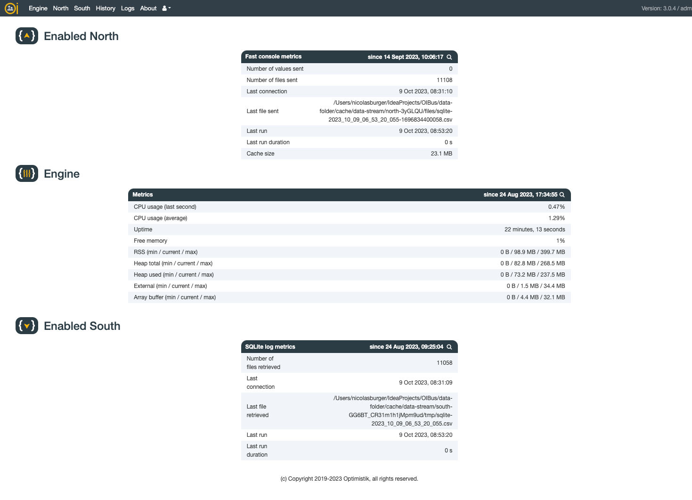
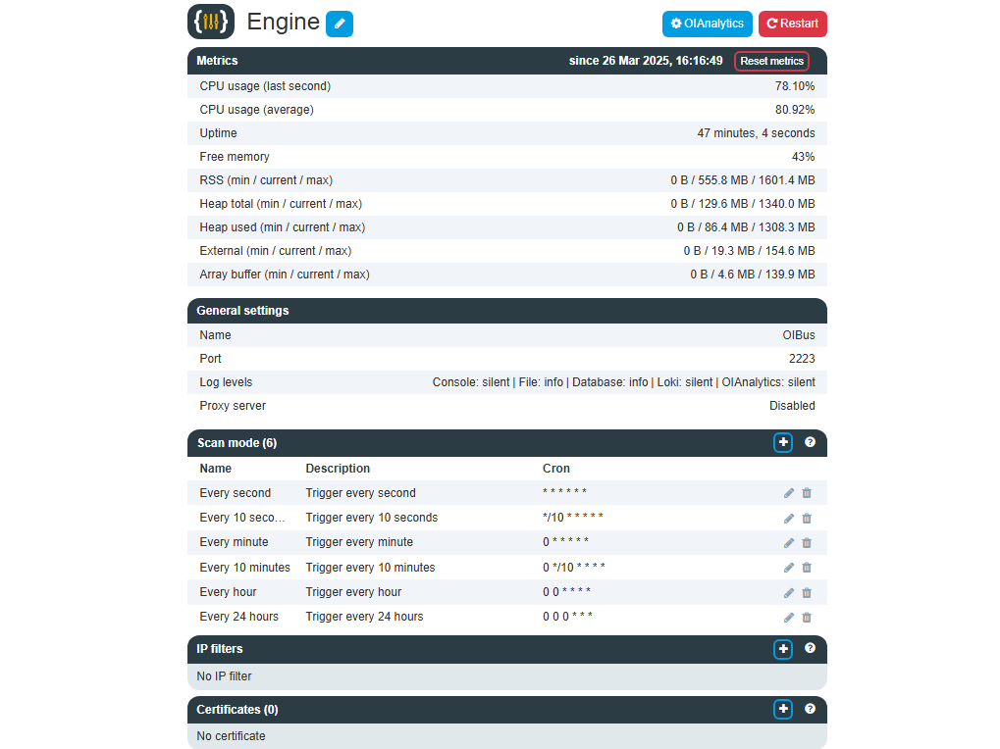
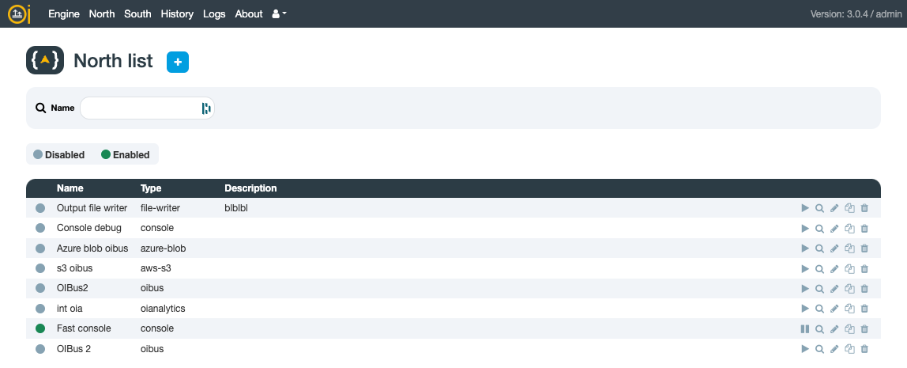
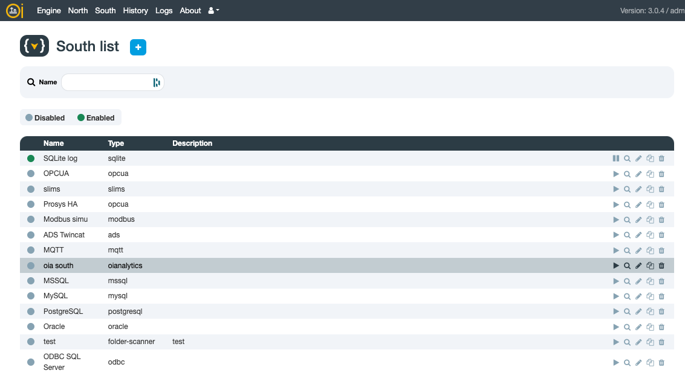
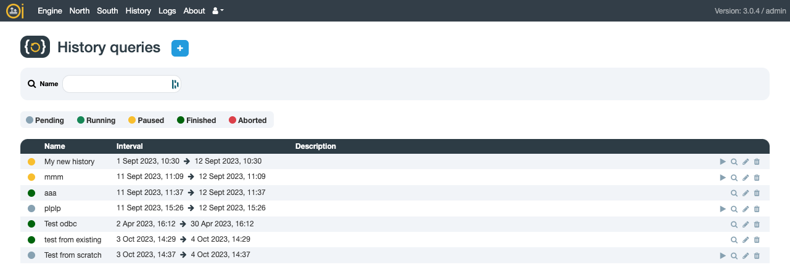
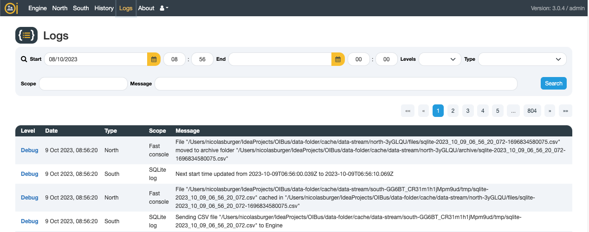
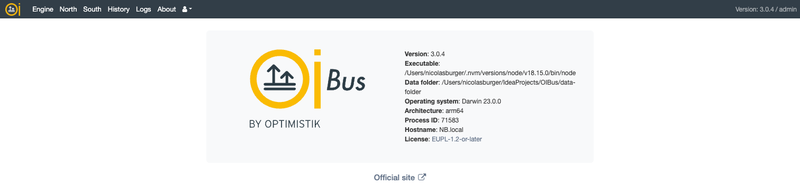
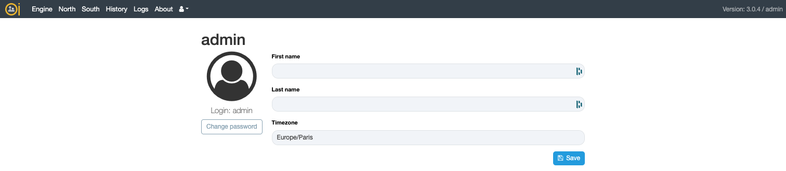

# First Access

Once OIBus is running, open a browser and navigate to `http://localhost:2223`.

:::caution Default credentials
The default login is **admin** with password **pass**.

Change the password immediately after your first login in the [User Settings](#user-settings) section.
:::

:::note Port configuration
The default port **2223** can be changed in [Engine Settings](../engine/engine-settings.mdx#oibus-port) if it conflicts with another service.
:::

## Home Page

The home page gives a real-time overview of your OIBus instance: enabled South and North connectors are listed with
their live metrics, and the engine status is shown at the top.

Click the **magnifying glass** icon next to any connector or the engine to open its display page, where you can
inspect detailed metrics and cache status.

## Engine

The engine page is the control centre for OIBus-wide settings. From here you can configure:

- [Engine settings](../engine/engine-settings.mdx) (name, port, proxy server)
- [Logging parameters](../engine/engine-settings.mdx#logging-parameters)
- [Scan Modes](../engine/scan-modes.mdx)
- [IP Filters](../engine/ip-filters.mdx)

:::note Restart button
The **Restart** button works only when OIBus is running as a system service. It signals the service manager
to stop and restart the process — the service itself handles the actual restart.

If OIBus is started manually (e.g. from a terminal), the restart button will stop the process without
bringing it back up automatically.
:::

:::tip Allow remote access
To access OIBus from another machine, add an IP filter — including via curl for automated setups.
See [IP Filters](../engine/ip-filters.mdx) for details.
:::

### Engine Metrics

The engine display page shows real-time resource usage for the OIBus process:

| Metric              | Description                                                                   |
| ------------------- | ----------------------------------------------------------------------------- |
| **CPU usage**       | Instantaneous CPU usage and rolling average over recent intervals.            |
| **Uptime**          | Time elapsed since the OIBus process last started.                            |
| **Free memory**     | Percentage of system memory currently available.                              |
| **RAM usage**       | Process memory resident in RAM — minimum, current, and maximum since startup. |
| **Heap total**      | Total memory allocated for the JavaScript heap.                               |
| **Heap used**       | Memory actively used within the heap.                                         |
| **External memory** | Memory used by native extensions (e.g., C++ bindings).                        |
| **Array buffer**    | Memory allocated for binary data buffers.                                     |

## North Connectors

North connectors define where OIBus sends data. Click **+** to add a new connector and choose from the available
types.

Each connector in the list has the following actions on the right-hand side:

- **Enable / Disable** — toggle the connector on or off without deleting it
- **Display** — open the connector's monitoring page (metrics, cache status, recent transmissions)
- **Edit** — modify the connector's settings
- **Duplicate** — create a copy of the connector with a new name
- **Delete** — permanently remove the connector

:::tip
Refer to the [North connectors guide](../north-connectors/common-settings.md) for details on cache settings,
throttling, and transformers.
:::

## South Connectors

South connectors define the data sources OIBus reads from. Click **+** to add a new connector and choose from the
available protocols.

Each connector in the list has the following actions on the right-hand side:

- **Enable / Disable** — toggle the connector on or off without deleting it
- **Display** — open the connector's monitoring page (metrics, last scan times, subscription status)
- **Edit** — modify the connector's settings
- **Duplicate** — create a copy of the connector with a new name
- **Delete** — permanently remove the connector

:::tip
Refer to the [South connectors guide](../south-connectors/common-settings.md) for details on scan modes,
items, and subscription-based protocols.
:::

## History Queries

History queries replay a time range of data through a South connector and forward it to a North connector.
Click **+** to create a new history query.

Each history query in the list has the following actions on the right-hand side:

- **Start / Pause** — begin or suspend the query execution
- **Display** — open the query's monitoring page (progress, metrics)
- **Edit** — modify the query's settings
- **Duplicate** — create a copy of the query
- **Delete** — permanently remove the query

:::tip
Refer to the [History Queries guide](../history-queries.md) for details on time range configuration and
execution controls.
:::

## Logs

The log page displays OIBus runtime logs and refreshes automatically every 10 seconds.

Use the filters to narrow down what you see:

| Filter         | Description                                                                            |
| -------------- | -------------------------------------------------------------------------------------- |
| **Date range** | Show only logs within a specific time window.                                          |
| **Level**      | Filter by severity: `trace`, `debug`, `info`, `warn`, `error`.                         |
| **Scope**      | Restrict logs to the engine, a South connector, a North connector, or a history query. |
| **Message**    | Search by free text within log message content.                                        |

Log verbosity is configured per destination (console, file, database, OIAnalytics) in
[Engine Settings → Logging Parameters](../engine/engine-settings.mdx#logging-parameters).

## About

The **About** page shows version and build information for the running OIBus instance, along with a link to this
documentation.

Use this page to confirm the exact version when reporting issues or checking compatibility with OIAnalytics.

## User Settings

The **User Settings** page lets you update your account password and set the timezone used for date and time
displays throughout the interface.

| Setting      | Description                                                          |
| ------------ | -------------------------------------------------------------------- |
| **Password** | Change the current user's login password.                            |
| **Timezone** | Select the timezone for all date/time values shown in the interface. |
