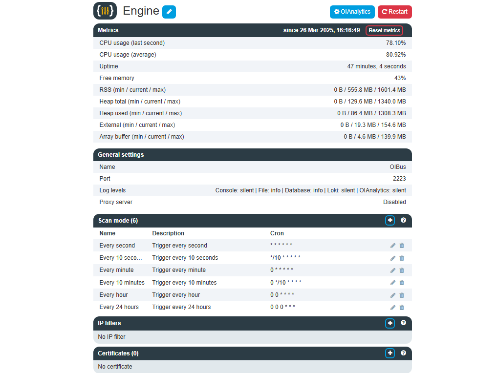
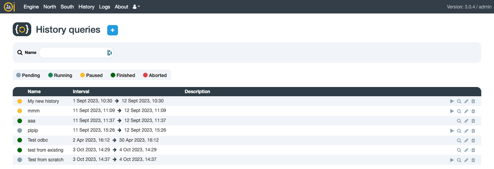
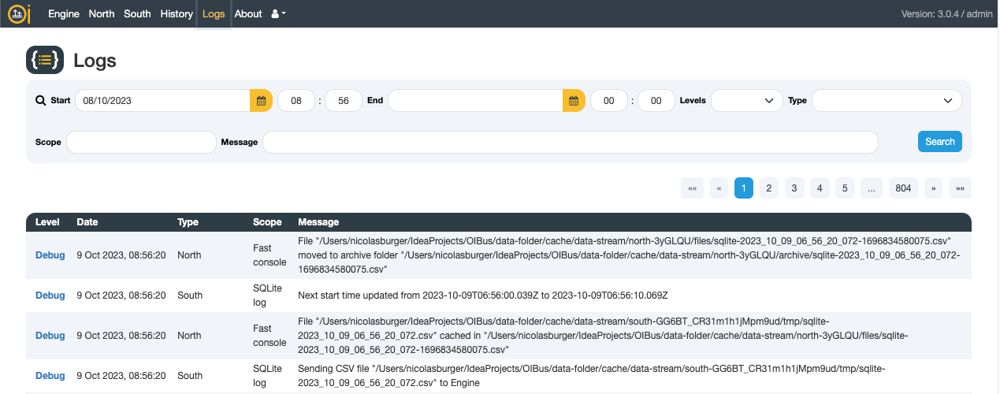
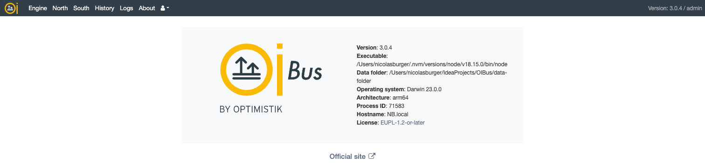

# First Access

Once OIBus is running, open a browser and navigate to `http://localhost:2223`.

:::caution Default credentials
The default login is **admin** with password **pass**.

Change the password immediately after your first login in the [User Settings](#user-settings) section.
:::

:::note Port configuration
The default port **2223** can be changed in [Engine Settings](../engine/engine-settings.mdx#port) if it conflicts with another service.
:::

## Home Page

The home page gives a real-time overview of your OIBus instance: enabled North connectors are listed with their
live metrics first, followed by the engine status, then the enabled South connectors.

Click the **magnifying glass** icon next to any connector or the engine to open its display page, where you can
inspect detailed metrics and cache status.

## Engine

The engine page is the control centre for OIBus-wide settings. From here you can configure:

- General settings (name)
- [Web server settings](../engine/engine-settings.mdx#web-server) (port, authentication duration)
- [Proxy server](../engine/engine-settings.mdx#proxy-server)
- [Logging parameters](../engine/engine-settings.mdx#logging-parameters)
- [Scan Modes](../engine/scan-modes.mdx)
- [IP Filters](../engine/ip-filters.mdx)
- Certificates
- Transformers

The **OIAnalytics** button at the top of the page opens the [OIAnalytics registration](./oianalytics.mdx) settings.

:::note Restart button
The **Restart** button stops the OIBus process. It comes back up automatically only when OIBus runs under the
**OIBus Launcher** (`oibus-launcher`), which is how the installed system service runs it — the launcher detects
that the OIBus process exited and starts it again.

If the `oibus` binary is started directly (e.g. from a terminal, without the launcher), the restart button will
stop the process without bringing it back up automatically.
:::

:::tip Allow remote access
To access OIBus from another machine, add an IP filter — including via curl for automated setups.
See [IP Filters](../engine/ip-filters.mdx) for details.
:::

### Engine Metrics

The engine display page shows real-time resource usage for the OIBus process, tracked since the last time metrics
were reset (a **Reset metrics** button is available on this page):

| Metric                                    | Description                                              |
| ----------------------------------------- | -------------------------------------------------------- |
| **CPU usage (last second)**               | CPU usage over the last second.                          |
| **CPU usage (average)**                   | Rolling average CPU usage since metrics were last reset. |
| **Uptime**                                | Time elapsed since the OIBus process last started.       |
| **Free memory**                           | Percentage of system memory currently available.         |
| **RAM usage (min / current / max)**       | Process memory resident in RAM since metrics were reset. |
| **Heap total (min / current / max)**      | Total memory allocated for the JavaScript heap.          |
| **Heap used (min / current / max)**       | Memory actively used within the heap.                    |
| **External memory (min / current / max)** | Memory used by native extensions (e.g., C++ bindings).   |
| **Array buffer (min / current / max)**    | Memory allocated for binary data buffers.                |

## North Connectors

North connectors define where OIBus sends data. Click **+** to add a new connector and choose from the available
types.

Each connector in the list has the following actions on the right-hand side:

- **Enable / Disable** — toggle the connector on or off without deleting it
- **Display** — open the connector's monitoring page (metrics, cache status, recent transmissions)
- **Edit** — modify the connector's settings
- **Duplicate** — create a copy of the connector with a new name
- **Delete** — permanently remove the connector

:::tip
Refer to the [North connectors guide](../north-connectors/common-settings.md) for details on cache settings,
throttling, and transformers.
:::

## South Connectors

South connectors define the data sources OIBus reads from. Click **+** to add a new connector and choose from the
available protocols.

Each connector in the list has the following actions on the right-hand side:

- **Enable / Disable** — toggle the connector on or off without deleting it
- **Display** — open the connector's monitoring page (metrics, last scan times, subscription status)
- **Edit** — modify the connector's settings
- **Duplicate** — create a copy of the connector with a new name
- **Delete** — permanently remove the connector

:::tip
Refer to the [South connectors guide](../south-connectors/common-settings.md) for details on scan modes,
items, and subscription-based protocols.
:::

## History Queries

History queries replay a time range of data through a South connector and forward it to a North connector.
Click **+** to create a new history query.

Each history query in the list has the following actions on the right-hand side, depending on its current status:

- **Start / Pause / Resume / Restart** — control the query's execution
- **Display** — open the query's monitoring page (progress, metrics)
- **Edit** — modify the query's settings
- **Duplicate** — create a copy of the query
- **Delete** — permanently remove the query

:::tip
Refer to the [History Queries guide](../history-queries.md) for details on time range configuration and
execution controls.
:::

## Logs

The log page displays OIBus runtime logs and refreshes automatically every 10 seconds.

Use the filters to narrow down what you see:

| Filter         | Description                                                                                   |
| -------------- | --------------------------------------------------------------------------------------------- |
| **Date range** | Show only logs within a specific time window.                                                 |
| **Level**      | Filter by severity, selected as clickable chips: `trace`, `debug`, `info`, `warn`, `error`.   |
| **Scope type** | Filter by category, also selected as clickable chips: engine, South, North, or history query. |
| **Scope**      | Restrict logs to a specific South connector, North connector, or history query.               |
| **Item**       | Restrict logs to a specific South/history query item.                                         |
| **Group**      | Restrict logs to a specific South item group.                                                 |
| **Message**    | Search by free text within log message content.                                               |

Log verbosity is configured per destination (console, file, database, Loki, Syslog, OIAnalytics) in
[Engine Settings → Logging Parameters](../engine/engine-settings.mdx#logging-parameters).

## About

The **About** page shows the OIBus version, launcher version, and runtime environment details (executable path,
data folder, operating system, architecture, process ID, hostname), along with a license link and a link to the
official OIBus site.

Use this page to confirm the exact version when reporting issues or checking compatibility with OIAnalytics.

## User Settings

The **User Settings** page lets you update your account's name, set the timezone used for date and time displays
throughout the interface, and change your login password.

| Setting        | Description                                                          |
| -------------- | -------------------------------------------------------------------- |
| **First name** | The user's first name.                                               |
| **Last name**  | The user's last name.                                                |
| **Timezone**   | Select the timezone for all date/time values shown in the interface. |
| **Password**   | Change the current user's login password (via a separate dialog).    |
