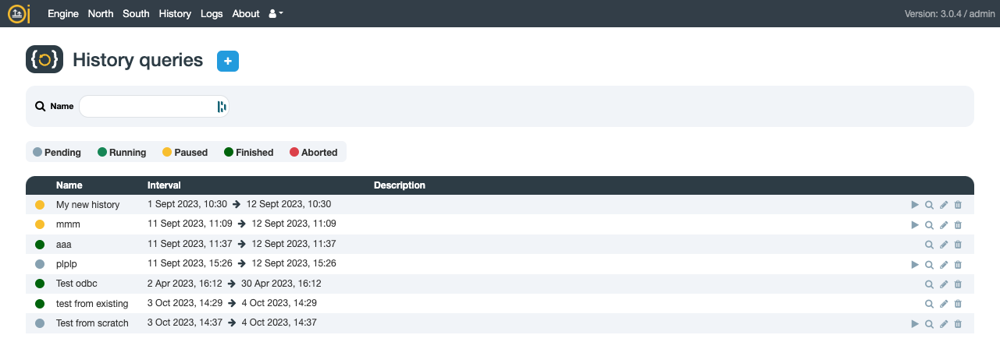

# First Access

OIBus configuration interface is available on http://localhost:2223.

:::caution Default access
By default, the user is **admin** and the password is **pass**.

We strongly advise to change the password in the [user settings](#user-settings).
:::

## Home Page

The OIBus home page shows enabled connectors and the engine with their associated metrics.

<div style={{ textAlign: 'center' }}></div>

The magnifying glass icon redirects you to the display page of the connector or of the engine.

## Engine

The engine page allows you to set [logging parameters](../engine/engine-settings.mdx#logging-parameters), [Scan Modes](../engine/scan-modes.md) and [IP Filters](../engine/ip-filters.md).

<div style={{ textAlign: 'center' }}></div>

:::note
The restart button and the shutdown button affect the engine only, not the service. It means it will shut down the connectors, but not the web service, which allows you to still access the OIBus interface.
:::

:::tip Allow remote access by adding an IP filter with curl
If you want to automatize the setup of OIBus, and access it remotely, you can send a curl command to accept connection from various IP addresses. Here is an example that accepts all IP addresses.

```bash
curl --location --request POST "http://localhost:2223/api/ip-filters" \
--header "Content-Type: application/json" \
--data-raw '{"address": "*", "description": "All"}' \
-u "admin\:pass"
```

:::

### Engine Metrics

These metrics provide insights into the resource usage and performance of the OIBus process:
Metric | Description |
|----------------------|-------------------------------------------------------------------------------------------------|
| **CPU usage** | Last second: `78.10%` (instantaneous), Average: `80.92%` (over time) |
| **Uptime** | `47 minutes, 4 seconds` (duration the process has been running) |
| **Free memory** | `43%` (available system memory) |
| **RAM usage** | min: `0 B` / current: `555.8 MB` / max: `1601.4 MB` (process memory in RAM) |
| **Heap total** | min: `0 B` / current: `129.6 MB` / max: `1340.0 MB` (memory allocated for heap) |
| **Heap used** | min: `0 B` / current: `86.4 MB` / max: `1308.3 MB` (actual memory in use) |
| **External memory** | min: `0 B` / current: `19.3 MB` / max: `154.6 MB` (memory for native extensions) |
| **Array buffer** | min: `0 B` / current: `4.6 MB` / max: `139.9 MB` (memory for binary data) |

## North Connectors

To add a North connector, simply click the "+" button.

<div style={{ textAlign: 'center' }}></div>

On the list's right-hand side, you have options to:

- Activate/deactivate a connector
- Access its display page or editing form
- Create a duplicate
- Delete it

## South Connectors

To add a South connector, simply click the "+" button.

<div style={{ textAlign: 'center' }}></div>

On the list's right-hand side, you have options to:

- Activate/deactivate a connector
- Access its display page or editing form
- Create a duplicate
- Delete it

## History Queries

To add a History query, simply click the "+" button.

<div style={{ textAlign: 'center' }}></div>

On the list's right-hand side, you have options to:

- Activate/deactivate a query
- Access its display page or editing form
- Create a duplicate
- Delete it

## Logs

The log page automatically refreshes every 10 seconds.

<div style={{ textAlign: 'center' }}></div>

Filter logs by:

- Dates
- Log level
- Log type (South, North, engine, etc.)
- Scope (connector/history query)
- Message content

## About

Information about the OIBus process and link to the documentation.

<div style={{ textAlign: 'center' }}></div>

## User Settings

Modify your password and select the timezone for date displays.

<div style={{ textAlign: 'center' }}></div>
