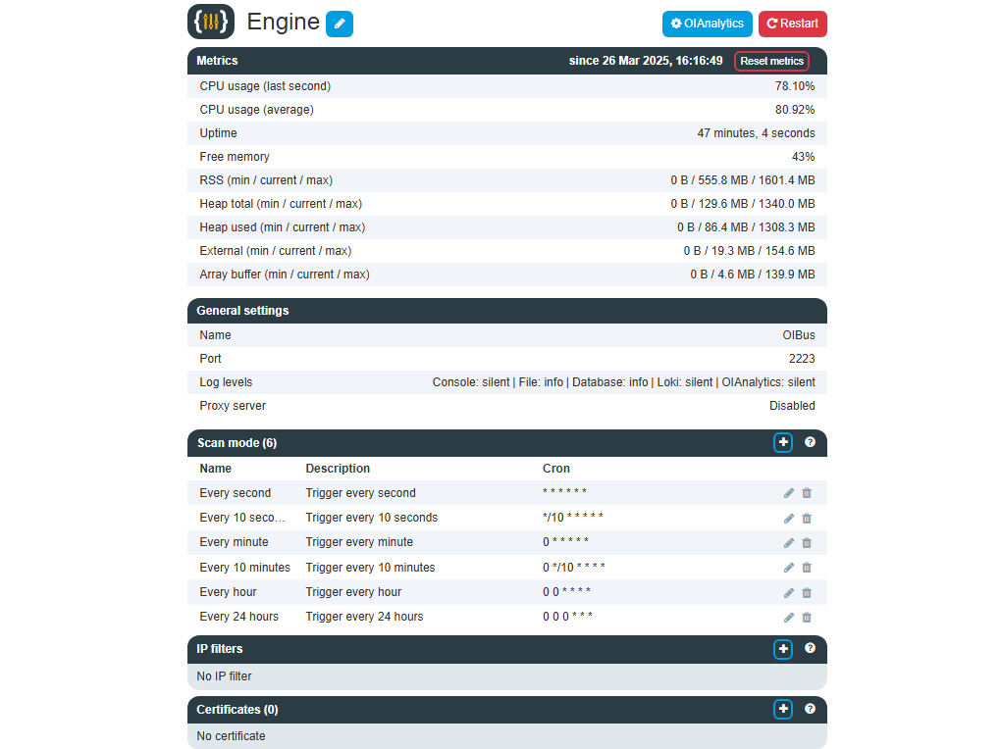
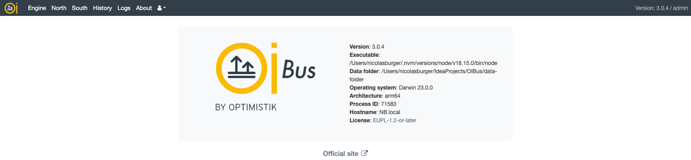

# First access

OIBus configuration interface is available on `http://localhost:2223`.

:::caution Default access
By default, the user is **admin** and the password is **pass**.

We strongly advise to change the password in the [user settings](#user-settings).
:::

## Home page

The OIBus home page show enabled connectors and the engine with their associated metrics.

<div style={{ textAlign: 'center' }}>


</div>

The magnifying glass icon redirect you to the display page of the connector or of the engine.

## Engine

The engine page allows you to set logger, [Scan Modes](../engine/scan-modes.md) and [IP Filters](../engine/ip-filters.md).

<div style={{ textAlign: 'center' }}>



</div>

The restart button and the shutdown button has an effect on the engine only, not on the service. It means it will shut down the connectors,
but not the web service, which allows you to still access the OIBus interface.

When installing OIBus, remember to choose an appropriate name. The _Engine name_ is important mainly if you use several OIBus and send the
logs to a remote [loki instance](../engine/engine-settings.mdx#loki) or when you register OIBus into OIAnalytics.

[Registering OIBus into OIAnalytics](../advanced/oianalytics-registration) is useful when sending data to a
[North OIAnalytics](../north-connectors/oianalytics) connector and when sending logs to OIAnalytics. From OIAnalytics, once registered, you
can update OIBus remotely or parse the logs.

:::tip Allow remote access by adding an IP filter with curl
If you want to automatize the setup of OIBus, and access it remotely, you can
send a curl command to accept connection from various IP addresses. Here is an example that accepts all IP addresses.

```curl title="curl command"
curl --location --request POST "http://localhost:2223/api/ip-filters" --header "Content-Type: application/json" --data-raw "{\"address\": \"*\", \"description\": \"All\" }" -u "admin:pass"
```

:::

### Engine metrics

These metrics provide insights into the resource usage and performance of the OIBus process, helping to identify potential bottlenecks or
inefficiencies. You can access these metrics in the dedicated "Metrics" section of the OIBus engine, and they are automatically logged every
10 minutes for historical analysis.

Below, you will find further details based on the example mentioned earlier.

**CPU usage (last second)**: `78.10%`

- This represents the instantaneous CPU usage of the process over the last second. A value of `78.10%` indicates high CPU usage at that
  moment.

**CPU usage (average)**: `80.92%`

- This shows the average CPU usage of the process over a period of time. An average of `80.92%` suggests consistently high CPU usage.

**Uptime**: `47 minutes, 4 seconds`

- This is the duration for which the process has been running.

**Free memory**: `43%`

- This indicates that 43% of the system memory is currently free.

**RAM usage**: **min**: `0 B` / **current**: `555.8 MB` / **max**: `1601.4 MB`

- The portion of memory (RSS - Resident Set Size) occupied by a process that is held in RAM. The current RSS is `555.8 MB`, with a maximum
  observed RSS of `1601.4 MB`.

**Heap**

- **Heap total**: **min**: `0 B` / **current**: `129.6 MB` / **max**: `1340.0 MB`
  - The total memory allocated for the heap, indicating the capacity for dynamic memory allocation. The current heap total is `129.6 MB`,
    with a maximum of `1340.0 MB`.
- **Heap used**: **min**: `0 B` / **current**: `86.4 MB` / **max**: `1308.3 MB`
  - The actual memory within the heap that is currently in use.. The current heap used is `86.4 MB`, with a maximum of `1308.3 MB`.

**External memory**: **min**: `0 B` / **current**: `19.3 MB` / **max**: `154.6 MB`

- Memory allocated outside the JavaScript heap, often for native extensions or libraries. The current external memory usage is `19.3 MB`,
  with a maximum of `154.6 MB`.

**Array buffer**: **min**: `0 B` / **current**: `4.6 MB` / **max**: `139.9 MB`

- Memory allocated for handling binary data directly in memory. The current array buffer memory usage is `4.6 MB`, with a maximum of
  `139.9 MB`.

## North

To add a North connector, simply click the "+" button.

On the list's right-hand side, you have the options to activate/deactivate a connector, access its display page or editing form, create a
duplicate, or delete it.

<div style={{ textAlign: 'center' }}>


</div>

## South

To add a South connector, simply click the "+" button.

On the list's right-hand side, you have the options to activate/deactivate a connector, access its display page or editing form, create a
duplicate, or delete it.

<div style={{ textAlign: 'center' }}>


</div>

## History

To add a History query, simply click the "+" button. You can then either create a History query from scratch or by importing existing South
or North settings.

On the list's right-hand side, you have the options to activate/deactivate a connector, access its display page or editing form, create a
duplicate, or delete it.

<div style={{ textAlign: 'center' }}>


</div>

## Logs

The log page automatically refreshes every 10 seconds. You have the ability to filter the logs based on dates, log level, log type (logs
generated by South, North, engine, etc.), scope (the connector or history query responsible for the log), or the content of the log message.

<div style={{ textAlign: 'center' }}>


</div>

## About

Information about the OIBus process and link to the documentation.

<div style={{ textAlign: 'center' }}>



</div>

## User settings

You can modify your password and select the timezone for how you'd like dates to appear in the interface.

<div style={{ textAlign: 'center' }}>


</div>
