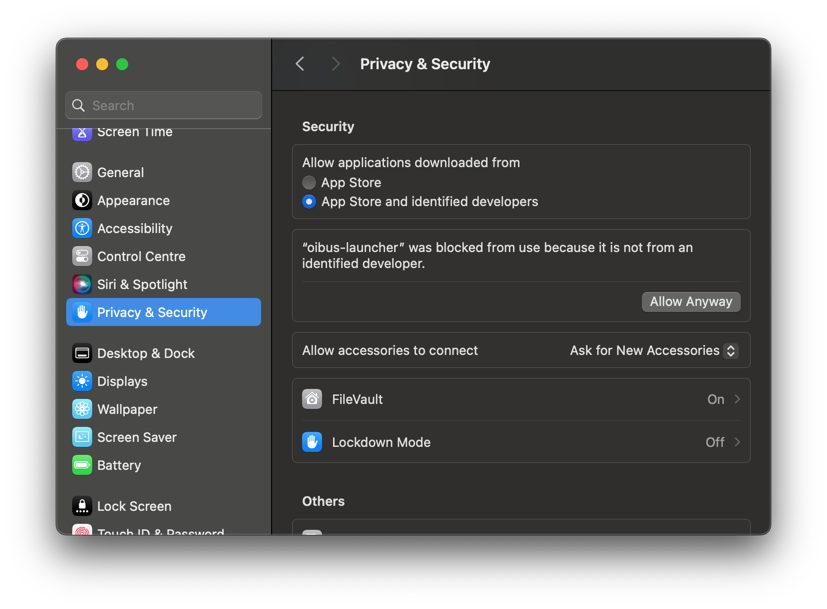

import CodeBlock from "@theme/CodeBlock";
import DownloadButton from "../../../src/components/DownloadButton";
import packageInfo from '../../../package.json'

# macOS
## Download

  <DownloadButton
    link={`https://github.com/OptimistikSAS/OIBus/releases/download/v${packageInfo.version}/oibus-macos_x64-v${packageInfo.version}.zip`}>
    

      
{`OIBus v${packageInfo.version}`}

      
MacOS (Intel chip)

    

  </DownloadButton>

macOS OIBus binary can be run through its executable. Once unzipped, start a Terminal and enter the following command:

<CodeBlock>
  {`./oibus-launcher --config ./data-folder`}
</CodeBlock>

The `./data-folder` path must be adapted according to the place where the OIBus cache and config will be stored and the binary
must be run from its own folder.

For example, if the binary is stored in `/bin/` and the cache and configuration files are stored in
`~/test/oibus-data`, the command will be:

<CodeBlock>
  {`cd /bin && ./oibus-launcher --config ~/test/oibus-data`}
</CodeBlock>

:::caution
Be sure to have admin permissions to run the binary
:::

:::caution Allow the app to be executed
On macOS, you may need to allow the execution of the binary. When first run, go to the System Settings, on the Privacy &
Security menu, and allow the oibus-launcher in the Security section by clicking on `Allow Anyway`.

  

This operation must be done twice:
- One for `oibus-launcher`
- One for `oibus` (run by `oibus-launcher`)
:::

Get familiar with the OIBus interface on the [first access page](./first-access.mdx).