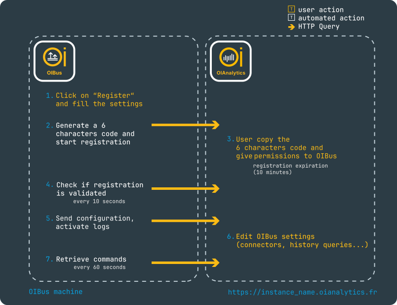

# OIAnalytics Registration

While OIBus can be used completely in standalone mode, registering your OIBus instance with OIAnalytics provides powerful remote management capabilities, centralized logging, and configuration synchronization. This registration is optional but recommended for organizations managing multiple OIBus instances or requiring centralized monitoring and control.

## Registration Process

### Step-by-Step Guide

  

**Initiate Registration** (1 and 2)

- Navigate to the OIBus Engine page
- Click the **OIAnalytics** button
- Complete the registration form and click **Register**

**Validation in OIAnalytics** (3)

- Access your OIAnalytics application
- Go to the OIBus section in configuration
- Locate your pending registration
- Enter the 6-character code (available on the OIBus registration screen or sent to the email address configured in OIAnalytics)
- Grant required permissions (API access is mandatory)

**Completion** (4 and 5)

- OIBus verifies registration status with OIAnalytics
- Upon success, OIBus sends its full configuration to OIAnalytics
- Log transmission begins (if enabled in [Engine Settings](../engine/engine-settings#logging-parameters))

**Ongoing Synchronization** (6 and 7)

- OIBus periodically checks for new commands from OIAnalytics
- Executes permitted commands and sends acknowledgments

## Registration Settings

### Network Configuration

| Parameter                            | Description                           | Details                                                      |
| ------------------------------------ | ------------------------------------- | ------------------------------------------------------------ |
| **Host**                             | OIAnalytics instance address          | Use full URL (e.g., `https://instance_name.oianalytics.com`) |
| **Accept unauthorized certificates** | Bypass HTTPS certificate verification | Only enable behind trusted proxies                           |
| **Use proxy**                        | Route requests through proxy          |                                                              |
| **Proxy URL**                        | Proxy server address                  | Format: `http://proxy.example.com:8080`                      |
| **Proxy credentials**                | Authentication for proxy              | Stored securely if required                                  |

### Timing Configuration

| Interval          | Default    | Description                                   |
| ----------------- | ---------- | --------------------------------------------- |
| Command retrieval | 60 seconds | Frequency of checking for new commands        |
| Command retry     | 5 seconds  | Delay before retrying failed command requests |
| Message retry     | 5 seconds  | Delay before retrying failed message delivery |

## OIAnalytics Integration in North Connectors

[North OIAnalytics](../north-connectors/oianalytics.md) connectors and history queries can leverage your existing OIAnalytics registration to streamline data transmission:

1. Go to your North OIAnalytics connector or history query configuration
2. Enable the **"Use OIAnalytics registration"** option
3. Save your configuration

:::tip Benefits of Using Registration

- **Automatic Authentication**: Uses your existing registered credentials
- **Consistent Routing**: Ensures all data follows the same secure path
- **Reduced Configuration**: No need to maintain separate connection parameters

:::

## OIAnalytics Logs

When enabled in [Engine Settings](../engine/engine-settings#logging-parameters):

- All OIBus logs are forwarded to OIAnalytics
- Accessible via OIAnalytics OIBus log page
- Retention follows OIAnalytics policies
- Searchable and filterable in OIAnalytics interface

## Command Architecture

### Secure Communication Flow

OIBus follows a **pull-based architecture** for command execution:

- OIBus **actively polls** OIAnalytics for new commands at regular intervals
- The polling frequency is configurable in the [timing settings](#timing-configuration)
- **No inbound connections** are required to your OIBus instance
- All communications are initiated by OIBus and use standard HTTPS (port 443)

:::info Firewall Requirements
For proper operation, your firewall only needs to allow:

- **Outbound HTTPS connections** (TCP port 443)
- To your OIAnalytics instance domain

While TCP is bidirectional at the protocol level, the application-level communication follows a strict one-way initiation pattern where OIBus always starts the connection. The response body contains any pending commands in JSON format.
:::

### Command Reference

OIBus supports these remote commands from OIAnalytics:

| Command                    | Description                         | Details                                                   |
| -------------------------- | ----------------------------------- | --------------------------------------------------------- |
| **Upgrade version**        | Update OIBus to specified version   |                                                           |
| **Restart**                | Gracefully restart OIBus service    |                                                           |
| **Update engine settings** | Apply new engine configuration      | Logging parameters, proxy...                              |
| **Regenerate cipher keys** | Create new encryption key pair      | Used to securely retrieve secrets friels from OIAnalytics |
| **Scan mode management**   | Create/update/delete scan modes     |                                                           |
| **North connector**        | Create/update/delete/test           | Manage North connectors                                   |
| **South connector**        | Create/update/delete/test           | Manage South connectors and items                         |
| **History query**          | Create/update/delete/test           | Manage History queries and items                          |
| **Setpoint**               | Retrieve setpoints from OIAnalytics | Dispatch setpoints to North connectors                    |

### Command Execution Flow

1. OIBus retrieves commands from OIAnalytics
2. Validates command permissions
3. Executes approved commands
4. Sends acknowledgment to OIAnalytics

### Version Upgrade Process

:::info Process Architecture Reminder
The OIBus service runs the `oibus-launcher` binary which:

1. Manages the main `oibus` process as a child process
2. Continuously monitors the `oibus` process state
3. When `oibus` stops (either normally or unexpectedly):

- Checks the update folder for new binaries
- If new binaries are present: performs backup and binary replacement
- If no new binaries are found: restarts the existing `oibus` binary

4. Automatically handles all upgrade and recovery operations

:::

The OIBus upgrade follows a secure, multi-step process designed to maintain data integrity and minimize downtime:

1. **Command Retrieval**

OIBus retrieves an upgrade command from OIAnalytics specifying the target version.

2. **Upgrade Execution**

OIBus automatically performs these steps:

- Downloads the specified version from GitHub releases through OIAnalytics (eliminating the need for direct GitHub access from the OIBus machine)
- Extracts the package contents to a temporary update folder
- Creates a complete backup of the current data folder
- Gracefully terminates the current OIBus process

3. **Launcher Operations**

The OIBus launcher then:

- Detects the new version in the update folder
- Replaces the existing binaries with the new version
- Restarts OIBus with the upgraded version

4. **Automatic Rollback**

Should any step fail during the upgrade:

- The launcher automatically restores the previous version
- Reverts to the backed-up data folder
- Restarts OIBus using the original configuration

:::danger Data Folder Size Impact
The upgrade process creates a complete backup of your data folder, requiring **at least twice your data folder size in free disk space**.

For large data folders:

- The backup process may require **significant time** to complete
- The process may fail if **insufficient disk space** is available

**Recommendations:**

- Verify available disk space before initiating upgrades
- Schedule upgrades during periods of low system activity

:::

## Security Architecture

### Secret Management

OIBus implements a **zero-trust security model** for sensitive credentials:

**Core Principles:**

- **No Secret Storage**: OIAnalytics never stores plaintext or encrypted secrets
- **Local Encryption**: All secrets remain encrypted on the OIBus instance
- **Asymmetric Protection**: Uses RSA public-key cryptography for secure transmission

### Encryption Workflow

1. **Configuration Synchronization**

When OIBus sends configuration to OIAnalytics:

- All secrets (passwords, tokens, API keys) are **automatically filtered out**
- Only non-sensitive configuration data is transmitted
- Secrets remain **locally encrypted** on the OIBus instance

2. **Secure Secret Entry**

When entering new secrets through OIAnalytics:

- The secret is **immediately encrypted** using OIBus's public key (RSA-OAEP)
- Encrypted data is transmitted to OIBus
- OIAnalytics **never sees** the plaintext secret

3. **Local Storage Protection**

On the OIBus instance:

- Secrets are **double-encrypted** before storage
- First with the public key during transit
- Then with local encryption before persistent storage
- Private key **never leaves** the OIBus instance

:::info Cryptographic Details

- **Algorithm**: RSA-OAEP (Optimal Asymmetric Encryption Padding)
- **Key Pair**: Unique per OIBus instance, generated during registration

Once on OIBus, secrets are [stored securely](../advanced/oibus-security.md).
:::

## Troubleshooting

### Common Issues

| Issue                  | Solution                                           |
| ---------------------- | -------------------------------------------------- |
| Registration fails     | Verify network connectivity to OIAnalytics         |
| Commands not executing | Check command permissions in OIAnalytics           |
| Upgrade failures       | Ensure sufficient disk space and write permissions |
| Connection errors      | Verify proxy settings and firewall rules           |

### Verification Steps

1. Check OIBus logs for errors
2. Verify network connectivity to OIAnalytics host
3. Confirm registration status in OIAnalytics interface
4. Review command permissions
