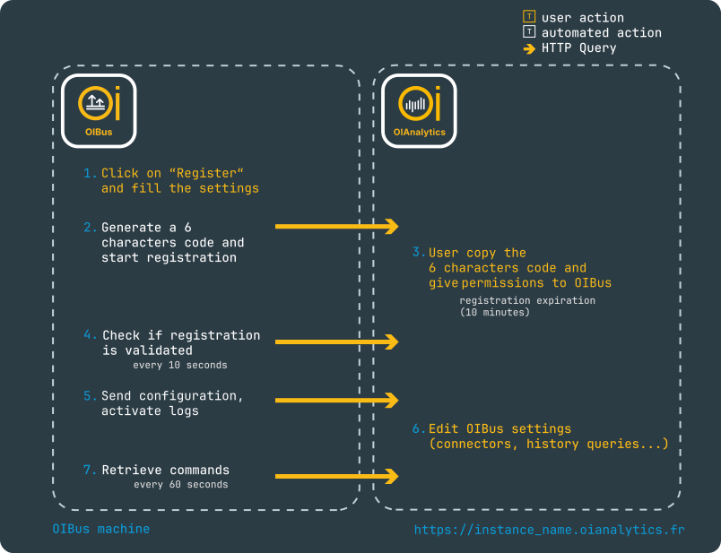

# OIAnalytics Registration

Registering OIBus with OIAnalytics® is optional, but it unlocks centralized remote management: configuration
synchronization, remote command execution, log forwarding, and streamlined upgrades — all without requiring
inbound access to the OIBus machine.

## Registration Process

  

**1 – 2 · Initiate registration**

- Navigate to the **Engine** page in OIBus.
- Click the **OIAnalytics** button, fill in the registration form, and click **Register**.

**3 · Validate in OIAnalytics**

- In OIAnalytics, go to **Configuration → OIBus** and locate the pending registration.
- Enter the **6-character code** displayed on the OIBus registration screen (also sent to the email address
  configured in OIAnalytics).
- Grant the required permissions — **API access is mandatory**.

**4 – 5 · Completion**

- OIBus polls OIAnalytics to confirm the registration was approved.
- On success, OIBus sends its full configuration (secrets excluded — see [Secret Management](#secret-management))
  to OIAnalytics.
- Log forwarding starts if enabled in [Engine Settings → Logging Parameters](../engine/engine-settings.mdx#logging-parameters).

**6 – 7 · Ongoing synchronization**

- OIBus periodically polls OIAnalytics for new commands.
- Each command is validated, executed, and acknowledged.

## Registration Settings

### Network Configuration

| Setting                              | Description                                                              | Example Value                              |
| ------------------------------------ | ------------------------------------------------------------------------ | ------------------------------------------ |
| **Host**                             | URL of the OIAnalytics instance.                                         | `https://instance_name.oianalytics.com`    |
| **Accept unauthorized certificate**  | Accept self-signed or otherwise untrusted TLS certificates.              | Enabled/Disabled                           |
| **Use proxy**                        | Route OIAnalytics requests through a proxy server.                       | Enabled/Disabled                           |
| **Proxy URL**                        | URL of the proxy server. Required when **Use proxy** is enabled.         | `http://proxy.example.com:8080`            |
| **Proxy username**                   | Username for proxy authentication (if required).                         | `proxy_user`                               |
| **Proxy password**                   | Password for proxy authentication (if required).                         | `••••••••`                                 |
| **Use API gateway**                  | Route requests through an API gateway instead of calling OIAnalytics directly. | Enabled/Disabled                    |
| **API gateway header key**           | HTTP header name sent to authenticate against the gateway. Required when **Use API gateway** is enabled. | `X-Api-Key` |
| **API gateway header value**         | Secret value for the gateway header (stored encrypted). Required when **Use API gateway** is enabled.   | `••••••••`  |
| **API gateway base endpoint**        | Path prefix prepended to every OIAnalytics API path when routing through the gateway. Required when **Use API gateway** is enabled. | `/oianalytics` |

### Timing Configuration

| Setting                       | Description                                             | Default    |
| ----------------------------- | ------------------------------------------------------- | ---------- |
| **Command check interval**    | How often OIBus polls OIAnalytics for new commands.     | `60 s`     |
| **Command retry interval**    | Delay before retrying a failed command request.         | `5 s`      |
| **Message retry interval**    | Delay before retrying a failed message delivery.        | `5 s`      |

## Using the Registration in Connectors

Once registered, the [OIAnalytics South Connector](../south-connectors/oianalytics.mdx),
the [OIAnalytics North Connector](../north-connectors/oianalytics.md), and history queries can reuse the
registration settings instead of requiring separate connection parameters:

1. Open the connector or history query configuration.
2. Enable **Use OIAnalytics registration**.
3. Save — host, authentication, and proxy are inherited from the registration automatically.

## Log Forwarding

When the OIAnalytics log level is enabled in
[Engine Settings → Logging Parameters](../engine/engine-settings.mdx#logging-parameters), OIBus forwards its
logs to OIAnalytics. The forwarding frequency and minimum log level depend on the logging configuration — logs
are batched and sent according to those settings, not streamed continuously. Forwarded logs are searchable and
filterable in the OIAnalytics OIBus log page, and their retention follows OIAnalytics policies.

## Command Architecture

### Pull-Based Communication

OIBus uses a **pull-based model** — it initiates all communication with OIAnalytics. This means:

- No inbound network connections are required to the OIBus machine.
- All traffic uses outbound **HTTPS on port 443**.
- OIBus polls OIAnalytics at the configured interval and reads any pending commands from the response body.

:::info Firewall requirements
Only **outbound HTTPS (TCP 443)** to the OIAnalytics domain needs to be allowed. No inbound rules are required.
:::

### Supported Commands

| Command                      | Description                                                              |
| ---------------------------- | ------------------------------------------------------------------------ |
| **Upgrade version**          | Download and install a new OIBus version.                                |
| **Restart**                  | Restart the OIBus service.                                               |
| **Update engine settings**   | Apply new engine configuration (logging, proxy…).                        |
| **Regenerate cipher keys**   | Generate a new RSA key pair for secret encryption.                       |
| **Scan mode management**     | Create, update, or delete scan modes.                                    |
| **North connector**          | Create, update, delete, or test North connectors.                        |
| **North connector cache**    | Search, retrieve, or delete cached content in a North connector's cache. |
| **South connector**          | Create, update, delete, or test South connectors and their items.        |
| **History query**            | Create, update, delete, or test history queries and their items.         |
| **History query cache**      | Search, retrieve, or delete cached content in a history query's cache.   |
| **Custom transformer**       | Create, update, delete, or test custom transformers.                     |
| **Setpoint**                 | Receive setpoint values from OIAnalytics and dispatch them to North connectors. |

### Version Upgrade Process

Upgrades are downloaded through OIAnalytics, so the OIBus machine does not need direct access to GitHub.

1. OIBus receives an upgrade command with the target version.
2. OIBus downloads the package through OIAnalytics, extracts it to a temporary update folder, backs up the
   current data folder, then shuts down gracefully.
3. The **OIBus launcher** (`oibus-launcher`) detects the new binaries, replaces the existing ones, and restarts
   OIBus with the upgraded version.
4. If any step fails, the launcher automatically restores the backed-up binaries and data folder.

:::info Launcher architecture
`oibus-launcher` runs the main `oibus` process as a child process. Whenever `oibus` stops — whether normally or
unexpectedly — the launcher checks the update folder: if new binaries are present it upgrades, otherwise it
restarts the existing binary. This handles both upgrades and crash recovery automatically.
:::

:::danger Disk space requirement
The upgrade creates a full backup of the data folder, so you need **at least twice the current data folder size**
in free disk space. Verify available space and schedule upgrades during low-activity periods.
:::

## Security Architecture

### Secret Management

OIBus uses a **zero-trust model** to ensure secrets (passwords, tokens, API keys) never leave the OIBus machine
in plaintext:

- When OIBus sends its configuration to OIAnalytics, all secrets are **stripped out** before transmission.
  Only non-sensitive settings are synchronized.
- When a secret is entered through OIAnalytics, it is **immediately encrypted with OIBus's RSA public key**
  (RSA-OAEP) in the browser before being transmitted. OIAnalytics never sees the plaintext value.
- On the OIBus machine, secrets are stored with local encryption. The private key never leaves the OIBus instance.

Use the **Regenerate cipher keys** command to rotate the RSA key pair. After regeneration, secrets stored in
OIAnalytics must be re-entered since the old ciphertext can no longer be decrypted.

:::info Cryptographic details
**Algorithm**: RSA-OAEP — a unique key pair is generated per OIBus instance during registration.

Once on the OIBus machine, secrets are stored using the [OIBus security model](../advanced/oibus-security.md).
:::

## Troubleshooting

| Issue                   | What to check                                              |
| ----------------------- | ---------------------------------------------------------- |
| Registration fails      | Network connectivity and firewall rules to OIAnalytics.    |
| Code not accepted       | Ensure the 6-character code matches and has not expired.   |
| Commands not executing  | Command permissions granted in OIAnalytics.                |
| Upgrade fails           | Available disk space and write permissions on data folder. |
| Connection errors       | Proxy settings, certificate trust, and firewall rules.     |
