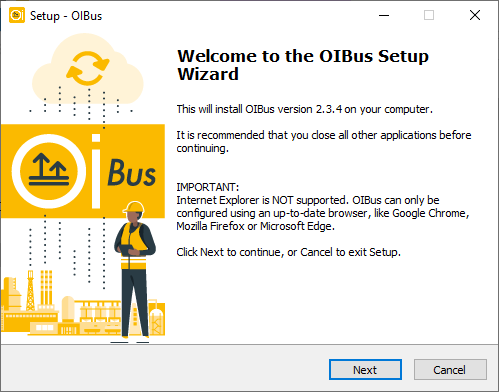
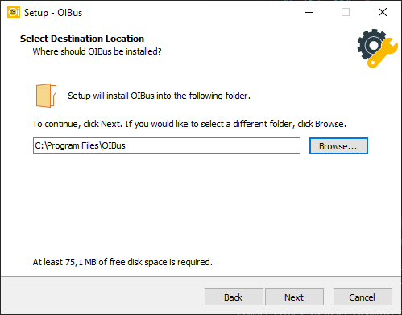
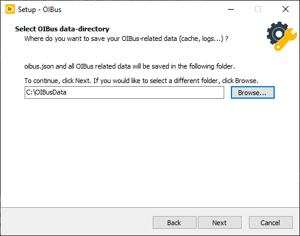
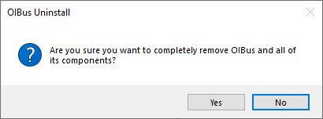
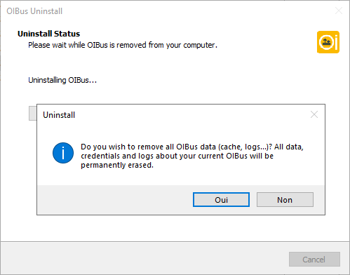

# Windows
## Installation
### With the Windows Installer
1. Run the Windows Installer, you should see the following welcome screen:

<div style={{textAlign: 'center'}}>

  

</div>


2. Accept the EU-PL license and the OPCHDA license.

3. Choose the path where you want to install the binaries.

<div style={{textAlign: 'center'}}>

  

</div>

4. Choose the path where you want to store the cache, logs and configuration files

<div style={{textAlign: 'center'}}>

  

</div>

5. Validate the settings and wait for the installer to extract and copy the files in the appropriate folder.

<div style={{textAlign: 'center'}}>

  

</div>

6. The final screen confirms the installation.

:::caution Browser support
Note that Internet Explorer is not supported.
:::

### With the installation bat script
``` commandline title="Usage"
install.bat <data-path>
```

``` commandline title="Example with terminal outputs"
install.bat C:\OIBusData
> Administrator permissions required. Detecting permission...
> Stopping OIBus service...
> Installing OIBus as Windows service...
> The "OIBus" service has been successfully installed!
> Configuration of the "AppDirectory" parameter value for the "OIBus" service.
> nssm set OIBus AppNoConsole 1
> Starting OIBus service...
> OIBus: START: Operation successful.
> Creating go.bat
> echo Stopping OIBus service... You can restart it from the Windows Service Manager
> nssm.exe stop OIBus
> "C:\Users\Administrator\Downloads\oibus-win_x64\oibus.exe" --config "C:\OIBusData"
```

:::tip
If you omit the data path argument, it will be asked as input when running the script
:::

## Uninstall
### With the Windows Uninstaller
Go to the binary folder and run with administration privileges the `unin000.exe` file.

<div style={{textAlign: 'center'}}>

  

</div>

<div style={{textAlign: 'center'}}>

  

</div>


### With the uninstallation bat script
```` title="Example with terminal outputs"
uninstall.bat
Administrator permissions required. Detecting permission...
Stopping OIBus service...
Removing OIBus service...
````

:::caution
The data folder must be removed manually
:::

## Update
### With the Windows Installer
In case of OIBus update, you can use the OIBus Windows Installer and specify the already existing executable and
config path. You can choose to keep the existing configuration file or overwrite it.

During the update, OIBus service will be stopped briefly.

The configuration database `oibus.db` will be updated to its latest version during the first startup.

### With binaries (from zip file)
Once you unzip the files from the zip file:

1. Go to the Windows service manager.
2. Stop the OIBus service.
3. Copy and paste the content of the zip file into the OIBus executable folder. Overwrite all existing files.
4. Start the OIBus service.

The configuration database `oibus.db` will be updated to its latest version during the first startup.
