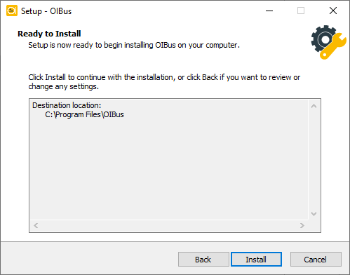
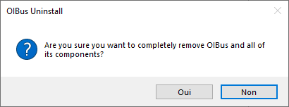

import DownloadButton from "../../../src/components/DownloadButton";
import packageInfo from '../../../package.json'


# Windows
## Download
<div style={{ display: "flex", justifyContent: "space-around" }}>
  <DownloadButton link={`https://github.com/OptimistikSAS/OIBus/releases/download/v${packageInfo.version}/oibus-setup-win_x64-v${packageInfo.version}.exe`}>
    <div>
      <div>{`OIBus v${packageInfo.version} (installer)`}</div>
      <div>Windows (x64)</div>
    </div>
  </DownloadButton>
  <DownloadButton link={`https://github.com/OptimistikSAS/OIBus/releases/download/v${packageInfo.version}/oibus-win_x64-v${packageInfo.version}.zip`}>
    <div>
      <div>{`OIBus v${packageInfo.version} (zip)`}</div>
      <div>Windows (x64)</div>
    </div>
  </DownloadButton>
</div>

## Installation
### With the Windows Installer
1. Run the Windows Installer, you should see the following welcome screen:

<div style={{textAlign: 'center'}}>

  

</div>


2. Accept the EU-PL license.

3. Choose the path where you want to install the binaries.

<div style={{textAlign: 'center'}}>

  

</div>

4. Select the directory where you'd like to store the cache, logs, and configuration files.

<div style={{textAlign: 'center'}}>

  

</div>

5. Confirm the settings and await the installer to extract and copy the files to the designated folder.

<div style={{textAlign: 'center'}}>

  

</div>

6. The last screen will confirm the completion of the installation process.

:::caution Browser support
Note that Internet Explorer is not supported.
:::

Get familiar with the OIBus interface on the [first access page](./first-access.mdx).

### With the installation bat script
``` commandline title="Usage"
install.bat <data-path>
```

``` commandline title="Example with terminal outputs"
install.bat C:\OIBusData
> Administrator permissions required. Detecting permission...
> Stopping OIBus service...
> Installing OIBus as Windows service...
> The "OIBus" service has been successfully installed!
> Configuration of the "AppDirectory" parameter value for the "OIBus" service.
> nssm set OIBus AppNoConsole 1
> Starting OIBus service...
> OIBus: START: Operation successful.
> Creating go.bat
> echo Stopping OIBus service... You can restart it from the Windows Service Manager
> nssm.exe stop OIBus
> "C:\Users\Administrator\Downloads\oibus-win_x64\oibus.exe" --config "C:\OIBusData"
```

:::tip
If you do not provide the data path argument, the script will prompt you to input it during execution.
:::

Get familiar with the OIBus interface on the [first access page](./first-access.mdx).

## Uninstall
### With the Windows Uninstaller
Navigate to the binary folder and execute the `unin000.exe` file with administrative privileges.

<div style={{textAlign: 'center'}}>

  

</div>

<div style={{textAlign: 'center'}}>

  

</div>


### With the uninstallation batch script
```` title="Example with terminal outputs"
uninstall.bat
Administrator permissions required. Detecting permission...
Stopping OIBus service...
Removing OIBus service...
````

:::caution
The data folder must be removed manually.
:::

## Update
### With the Windows Installer
If you wish to update OIBus, you can utilize the OIBus Windows Installer and indicate the current executable and configuration
paths. You have the option to retain the existing configuration file or replace it.

During the update process, the OIBus service will experience a brief interruption.

Upon the initial startup after the update, the configuration database `oibus.db` will be automatically upgraded to the
latest version.

### With binaries (from zip file)
After extracting the files from the zip archive:
1. Open the Windows Service Manager.
2. Halt the OIBus service.
3. Copy and paste the contents of the zip file into the OIBus executable directory, replacing any existing files.
4. Resume the OIBus service.

Upon the initial startup after the update, the configuration database `oibus.db` will be automatically upgraded to the
latest version.

