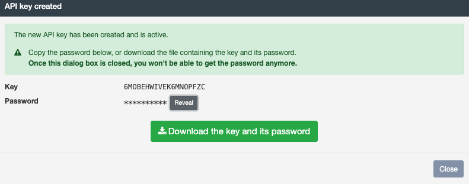

# OIAnalytics®

The **OIAnalytics® North Connector** sends files and values to the **OIAnalytics® SaaS application**, supporting both **JSON payloads** and **file-based data**.

OIAnalytics® can process:

- **JSON time-values payloads**: Formatted data points from South protocols (e.g., OPC UA, MQTT).
- **Files**: Transmitted as-is (compressed or uncompressed). Supported formats include CSV, TXT, and XLSX.

OIAnalytics® includes **built-in file parsers**, eliminating the need for pre-processing. Parsing is configured directly in the SaaS application.

**Example Use Cases**:

- **Real-time Analytics**: Send JSON payloads for immediate processing.
- **Historical Data Storage**: Transmit files for archiving and analysis.
- **Integration**: Combine with OIAnalytics® dashboards, alerts, and analysis tools.

## Specific Settings

| Setting                          | Description                                                                                          |
| -------------------------------- | ---------------------------------------------------------------------------------------------------- |
| **Use OIAnalytics registration** | Use connection settings from [OIAnalytics registration](../installation/oianalytics.mdx).            |
| **Timeout**                      | Duration (in milliseconds) before a connection failure is reported.                                  |
| **Compress data**                | Compress data if not already compressed. Adds `.gz` extension to files and compresses JSON payloads. |

### Manual Configuration (if registration is not used)

| Setting                             | Description                                                                                  |
| ----------------------------------- | -------------------------------------------------------------------------------------------- |
| **Host**                            | Hostname of the OIAnalytics® SaaS application (e.g., `https://optimistik.oianalytics.com`). |
| **Accept unauthorized certificate** | Enable if HTTP queries pass through a firewall that strips certificates.                     |

#### Authentication Methods

Choose one of the following authentication methods:

| Method                       | Description                                      | Required Parameters                      |
| ---------------------------- | ------------------------------------------------ | ---------------------------------------- |
| **Access key/Secret**        | Standard authentication using access keys.       | Access key, Secret                       |
| **Azure AD (Client Secret)** | Use Azure Active Directory with a client secret. | Tenant ID, Client ID, Client Secret      |
| **Azure AD (Certificate)**   | Use Azure Active Directory with a certificate.   | Tenant ID, Client ID, Certificate, Scope |

#### Proxy Configuration

| Setting            | Description                                                      |
| ------------------ | ---------------------------------------------------------------- |
| **Use proxy**      | Route requests through a proxy.                                  |
| **Proxy URL**      | URL of the proxy server (e.g., `http://proxy.example.com:8080`). |
| **Proxy username** | Username for proxy authentication (if required).                 |
| **Proxy password** | Password for proxy authentication (if required).                 |

For proxy settings with OIAnalytics registration, see [OIAnalytics Registration](../installation/oianalytics.mdx).

## Connecting OIBus to OIAnalytics®

### Recommended Approach: OIAnalytics Registration

1. **Register OIBus** on OIAnalytics® for seamless integration and secure communication.
2. Enable **Use OIAnalytics registration** in the North connector settings.
   - This eliminates the need to manually transfer API keys, enhancing security.

:::tip OIBus Registration in OIAnalytics®
For the complete registration procedure, refer to the [OIAnalytics registration guide](../installation/oianalytics.mdx).
:::

### Alternative Approach: API Key Authentication

If you choose not to register OIBus on OIAnalytics®, obtain an API key:

1. In OIAnalytics®, navigate to **Configuration → Users**.
2. Select the user and click the **key icon** to generate an API key.
3. Copy and securely store both the **API key** and its associated password.
4. Enter the API key and secret key in OIBus.

:::danger Password Retrieval
The password is **only displayed once** during API key generation. If lost, you must generate a new API key.
:::

:::tip API User Management

- Create a **dedicated API user** in OIAnalytics® with exclusive API access.
- Assign a **unique API key** to each OIBus instance for easier management and security.

:::

## Data Format

- OIBus **time values** are sent as **JSON payloads** to OIAnalytics®.
- OIAnalytics® directly references external data in time values `pointId` field (no file parser needed).
