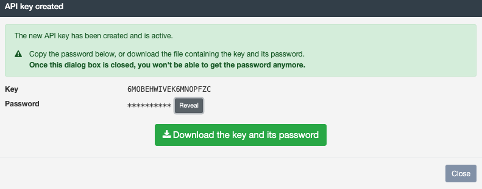

# OIAnalytics®

The **OIAnalytics® North Connector** sends files and values to the **OIAnalytics® SaaS application**, supporting both **JSON payloads** and **file-based data**.

OIAnalytics® can process:

- **JSON time-values payloads**: Formatted data points from South protocols (e.g., OPC UA, MQTT).
- **Files**: Transmitted as-is (compressed or uncompressed). Supported formats include CSV, TXT, and XLSX.

OIAnalytics® includes **built-in file parsers**, eliminating the need for pre-processing. Parsing is configured directly in the SaaS application.

**Example Use Cases**:

- **Real-time Analytics**: Send JSON payloads for immediate processing.
- **Historical Data Storage**: Transmit files for archiving and analysis.
- **Integration**: Combine with OIAnalytics® dashboards, alerts, and analysis tools.

## Specific Settings

| Setting                          | Description                                                                                          | Example Value    |
| -------------------------------- | ---------------------------------------------------------------------------------------------------- | ---------------- |
| **Use OIAnalytics registration** | Use connection settings from [OIAnalytics registration](../installation/oianalytics.mdx).            | Enabled/Disabled |
| **Timeout**                      | Duration (in milliseconds) before a connection failure is reported.                                  | `30000`          |
| **Compress data**                | Compress data if not already compressed. Adds `.gz` extension to files and compresses JSON payloads. | Enabled/Disabled |

### Manual Configuration (if registration is not used)

| Setting                             | Description                                                              | Example Value                        |
| ----------------------------------- | ------------------------------------------------------------------------ | ------------------------------------ |
| **Host**                            | Hostname of the OIAnalytics® SaaS application.                           | `https://optimistik.oianalytics.com` |
| **Accept unauthorized certificate** | Enable if HTTP queries pass through a firewall that strips certificates. | Enabled/Disabled                     |

#### Authentication

| Setting            | Description                                                                        | Example Value                                                                                               |
| ------------------ | ---------------------------------------------------------------------------------- | ----------------------------------------------------------------------------------------------------------- |
| **Authentication** | Authentication method.                                                             | `Access key/Secret`, `Azure Active Directory with client secret`, `Azure Active Directory with certificate` |
| **Access key**     | Access key. Required for Access key/Secret.                                        | `my-access-key`                                                                                             |
| **Secret**         | Secret key. Required for Access key/Secret.                                        | `••••••••`                                                                                                  |
| **Tenant ID**      | Azure AD tenant ID. Required for AAD methods.                                      | `xxxxxxxx-xxxx-xxxx-xxxx-xxxxxxxxxxxx`                                                                      |
| **Client ID**      | Application (client) ID. Required for AAD methods.                                 | `xxxxxxxx-xxxx-xxxx-xxxx-xxxxxxxxxxxx`                                                                      |
| **Client secret**  | Application client secret. Required for Azure Active Directory with client secret. | `••••••••`                                                                                                  |
| **Certificate**    | Application certificate. Required for Azure Active Directory with certificate.     | (selected from list)                                                                                        |
| **Scope**          | OAuth2 scope. Required for Azure Active Directory with certificate.                | `https://example.com/.default`                                                                              |

#### Proxy Configuration

If your network infrastructure requires requests to pass through a proxy server to reach OIAnalytics®, enable
**Use proxy** and configure the proxy details below.

| Setting            | Description                                      | Example Value                   |
| ------------------ | ------------------------------------------------ | ------------------------------- |
| **Use proxy**      | Route requests through a proxy server.           | Enabled/Disabled                |
| **Proxy URL**      | URL of the proxy server.                         | `http://proxy.example.com:8080` |
| **Proxy username** | Username for proxy authentication (if required). | `proxy_user`                    |
| **Proxy password** | Password for proxy authentication (if required). | `••••••••`                      |

## Connecting OIBus to OIAnalytics®

### Recommended Approach: OIAnalytics Registration

1. **Register OIBus** on OIAnalytics® for seamless integration and secure communication.
2. Enable **Use OIAnalytics registration** in the North connector settings.
   - This eliminates the need to manually transfer API keys, enhancing security.

:::tip OIBus Registration in OIAnalytics®
For the complete registration procedure, refer to the [OIAnalytics registration guide](../installation/oianalytics.mdx).
:::

### Alternative Approach: API Key Authentication

If you choose not to register OIBus on OIAnalytics®, obtain an API key:

1. In OIAnalytics®, navigate to **Configuration → Users**.
2. Select the user and click the **key icon** to generate an API key.
3. Copy and securely store both the **API key** and its associated password.
4. Enter the API key and secret key in OIBus.

:::danger Password Retrieval
The password is **only displayed once** during API key generation. If lost, you must generate a new API key.
:::

:::tip API User Management

- Create a **dedicated API user** in OIAnalytics® with exclusive API access.
- Assign a **unique API key** to each OIBus instance for easier management and security.

:::

## Data Format

- OIBus **time values** are sent as **JSON payloads** to OIAnalytics®.
- OIAnalytics® directly references external data in time values `pointId` field (no file parser needed).
