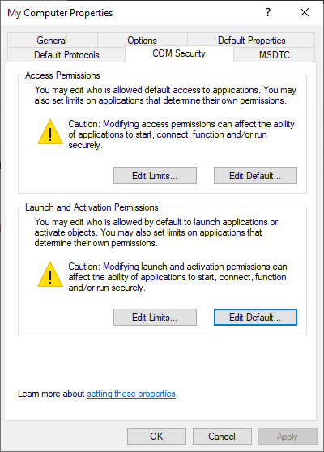
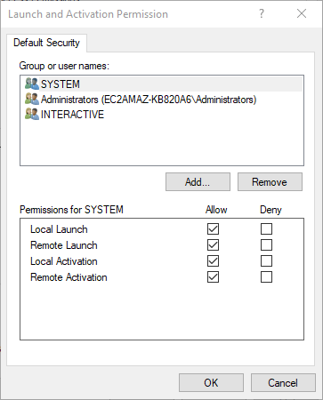
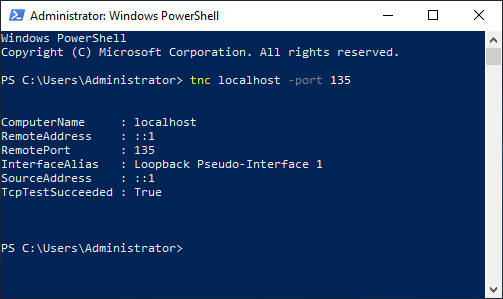
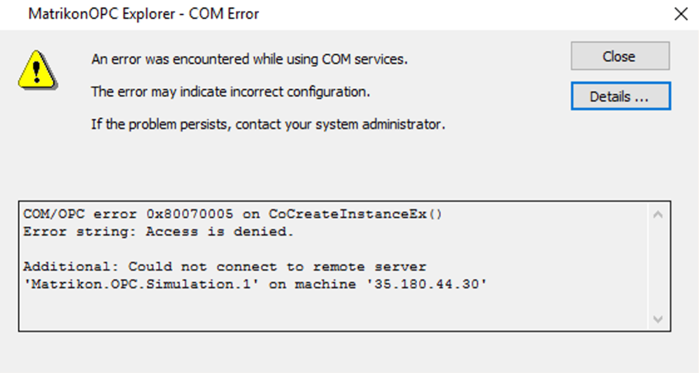
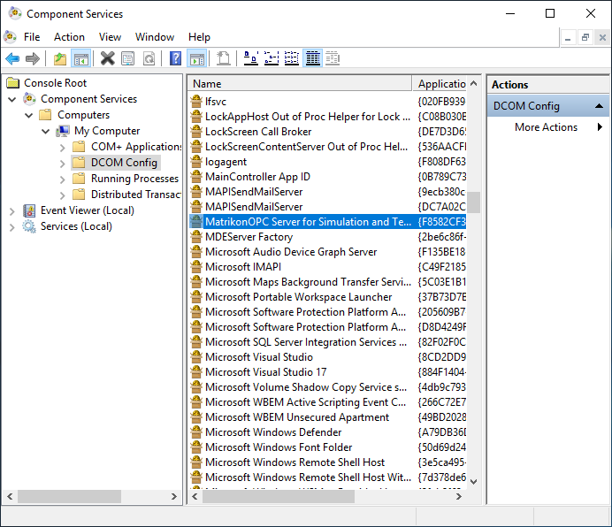

# OPC Classic™

The OIBus agent can receive the following [HTTP calls](#http-api). The agent runs a local HDA module through an inter-process communication. To run properly, [COM/DCOM](#comdcom-setup) must be enabled.

## HTTP API

### Status

```bash
curl --location 'http://localhost:2224/api/opc/id/status'
```

### Connection

```bash
curl --location --request PUT 'http://localhost:2224/api/opc/id/connect' \
--header 'Content-Type: application/json' \
--data '{
    "host": "localhost",
    "serverName": "Matrikon.OPC.Simulation"
}'
```

### Read

```bash
curl --location --request PUT 'http://localhost:2224/api/opc/id/read' \
--header 'Content-Type: application/json' \
--data '{
    "host": "localhost",
    "serverName": "Matrikon.OPC.Simulation",
    "startTime": "2023-11-02T15:00:00.000Z",
    "endTime": "2023-11-02T16:00:00.000Z",
    "aggregate": "raw",
    "resampling": "none",
    "items": [
        {
            "name": "Random",
            "nodeId": "Random.Int1"
        },
        {
            "name": "Triangle Waves",
            "nodeId": "Triangle Waves.Int1"
        },
        {
            "name": "Saw-toothed Waves",
            "nodeId": "Saw-toothed Waves.Int1"
        }
    ]
}'
```

### Disconnection

```bash
curl --location --request DELETE 'http://localhost:2224/api/opc/id/disconnect'
```

## COM/DCOM setup

### Background

#### COM

COM is the standard protocol for communication between objects located on the same computer but which are part of different programs. The server is the object providing services, such as making data available. The client is an application that uses the services provided by the server.

#### DCOM

DCOM represents an expansion of COM functionality to allow access to objects on remote computers. This protocol allows standardized data exchange between applications from industry, administrative offices and manufacturing.

#### OPC

The OPC client is an application that accesses process data, messages, and archives of an OPC server. An OPC server is a program that provides standard software interface to read or write data.

:::info DCOM connectivity
This page gives some hints on how to set up a communication with COM/DCOM to an OPCHDA server. However, in industrial context, it is often the responsibility of the IT team to correctly set the permissions, firewall and Windows configuration.
:::

### Windows settings (client)

#### Client machine settings

Follow these steps to enable COM/DCOM communications from the client. First, open the Component services, and access the _Properties_ of the computer.

<div style={{ textAlign: 'center' }}></div>

Be sure to enable _Distributed COM_ on this computer (on the _Default Properties_ tab).

<div style={{ textAlign: 'center' }}></div>

On the _COM Security_ tab, edit default _Launch and Activation Permissions_.

<div style={{ textAlign: 'center' }}></div>

On the _Launch and Activation Permissions_ window, allow the following permissions:

- Local Launch
- Remote Launch
- Local Activation
- Remote Activation

<div style={{ textAlign: 'center' }}></div>

#### Test communication

DCOM uses port 135 of the HDA server to exchange with the client. To test connectivity:

```powershell
tnc localhost -port 135
```

<div style={{ textAlign: 'center' }}></div>

#### Authentication

An OPCHDA client program will communicate with the DA/HDA server with the IP address or hostname of the server followed by the "progId" of the server. The user must be known on the HDA server.

:::info Important
The user must be a member of the _Distributed COM Users_ group
:::

:::tip Service
If the program runs through a service (such as OIBus), configure the service to run as a specific user.
:::

#### Firewall configuration

Configure the firewall by adding a rule on port 135.

<div style={{ textAlign: 'center' }}>
  
</div>

For cloud hosts like Lightsail, configure additional firewall rules:

<div style={{ textAlign: 'center' }}>
  
</div>

#### OPCEnum tool

The [OPCEnum](https://opcfoundation.org/developer-tools/samples-and-tools-classic/core-components/) tool allows OPCHDA clients to locate servers on remote nodes.

##### RPC unavailable

If the RPC server is unavailable, check your firewall and test communication again.

<div style={{ textAlign: 'center' }}></div>

##### Access denied

Check user credentials and group membership if access is denied.

<div style={{ textAlign: 'center' }}></div>

### Server settings

Check if DCOM is enabled for the OPC Server application in the _Component Service_ window.

<div style={{ textAlign: 'center' }}>
  
</div>
