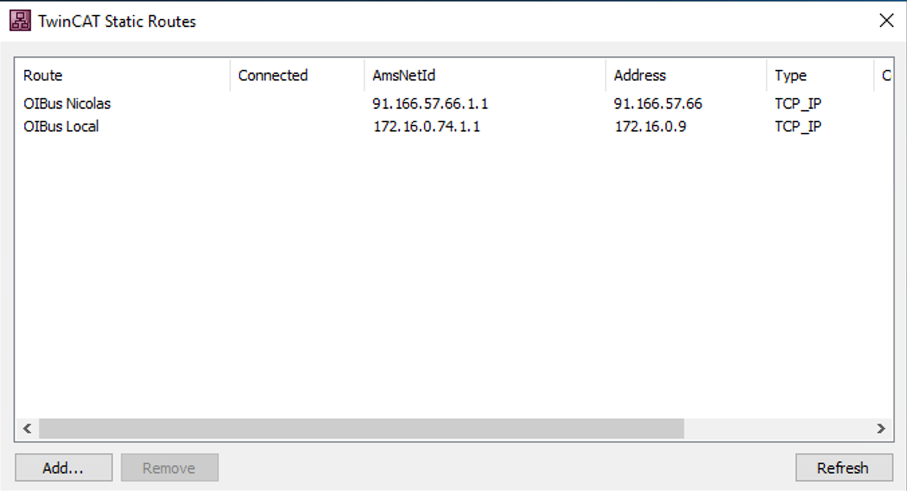
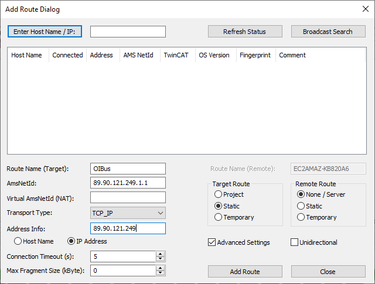

# ADS - TwinCAT
The Automation Device Specification (ADS) protocol serves as a transport layer integrated into TwinCAT systems, designed 
and developed by Beckhoff.

Every data item is identified by a distinct address within the controller, which can be conveniently accessed through 
the ADS connector on the OIBus.

The OIBus utilizes the [ads-client](https://github.com/jisotalo/ads-client) library for this purpose.

## Specific settings
OIBus uses the ADS protocol to connect to an AMS Router. The AMS Router serves as the intermediary that connects ADS clients, 
such as OIBus, to PLCs and the TwinCAT runtime. This connectivity enables OIBus to access data from PLCs.

The specific configuration possibilities depend on the placement and location of the AMS Router.

### With local AMS server (TwinCAT runtime)
When TwinCAT is installed on the same machine and network as OIBus, the ADS connector has the capability to utilize the 
TwinCAT runtime, enabling direct communication with the PLC using its **Net ID** and **PLC Port** (no need to specify Router 
address, Router TCP port, Client AMS Net ID, Client ADS port).

The Net ID is an address resembling an IP address with two extra numeric values. Typically, the Net ID corresponds to 
the IP address used to access the PLC from the network, with two additional numbers for distinguishing between multiple 
PLCs that can be accessed through a single AMS Router. For instance, an example Net ID might look like `127.0.0.1.1.1`.

The port specifies the communication endpoint for connecting with the PLC from the AMS Router, typically set to the default 
value of 851.

### With remote AMS server
When connecting to a remote AMS server, you will need the **Net ID** and **PLC Port** as well as several additional fields:
- **Router address**: This is the IP address or domain name of the AMS router.
- **Router TCP port**: The port used by the AMS router for communication. Ensure that this port is allowed by both the 
network and operating system firewalls.
- **AMS Net ID**: This is a client identifier used to establish a connection with the TwinCAT runtime.
- **ADS Client port** (optional): You can specify the port used by the client for data exchange. If left empty, the AMS 
server will assign a random port. If you choose to specify a port, ensure that it is not already in use by another client.

To enable communication between the ADS connector and the TwinCAT runtime, you must configure Static Routes using the 
_TwinCAT Static Routes_ tool. The following example illustrates how to configure two routes using the **AMS Net ID**, which 
should be utilized on the OIBus side. It is crucial that the **AMS Net ID** is used in conjunction with the IP address
specified in the Static Routes.

The AMSNetId specified must be filled in the **AMS Net ID** field of the OIBus configuration.

:::danger Multiple ADS connectors
OIBus supports only a single remote ADS connector at a time. If you need to connect to two different PLCs simultaneously, 
you can achieve this by using a local AMS server.
:::

### Other specific settings
Here are some additional configuration options:
- **Retry Interval**: This is the amount of time to wait before attempting to retry the connection.
- **PLC Name**: You can specify a prefix added to each item name before they are sent into North caches. For example, 
with a PLC name of `PLC001.` (including the dot), and an item name of `MyVariable.Value`, the resulting name, once the 
values are retrieved, will be `PLC001.MyVariable.Value`. This helps differentiate data from different PLCs. Another PLC 
might have a resulting item name like `PLC002.MyVariable.Value`.
- **Enumeration value**: You can choose whether to serialize enumerations as integers or as text.
- **Boolean value**: You can choose whether to serialize booleans as integers or as text.
- **Structure filtering**: For details on structure filtering, please refer to the [specific documentation](#structure-filtering).

:::tip When to use PLC name?
In scenarios where data from similar PLCs with shared point addresses schema is retrieved via two different ADS connectors 
and sent to the same North connector, the resulting values may possess identical point IDs despite originating from distinct 
PLCs.

To mitigate this potential ambiguity, you can opt to append the **PLC name** in front of each point ID once the data is 
retrieved. This practice ensures that the point IDs sent to the North connector remain distinct, which proves particularly 
useful when exporting these items for import into another OIBus. 

By simply altering the PLC name, you can ensure that your data remains unique in the North-targeted application.
:::

#### Structure filtering
You can also retrieve an entire data structure using this method. For instance, if the data _MyVariable_ is of the
_MyStructure_ type and includes fields like _MyDate_, _MyNumber_, and _Value_, but you only need _MyDate_ and
_MyNumber_, you can create a new structure within the _structure filtering_ section with the **Structure name**
`MyStructure`. 
In the **Fields to keep** section, you can specify only the required fields, separated by commas, such as `MyDate, MyNumber`.

This feature is particularly beneficial when dealing with multiple data items, all of which are of the _MyStructure_ type, 
but you are interested in retrieving only specific fields from the structure, such as _MyDate_ and _MyNumber_. The more
fields the structure has, the more advantageous this feature becomes.

Ultimately, each field specified will result in a unique point ID. In the example provided, using this method for the 
single point _MyVariable_ will result in two distinct points:
- MyVariable.MyDate
- MyVariable.MyNumber

## Item settings
- **Address**: The address of the data to query in the PLC.