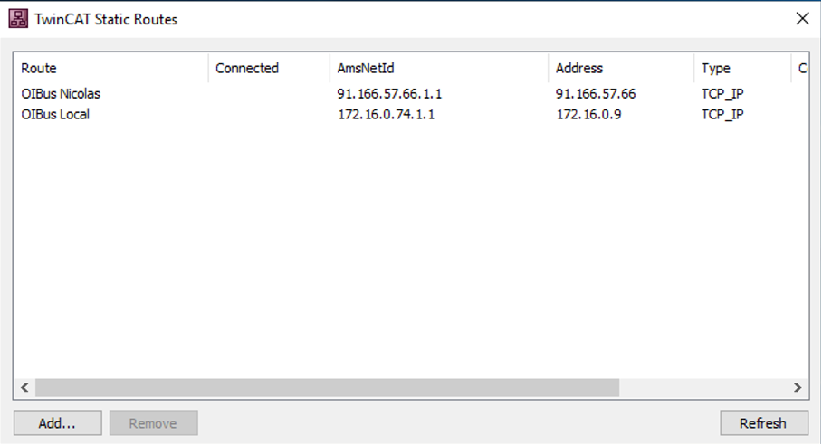
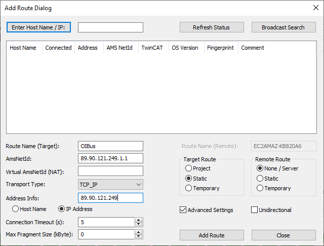

# TwinCAT® ADS

The **Automation Device Specification (ADS)** protocol is a transport layer integrated into TwinCAT® systems, developed
by Beckhoff. It enables OIBus to access PLC data by uniquely identifying each data item through a distinct address in
the controller.

OIBus uses the [ads-client](https://github.com/jisotalo/ads-client) library to communicate with TwinCAT® systems.

## Specific Settings

### Connection

#### Local AMS Server (TwinCAT Runtime)

Use this configuration if TwinCAT is installed on the same machine and network as OIBus.

**Local AMS Server Settings**

| Setting  | Description                                                                             | Example Value   |
| -------- | --------------------------------------------------------------------------------------- | --------------- |
| Net ID   | Unique address of the PLC, resembling an IP address with two additional numeric values. | `127.0.0.1.1.1` |
| PLC Port | Communication endpoint for the PLC.                                                     | `851`           |

> **Note**: When using a local AMS server, you do not need to specify the Router address, Router TCP port, Client AMS
> Net ID, or Client ADS port.

#### Remote AMS Server

Use this configuration if TwinCAT is installed on a remote machine.

**Remote AMS Server Settings**

| Setting         | Description                                                                              | Example Value      |
| --------------- | ---------------------------------------------------------------------------------------- | ------------------ |
| Net ID          | Unique address of the PLC.                                                               | `192.168.1.10.1.1` |
| PLC Port        | Communication endpoint for the PLC.                                                      | `851`              |
| Router Address  | IP address or domain name of the AMS Router.                                             | `192.168.1.100`    |
| Router TCP Port | Port used by the AMS Router for communication.                                           | `48898`            |
| AMS Net ID      | Client identifier for connecting to the TwinCAT runtime.                                 | `192.168.1.50.1.1` |
| ADS Client Port | (Optional) Port used by the client. If left empty, the AMS server assigns a random port. | `1200`             |

:::caution Static Routes
To enable communication, configure **Static Routes** using the _TwinCAT Static Routes_ tool. The
**AMS Net ID** specified in the tool must match the one in the OIBus configuration.
:::

:::danger
OIBus supports only **one remote ADS connector at a time**. To connect to multiple PLCs
simultaneously, use a local AMS server.
:::

### Advanced Settings

**Advanced Settings**

| Setting           | Description                                                                                                                                     | Example Value |
| ----------------- | ----------------------------------------------------------------------------------------------------------------------------------------------- | ------------- |
| Retry Interval    | Time to wait (in milliseconds) before retrying the connection.                                                                                  | `10000`       |
| PLC Name          | Prefix added to each item name (e.g., `PLC001.MyVariable.Value`). Useful for distinguishing data from multiple PLCs in North caches or exports. | `PLC001.`     |
| Enumeration Value | Choose to serialize enumerations as integers or text.                                                                                           | `text`        |
| Boolean Value     | Choose to serialize booleans as integers or text.                                                                                               | `integer`     |

#### Structure Filtering

| Setting        | Description                                                    | Example Value     |
| -------------- | -------------------------------------------------------------- | ----------------- |
| Structure Name | Name of the structure to filter.                               | `MyStructure`     |
| Fields to Keep | Comma-separated list of fields to retrieve from the structure. | `MyDate,MyNumber` |

> **Example**: If `MyVariable` is of type `MyStructure` with fields `MyDate`, `MyNumber`, and `Value`, filtering to keep
> only `MyDate, MyNumber` will generate unique point IDs:
>
> - `MyVariable.MyDate`
> - `MyVariable.MyNumber`

## Item Settings

| Setting | Description                           | Example Value     |
| ------- | ------------------------------------- | ----------------- |
| Address | The PLC address of the data to query. | `MAIN.MyVariable` |
