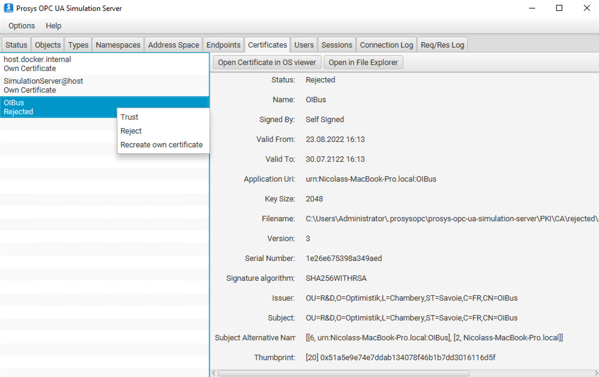

# OPCUA

OPCUA is a protocol for accessing data in read or write mode. The data are organized in a tree-like address 
space and are referenced with a unique address each (called node ID). OPCUA is a modern standard based on TPC, replacing
OPC HDA/DA (see [OPCHDA connector](../../guide/south-connectors/opchda.md)) technologies, and is often embedded natively in
industrial controllers.

OPCUA embeds two variants of the protocol: HA (Historical Access) and DA (Data Access). The first mode allows access to 
a history of values over a time interval for the requested points (data), while the second mode accesses the values at 
each request or listen to the values' changes.

OIBus integrates the two OPCUA modes (HA and DA) in read-only mode. The
[node-opcua](https://github.com/node-opcua/node-opcua) library is used.

## Specific settings
To connect to a OPCUA server, OIBus needs a URL which is composed of several part:
- **URL**: String to connect to the server, of the form `opc.tcp://<host>:<port>/<server-name>`
- **Retry interval**: Time to wait between a reconnection upon a connection failure.
- **Security Mode**: The communications can be secured with the **security mode** and **security policy** fields. 
Available modes are: None, Sign, SignAndEncrypt
- **Security Policy** (Security mode not None): None, Basic128, Basic192, Basic256, Basic128Rsa15, Basic192Rsa15, Basic256Rsa15, Basic256Sha256, Aes128_Sha256_RsaOaep, PubSub_Aes128_CTR, PubSub_Aes256_CTR
- **Authentication**: None, Basic, Certificate. See [security settings](#authentication)

:::caution Compatibility with the OPCUA server
Be careful to select a security mode and a security policy supported by the OPCUA server!
:::

## Item settings
- **Node ID**: The Node ID matches the path of the data in the appropriate namespace in the OPCUA server. Be careful of the supported 
node format of the server, with number of with string. For example, on Prosys, `ns=3;i=1001` matches `ns=3;s=Counter`. 
- **Mode**: HA (Historical Access) or DA (Data Access).
- **Aggregate** (HA mode only): It is possible to aggregate the retrieved values on the requested interval.
- **Resampling** (HA mode only): It is possible to resample the retrieved values on the requested interval.

:::caution Compatibility with the OPCUA server
Not every aggregate and resampling are supported by OPCUA server. _Raw_ aggregate and _None_ resampling are preferred to
avoid compatibility issues.
Also, be sure of the supported mode on the server (HA or DA).
:::

## Security settings
### Communication
If a security mode other than _None_ is used, a certificate will be needed to sign and maybe encrypt the 
communications. A self-signed certificate (generated by OIBus at startup) is used to secure the 
communication with the OPCUA server. You can find the certificate used by OPCUA in the opcua folder of the South cache
(in the data-stream).It must be trusted by the OPCUA server to allow communication.

:::info Example on Prosys OPCUA Simulation Server

If the certificate is not trusted, an error will occur: `Error: The connection may have been rejected by server`
:::

### Authentication
The certificate, used to authenticate the client, must be added in the trusted user certificates of the OPCUA server. It
is managed differently than the self-signed certificate mentioned before, used for [secure communication](#communication).

:::info Example on Prosys OPCUA Simulation Server
For Prosys, the certificate used to authenticate OIBus must be placed in the `.prosysopc\prosys-opc-ua-simulation-server\USERS_PKI\CA\certs`
folder. Otherwise, an error will occur: `Error:  serviceResult = BadIdentityTokenRejected (0x80210000)`.

If a connection has already been tried and rejected, the certificate must be removed from the rejected certificates'
folder `.prosysopc\prosys-opc-ua-simulation-server\USERS_PKI\CA\rejected` and be placed in the trusted folder
(`.prosysopc\prosys-opc-ua-simulation-server\USERS_PKI\CA\certs`).
:::

### Use the same certificate for user authentication and secure communications
The same certificate can be used for both sign and encrypt operations and for authentication. To do that, the `cert.pem` 
and `private.pem` file paths must be specified. They are located in the south cache data stream folder
(inside the opcua directory).

On the OPCUA server side, the self-signed certificate (`cert.pem`) must be copied in the user certificates' folder. 

For example, with Prosys OPCUA Simulation Server: `.prosysopc\prosys-opc-ua-simulation-server\USERS_PKI\CA\certs`.

