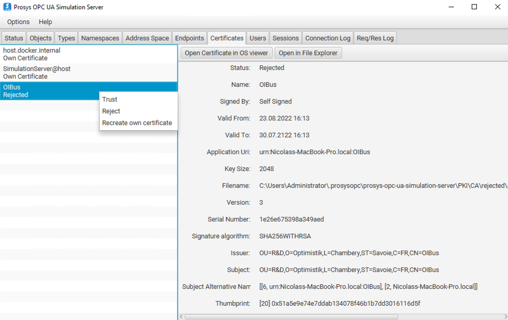

import ThrottlingSettings from './_throttling-settings.mdx';

# OPC UA™

OPC Unified Architecture (OPC UA) protocol for secure industrial data access in read-only mode, supporting both Historical Access (HA) and Data Access (DA) modes.

:::info Technology Overview

- Modern successor to OPC Classic™ (see [OPC Classic™ connector](./opc.mdx))
- TCP/IP based with tree-like address space
- Uses node IDs for data referencing
- Implemented using [node-opcua library](https://github.com/node-opcua/node-opcua)
- Natively embedded in many industrial controllers
  :::

## Specific Settings

### Connection Configuration

| Setting                | Description                                          | Example Value              |
| ---------------------- | ---------------------------------------------------- | -------------------------- |
| **Endpoint URL**       | URL of the OPC UA server.                            | `opc.tcp://localhost:4840` |
| **Keep session alive** | Keep the session alive between messages.             | Enabled/Disabled           |
| **Retry Interval**     | Delay in milliseconds between retries.               | `5000`                     |
| **Read timeout**       | Maximum execution time in milliseconds for requests. | `15000`                    |

### Data Throttling

| Setting                         | Description                                                                    | Example Value |
| ------------------------------- | ------------------------------------------------------------------------------ | ------------- |
| Number of messages before flush | Number of messages to accumulate before flushing to North caches               | `1000`        |
| Delay between flush             | Time delay (in milliseconds) between automatic flushes of accumulated messages | `1000`        |

### Security Settings

| Setting             | Description                                                       | Example Value                                       |
| ------------------- | ----------------------------------------------------------------- | --------------------------------------------------- |
| **Security Mode**   | Security mode for the connection.                                 | `None`, `Sign`, `Sign and encrypt`                  |
| **Security Policy** | Security policy for the connection. See note below for full list. | `None`, `Basic256-SHA256`, `AES128-SHA256-RSA-OAEP` |

:::note Security Policy values

| Value                  | Description                                                                                                                 |
| ---------------------- | --------------------------------------------------------------------------------------------------------------------------- |
| None                   | No security. Data is transmitted unencrypted with no message authentication.                                                |
| Basic128               | AES-128 encryption, HMAC-SHA1 signing, RSA-1024 key exchange.                                                               |
| Basic192               | AES-192 encryption, HMAC-SHA1 signing, RSA-1024 key exchange.                                                               |
| Basic256               | ⚠️ **Deprecated.** AES-256 encryption, HMAC-SHA1 signing. Avoid — SHA-1 is cryptographically weak.                          |
| Basic128-RSA15         | ⚠️ **Deprecated.** AES-128 encryption, HMAC-SHA1 signing, RSA PKCS#1 v1.5 padding. Avoid — both SHA-1 and RSA-1.5 are weak. |
| Basic192-RSA15         | AES-192 encryption, HMAC-SHA1 signing, RSA PKCS#1 v1.5 padding.                                                             |
| Basic256-RSA15         | AES-256 encryption, HMAC-SHA1 signing, RSA PKCS#1 v1.5 padding.                                                             |
| Basic256-SHA256        | AES-256 encryption, HMAC-SHA256 signing, RSA-OAEP padding. **Recommended** for most deployments.                            |
| AES128-SHA256-RSA-OAEP | AES-128 encryption, SHA-256 signing, RSA-OAEP padding. Modern standard (OPC UA Part 2 rev. 1.05).                           |
| PubSub AES-128-CTR     | AES-128-CTR symmetric encryption for OPC UA Pub/Sub mode.                                                                   |
| PubSub AES-256-CTR     | AES-256-CTR symmetric encryption for OPC UA Pub/Sub mode.                                                                   |

:::

### Authentication Methods

| Setting            | Description                                             | Example Value                                   |
| ------------------ | ------------------------------------------------------- | ----------------------------------------------- |
| Authentication     | Authentication method for the OPC UA server connection. | `Anonymous`, `Username/Password`, `Certificate` |
| Username           | Username for Username/Password authentication.          | `opc_user`                                      |
| Password           | Password for Username/Password authentication.          | `••••••••`                                      |
| Client certificate | Client certificate file for Certificate authentication. | `/path/to/cert.pem`                             |
| Private key        | Private key file for Certificate authentication.        | `/path/to/key.pem`                              |

## Group Settings

Items are organised into **groups**. Each group defines a shared schedule and, for HA mode, the default
throttling parameters for all items it contains.

| Setting       | Description                                             | Example Value |
| ------------- | ------------------------------------------------------- | ------------- |
| **Name**      | Unique label for the group within this connector.       | `Group A`     |
| **Scan mode** | Collection schedule applied to every item in the group. | `Every 1 min` |

<ThrottlingSettings />

:::tip Overriding throttling per item
Each item can override the group throttling defaults by disabling the **Sync with group** toggle in the item
edit form.
:::

## Item Settings

| Setting          | Description                                                                                                  | Example Value                                   |
| ---------------- | ------------------------------------------------------------------------------------------------------------ | ----------------------------------------------- |
| Node ID          | Path to the data point in the OPC UA server namespace.                                                       | `ns=3;i=1001`, `ns=3;s=Counter`                 |
| Mode             | Data access method: `ha` (Historical Access) or `da` (Data Access).                                          | `ha`, `da`                                      |
| Aggregate        | Value aggregation method (HA mode only).                                                                     | `Raw`, `Average`, `Minimum`, `Maximum`, `Count` |
| Resampling       | Interval resampling (HA mode only).                                                                          | `None`, `1 second`, `1 hour`, `1 day`           |
| Timestamp origin | Timestamp source: `OIBus` (query time), `Point` (server-reported timestamp), `Server` (server current time). | `OIBus`, `Point`, `Server`                      |

:::caution Server Compatibility

1. Verify server supports selected mode (HA/DA)
2. Not all servers support all aggregation/resampling options
3. Recommended: Use `Raw` aggregation and `None` resampling

:::

:::note Aggregate values (HA mode)

| Value   | Description                    |
| ------- | ------------------------------ |
| Raw     | All raw values in the interval |
| Average | Arithmetic mean                |
| Minimum | Minimum value in the interval  |
| Maximum | Maximum value in the interval  |
| Count   | Number of data points          |

:::

:::note Resampling values

`None` · `1 second` · `10 seconds` · `30 seconds` · `1 minute` · `1 hour` · `1 day`

:::

## Security Configuration

### Communication Security

- OIBus generates self-signed certificate on startup
- Certificate location: `<south_cache>/opcua/`
- Must be trusted by OPC UA server
- Error if untrusted: `The connection may have been rejected by the server`



### Certificate Management

1. **Communication Certificate**:

- Auto-generated by OIBus
- Location: `<south_cache>/opcua/cert.pem`

2. **Authentication Certificate**:

- Must be added to server's trusted certificates
- Prosys location: `.prosysopc\prosys-opc-ua-simulation-server\USERS_PKI\CA\certs`
- Error if rejected: `BadIdentityTokenRejected (0x80210000)`

:::info Prosys Specifics
Move rejected certificates from:
`.prosysopc\prosys-opc-ua-simulation-server\USERS_PKI\CA\rejected`
to:
`.prosysopc\prosys-opc-ua-simulation-server\USERS_PKI\CA\certs`
:::

## Certificate Creation for Prosys

1. Create `cert.conf`:

```ini
[ req ]
default_bits = 2048
default_md = sha256
distinguished_name = subject
req_extensions = req_ext
x509_extensions = req_ext
string_mask = utf8only
prompt = no

[ req_ext ]
basicConstraints = CA:FALSE
nsCertType = client, server
keyUsage = nonRepudiation, digitalSignature, keyEncipherment, dataEncipherment, keyCertSign
extendedKeyUsage= serverAuth, clientAuth
nsComment = "OIBus User Cert"
subjectKeyIdentifier=hash
authorityKeyIdentifier=keyid,issuer
subjectAltName = URI:urn:opcua:user:oibus,IP: 127.0.0.1

[ subject ]
countryName = FR
stateOrProvinceName = FR
localityName = Chambéry
organizationName = OI
commonName = oibus
```

2. Generate certificate:

```bash
# Create key and certificate
openssl req -new -x509 -keyout oibus.key -out oibus.pem -config cert.conf

# Remove passphrase
openssl rsa -in oibus.key -out oibus.key

# Convert to DER format
openssl x509 -inform PEM -outform DER -in oibus.pem -out oibus.der
```

4. Install in Prosys:

```bash
cp oibus.der .prosysopc/prosys-opc-ua-simulation-server/USERS_PKI/CA/certs/
```

:::tip Single Certificate Usage
The same certificate can be used for:

- Secure communication (sign/encrypt)
- Client authentication: Specify paths to `cert.pem` and `private.pem`
  :::
