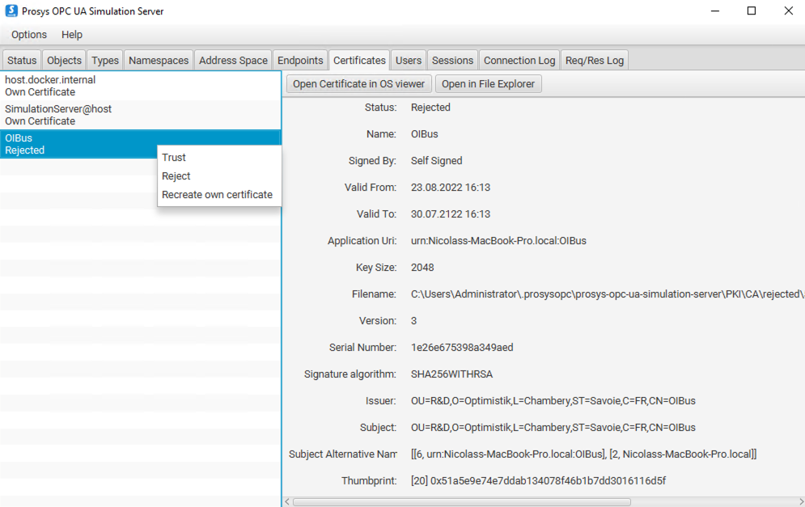

import ThrottlingSettings from './_throttling-settings.mdx';

# OPC UA™

OPC Unified Architecture (OPC UA) protocol for secure industrial data access in read-only mode, supporting both Historical Access (HA) and Data Access (DA) modes.

:::info Technology Overview

- Modern successor to OPC Classic™ (see [OPC Classic™ connector](./opc.mdx))
- TCP/IP based with tree-like address space
- Uses node IDs for data referencing
- Implemented using [node-opcua library](https://github.com/node-opcua/node-opcua)
- Natively embedded in many industrial controllers
  :::

## Specific Settings

### Connection Configuration

| Setting                | Description                                                 |
| ---------------------- | ----------------------------------------------------------- |
| **Endpoint URL**       | URL of the OPC UA server (e.g., `opc.tcp://localhost:4840`) |
| **Keep session alive** | Keep session alive between messages                         |
| **Retry Interval**     | Delay between retries (in milliseconds)                     |
| **Read timeout**       | Maximum execution time (ms) for requests                    |

### Security Settings

| Setting             | Description                                                              |
| ------------------- | ------------------------------------------------------------------------ |
| **Security Mode**   | Security mode for the connection (None, Sign, SignAndEncrypt)            |
| **Security Policy** | Security policy for the connection (None, Basic128Rsa15, Basic256, etc.) |

### Authentication Methods

| Method                | Description                                | Required Parameters             |
| --------------------- | ------------------------------------------ | ------------------------------- |
| **Anonymous**         | Connect without authentication.            | None                            |
| **Username/Password** | Standard username/password authentication. | Username, Password              |
| **Certificate**       | Authentication using client certificates.  | Client Certificate, Private Key |

<ThrottlingSettings />

## Item Settings

| Setting    | Description                   | HA Mode Options                   | DA Mode Options |
| ---------- | ----------------------------- | --------------------------------- | --------------- |
| Node ID    | Data path in server namespace | `ns=3;i=1001` or `ns=3;s=Counter` | Same as HA      |
| Mode       | Data access method            | HA or DA                          | -               |
| Aggregate  | Value aggregation (HA only)   | `Raw`, `Average`, `Min`, `Max`    | N/A             |
| Resampling | Interval resampling (HA only) | `None`, `1s`, `5m`, `1h`          | N/A             |

:::caution Server Compatibility

1. Verify server supports selected mode (HA/DA)
2. Not all servers support all aggregation/resampling options
3. Recommended: Use `Raw` aggregation and `None` resampling

:::

## Security Configuration

### Communication Security

- OIBus generates self-signed certificate on startup
- Certificate location: `<south_cache>/opcua/`
- Must be trusted by OPC UA server
- Error if untrusted: `The connection may have been rejected by the server`



### Certificate Management

1. **Communication Certificate**:

- Auto-generated by OIBus
- Location: `<south_cache>/opcua/cert.pem`

2. **Authentication Certificate**:

- Must be added to server's trusted certificates
- Prosys location: `.prosysopc\prosys-opc-ua-simulation-server\USERS_PKI\CA\certs`
- Error if rejected: `BadIdentityTokenRejected (0x80210000)`

:::info Prosys Specifics
Move rejected certificates from:
`.prosysopc\prosys-opc-ua-simulation-server\USERS_PKI\CA\rejected`
to:
`.prosysopc\prosys-opc-ua-simulation-server\USERS_PKI\CA\certs`
:::

## Certificate Creation for Prosys

1. Create `cert.conf`:

```ini
[ req ]
default_bits = 2048
default_md = sha256
distinguished_name = subject
req_extensions = req_ext
x509_extensions = req_ext
string_mask = utf8only
prompt = no

[ req_ext ]
basicConstraints = CA:FALSE
nsCertType = client, server
keyUsage = nonRepudiation, digitalSignature, keyEncipherment, dataEncipherment, keyCertSign
extendedKeyUsage= serverAuth, clientAuth
nsComment = "OIBus User Cert"
subjectKeyIdentifier=hash
authorityKeyIdentifier=keyid,issuer
subjectAltName = URI:urn:opcua:user:oibus,IP: 127.0.0.1

[ subject ]
countryName = FR
stateOrProvinceName = FR
localityName = Chambéry
organizationName = OI
commonName = oibus
```

2. Generate certificate:

```bash
# Create key and certificate
openssl req -new -x509 -keyout oibus.key -out oibus.pem -config cert.conf

# Remove passphrase
openssl rsa -in oibus.key -out oibus.key

# Convert to DER format
openssl x509 -inform PEM -outform DER -in oibus.pem -out oibus.der
```

4. Install in Prosys:

```bash
cp oibus.der .prosysopc/prosys-opc-ua-simulation-server/USERS_PKI/CA/certs/
```

:::tip Single Certificate Usage
The same certificate can be used for:

- Secure communication (sign/encrypt)
- Client authentication: Specify paths to `cert.pem` and `private.pem`
  :::
