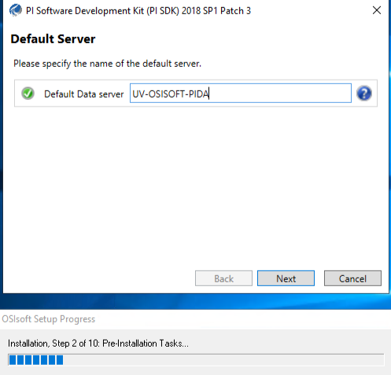
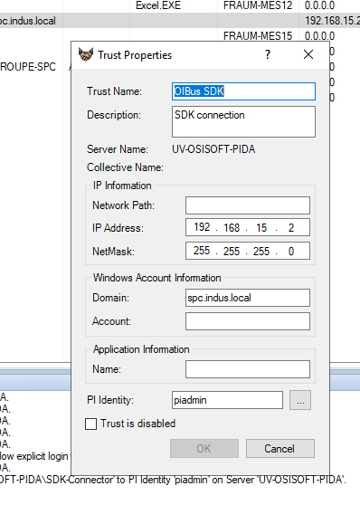
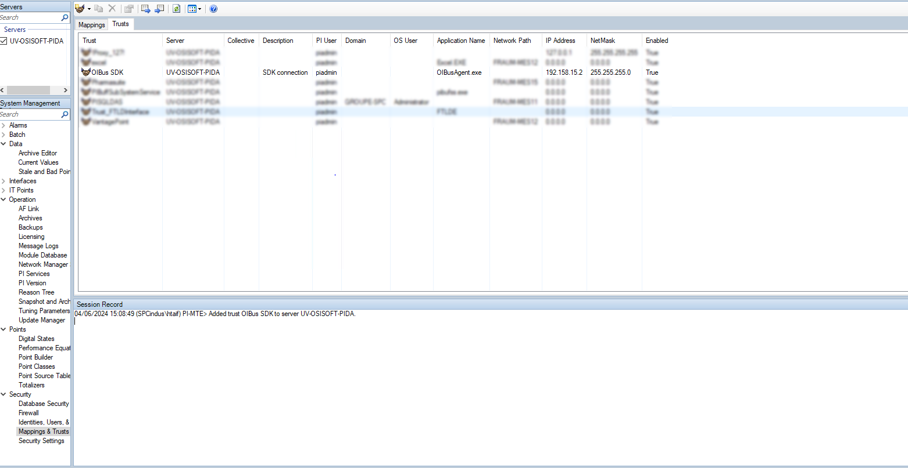
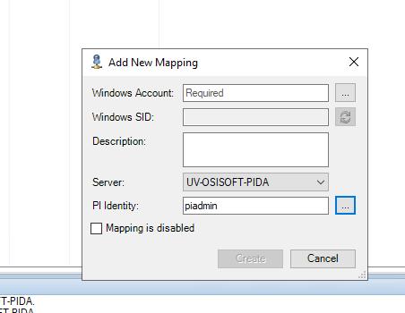
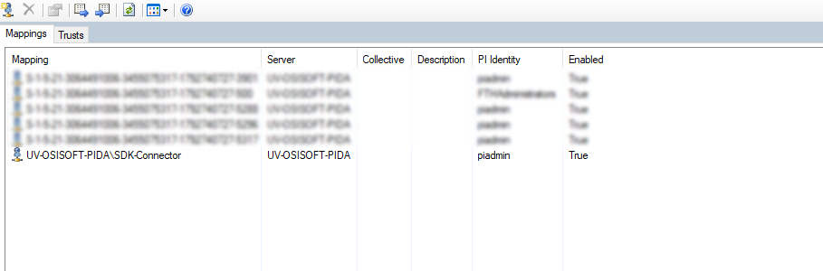

import ThrottlingSettings from './_throttling-settings.mdx';

# OSIsoft PI System™

Connect to OSIsoft PI System™ for industrial data collection and visualization using OIBus with the embedded PI driver in [OIBus Agent](../oibus-agent/installation.mdx).

:::caution System Requirements

- OIBus Agent **must** be installed on a Windows machine
- Can be installed on PI Server machine or separate machine with [PI SDK configured](#osisoft-pi-sdk-configuration)

:::

## Connection Settings

| Setting          | Description                                                                    | Example Value               |
| ---------------- | ------------------------------------------------------------------------------ | --------------------------- |
| Remote agent URL | Agent endpoint URL. Required for all connections.                              | `http://192.168.1.100:2224` |
| Retry interval   | Time in milliseconds to wait before retrying the connection. Default: `10000`. | `10000`                     |

## Group Settings

Items are organised into **groups**. Each group defines a shared schedule and the default throttling
parameters for historical data retrieval.

| Setting       | Description                                                             | Example Value |
| ------------- | ----------------------------------------------------------------------- | ------------- |
| **Name**      | Unique label for the group within this connector.                       | `Group A`     |
| **Scan mode** | Collection schedule applied to every item in the group.                 | `Every 1 min` |

<ThrottlingSettings />

:::tip Overriding throttling per item
Each item can override the group throttling defaults by disabling the **Sync with group** toggle in the item
edit form.
:::

## Item Configuration

### Point Access Methods

| Setting     | Description                                                                                                                                        | Example Value               |
| ----------- | -------------------------------------------------------------------------------------------------------------------------------------------------- | --------------------------- |
| Type        | Access method: `PI point` (single point by ID) or `PI query` (multiple points by query expression)                                                 | `PI point` or `PI query`    |
| Point ID    | Fully qualified point ID (without server name). Used when Type is `PI point`.                                                                      | `\\CDT158\SINUSOID`         |
| Point Query | Query selector for multiple points (see [PI Point Query Syntax](https://docs.aveva.com/bundle/af-sdk/page/html/pipoint-query-syntax-overview.htm)). Used when Type is `PI query`. | `Name:='SINUSOID'` |

:::info Reference Names

- For `PI point`: Item name serves as reference in JSON payloads
- For `PI query`: PI name is used as reference
  :::

## OSIsoft PI SDK Configuration

### Installation Requirements

1. Install PI SDK on agent machine
2. During installation, specify default data server
3. If installing remotely:

- PI SDK must be properly configured
- PI System Access (PSA) must be installed

### User Configuration

1. Create domain user account (accessible from both machines)

- If domain doesn't exist, create identical local users with same password

2. Configure OIBus Agent service to run as this user

### Trust Configuration

1. Open PI System Management Tools
2. Navigate to `Mapping & Trusts` → `Trusts` tab
3. Create new trust with:

- OIBus Agent machine IP and Net Mask
- Domain (if applicable)
- PI Identity to connect with

### Mapping Configuration

1. In PI System Management Tools
2. Navigate to `Mapping & Trusts` → `Mappings` tab
3. Create new mapping with:

- OIBus Agent service user
- PI Identity from trust configuration

:::tip Log Access
View system logs in PI System Management Tools:
`Operation` → `Messages Logs`
:::

### Configuration Screenshots

**1. SDK Installation** — Specify default data server during installation

**2. Trust Configuration** — Configure trust for agent machine

**3. Trust List** — Verified trust configuration

**4. Mapping Creation** — Map agent user to PI identity

**5. Mapping List** — Verified user mapping

