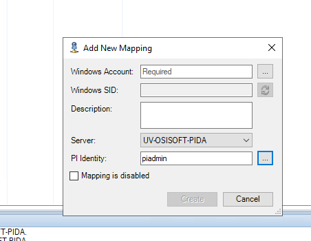

import ThrottlingSettings from './_throttling-settings.mdx';

# OSIsoft PI System™

Connect to OSIsoft PI System™ for industrial data collection and visualization using OIBus with the embedded PI driver in [OIBus Agent](../oibus-agent/installation.mdx).

:::caution System Requirements

- OIBus Agent **must** be installed on a Windows machine
- Can be installed on PI Server machine or separate machine with [PI SDK configured](#osisoft-pi-sdk-configuration)

:::

## Connection Settings

| Setting          | Description                                  | Default Value | Notes                        |
| ---------------- | -------------------------------------------- | ------------- | ---------------------------- |
| Remote agent URL | Agent endpoint (e.g., `http://host:2224`)    | -             | Required for all connections |
| Retry interval   | Time (ms) to wait before retrying connection | 10000         | Recommended: 5000-15000ms    |

<ThrottlingSettings />

## Item Configuration

### Point Access Methods

| Setting     | Description                                                                                                                                        | Example Value             |
| ----------- | -------------------------------------------------------------------------------------------------------------------------------------------------- | ------------------------- |
| Type        | Access method: `pointId` (single point) or `pointQuery` (multiple points)                                                                          | `pointId` or `pointQuery` |
| Point ID    | Fully qualified point ID (without server name)                                                                                                     | `\\CDT158\SINUSOID`       |
| Point Query | Query selector for multiple points (see [PI Point Query Syntax](https://docs.aveva.com/bundle/af-sdk/page/html/pipoint-query-syntax-overview.htm)) | `Name:='SINUSOID'`        |

:::info Reference Names

- For `pointId`: Item name serves as reference in JSON payloads
- For `pointQuery`: PI name is used as reference
  :::

## OSIsoft PI SDK Configuration

### Installation Requirements

1. Install PI SDK on agent machine
2. During installation, specify default data server
3. If installing remotely:

- PI SDK must be properly configured
- PI System Access (PSA) must be installed

### User Configuration

1. Create domain user account (accessible from both machines)

- If domain doesn't exist, create identical local users with same password

2. Configure OIBus Agent service to run as this user

### Trust Configuration

1. Open PI System Management Tools
2. Navigate to `Mapping & Trusts` → `Trusts` tab
3. Create new trust with:

- OIBus Agent machine IP and Net Mask
- Domain (if applicable)
- PI Identity to connect with

### Mapping Configuration

1. In PI System Management Tools
2. Navigate to `Mapping & Trusts` → `Mappings` tab
3. Create new mapping with:

- OIBus Agent service user
- PI Identity from trust configuration

:::tip Log Access
View system logs in PI System Management Tools:
`Operation` → `Messages Logs`
:::

### Configuration Screenshots

1. **SDK Installation**:
   
   _Specify default data server during installation_

2. **Trust Configuration**:
   
   _Configure trust for agent machine_

3. **Trust List**:
   
   _Verified trust configuration_

4. **Mapping Creation**:
   
   _Map agent user to PI identity_

5. **Mapping List**:
   
   _Verified user mapping_
