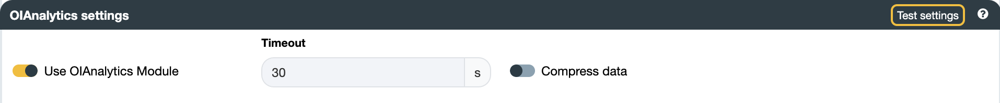

## North OIAnalytics
Verify that the OIAnalytics platform is accessible from the machine where OIBus is installed. To check this, enter the
OIAnalytics URL in your web browser's address bar (here `https://instance.oianalytics.fr`).
If the page loads correctly, OIAnalytics is reachable. If not, ensure that your network firewall permits the connection.

A connection issue might be due to a port rule (HTTPS / 443, although very unlikely) or a domain name rule. Consult
your IT team to add a rule allowing communication.

A best practice for sending values into OIAnalytics is to [register OIBus first](../guide/engine/oianalytics-module.md).

Create the OIAnalytics North connector and populate the relevant fields. If OIBus has been registered into OIAnalytics,
check the `Use OIAnalytics Module` toggle.

You can test the settings by clicking the `Test settings` button to verify the connection.

Confirm accessibility of the OIAnalytics platform from the machine hosting OIBus. To do so, type the OIAnalytics URL
(`https://instance.oianalytics.fr`) into your web browser's address bar. If the page loads successfully, OIAnalytics is
reachable. If not, ensure that your network firewall allows the connection.

Connection issues may arise from a port rule (HTTPS / 443, though unlikely) or a domain name rule. Consult your IT team
to add a rule permitting communication.

For optimal functionality, it is recommended to [register OIBus](../guide/engine/oianalytics-module.md) before sending
values to OIAnalytics.

If OIBus has been registered with OIAnalytics, activate the `Use OIAnalytics Module` toggle.

  

    

  

:::tip Testing connection
You can verify the connection by testing the settings using the `Test settings` button.
:::