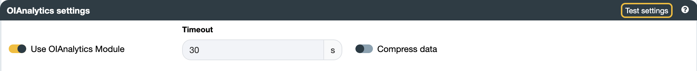

## North OIAnalytics

Before setting up the connector, verify that OIAnalytics is reachable from the OIBus host: open a browser on the OIBus machine and navigate to the OIAnalytics URL (e.g. `https://instance.oianalytics.fr`). If the page does not load, ask your IT team to allow the connection — the issue is typically a domain name firewall rule or, less commonly, a port rule on HTTPS/443.

For the best experience, [register OIBus with OIAnalytics](../guide/installation/oianalytics.mdx) before creating the connector. Once registered, enable the **Use OIAnalytics registration** toggle in the connector settings so credentials are managed automatically.

  

    

  

:::tip Testing connection
Click **Test settings** to verify the connection before saving.
:::
