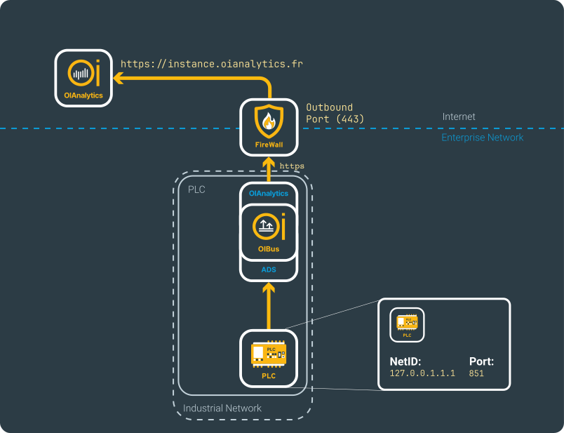
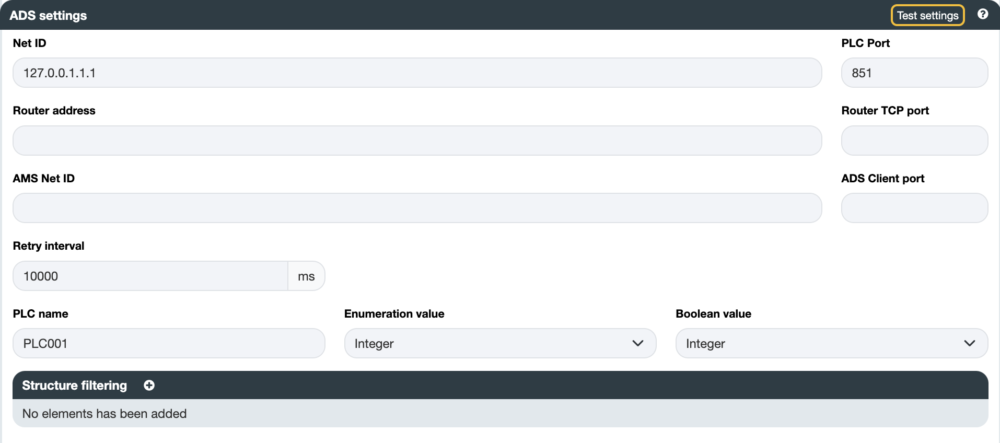
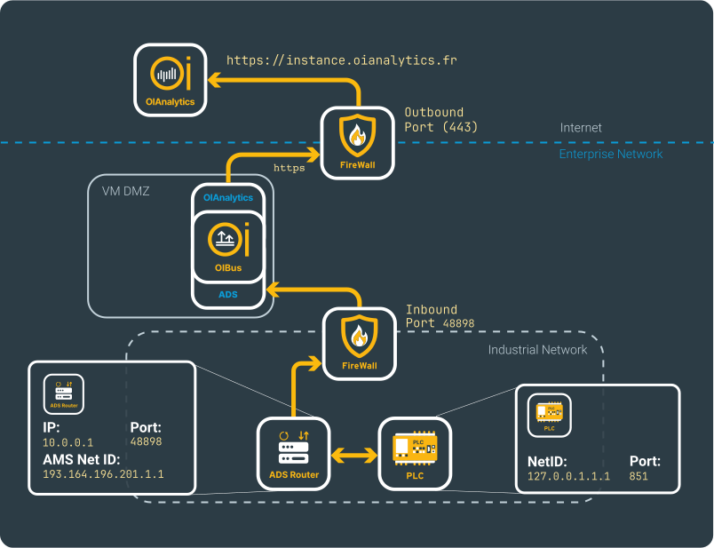
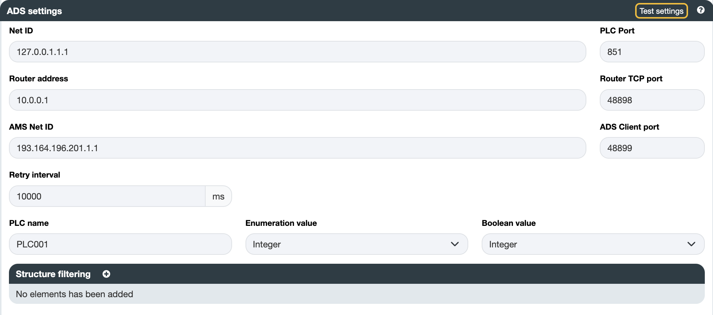
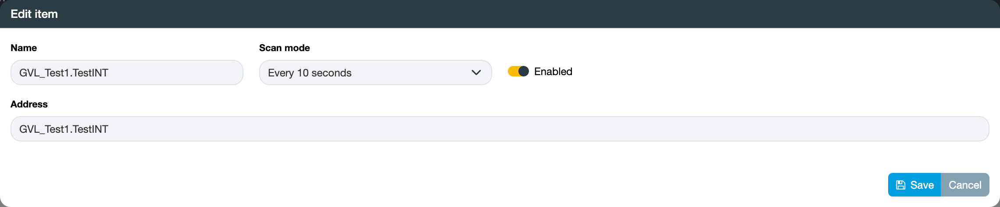

import NorthOIAnalytics from './_north_oianalytics.mdx';

# ADS / TwinCAT® → OIAnalytics®

## Beforehand

See the [North OIAnalytics](../guide/north-connectors/oianalytics.md) and [South ADS](../guide/south-connectors/ads.mdx) connector pages for full configuration details.

Read the [connector-specific network settings](../guide/south-connectors/ads.mdx#specific-settings) before configuring the ADS connector — the required parameters depend on how OIBus is deployed relative to the ADS router.

Two deployment scenarios are described below.

## South ADS

### Local ADS

OIBus is installed on the same machine as the ADS router.

Only the **ADS Net ID** needs to be specified (here `127.0.0.1.1.1`).

### Remote ADS

OIBus is deployed on a separate machine and must connect to the ADS router over the network.

- **ADS Router address**: `10.0.0.1`, port `48898`
- **AMS Net ID**: must match the static route configured on the AMS server. The first four segments typically correspond to the OIBus machine's IP address (e.g. `193.164.196.201.1.1`)
- **ADS Client port**: an unused local port used to connect to the PLC through the router (e.g. `48899`)

:::tip Testing connection
Click **Test settings** to verify the connection before saving.
:::

### Items

Add the addresses you want to read. Ask the PLC administrator for the available addresses. Select a [scan mode](../guide/engine/scan-modes.mdx) to control the collection interval.

  

    

  

:::tip Bulk import
Click **Export** to download a CSV template with the correct columns, fill in one item per row, then import it back. Item names must be unique.
:::

When collecting data from multiple PLCs that share the same address namespace, export items from one ADS connector and import them into another. Because the item names will be identical, use the **PLC name** field in the connector settings (e.g. `PLC001`) — OIBus prepends it to every item name to keep them unique.

<NorthOIAnalytics></NorthOIAnalytics>
