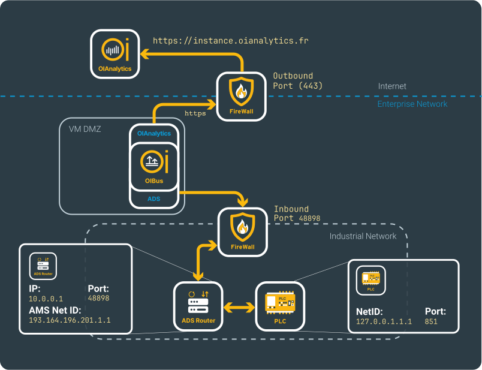
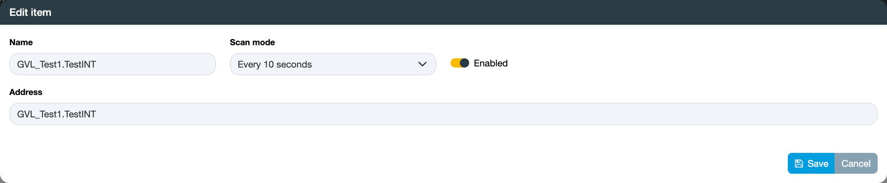

import NorthOIAnalytics from './_north_oianalytics.mdx';

# TwinCAT ADS → OIAnalytics
## Beforehand
This use case shows how to set up an ADS connector and how to send the resulting CSV files into OIAnalytics.

Details regarding the configurations can be located on the [North OIAnalytics](../guide/north-connectors/oianalytics.md)
and [South ADS](../guide/south-connectors/ads.md) connectors pages.

## South ADS
Ensure that you are familiar with the network configuration required to access the ADS server from the OIBus machine, as
detailed in the [connector documentation](../guide/south-connectors/ads.md#specific-settings).

Let's consider two implementation scenarios:
- OIBus directly installed in the PLC, which includes the ADS router.
- OIBus installed on a separate machine, or on the same machine but without direct access to the ADS router,
which can be accessed via another local network.

### Local ADS

  

In this scenario, OIBus is directly installed on the same machine than the ADS router. Only the ADS Net ID needs to be
specified (here `127.0.0.1.1.1`).

    

### Remote ADS

  

In this scenario, OIBus is deployed on a remote virtual machine. Initially, it needs to establish connectivity with the
ADS Router located at address `10.0.0.1` on port `48898`. Additionally, an AMS Net ID matching the static route configured
on the AMS Server (located on the TwinCAT machine) needs to be provided. For instance, here the AMS Net ID is specified
as `193.164.196.201.1.1`, where the first segment (`193.164.196.201`) typically corresponds to the IP address of the
OIBus machine.

The ADS Client port is used to establish the connection between the ADS router and the PLC. It's essential to designate
an unused port for this purpose, such as port `48899` in this example.

  

:::tip Testing connection
You can verify the connection by testing the settings using the `Test settings` button.
:::

### Items
Include the addresses you intend to read. Consult the person responsible for the PLC to identify the available addresses.
Choose a [scan mode](../guide/engine/scan-modes.md) to retrieve the data.

  

    

  

:::tip Massive import
For bulk item import, start by clicking the `Export` button to obtain a CSV file with the correct columns. Each line in
the file will correspond to a new item. Ensure that the names are unique.
:::

The ADS connector is frequently employed for accessing PLCs, and there are scenarios where multiple PLCs with the same
namespace need to be accessed.

To streamline this process, OIBus allows you to import items from a CSV file, which can be the result of exporting from
another ADS connector. However, note that the names will be the same between the two connectors. To distinguish them,
utilize the `PLC name` field from the connector settings section (here `PLC001`).

The PLC name will be appended in front of all item names, providing a unique identifier.

<NorthOIAnalytics></NorthOIAnalytics>