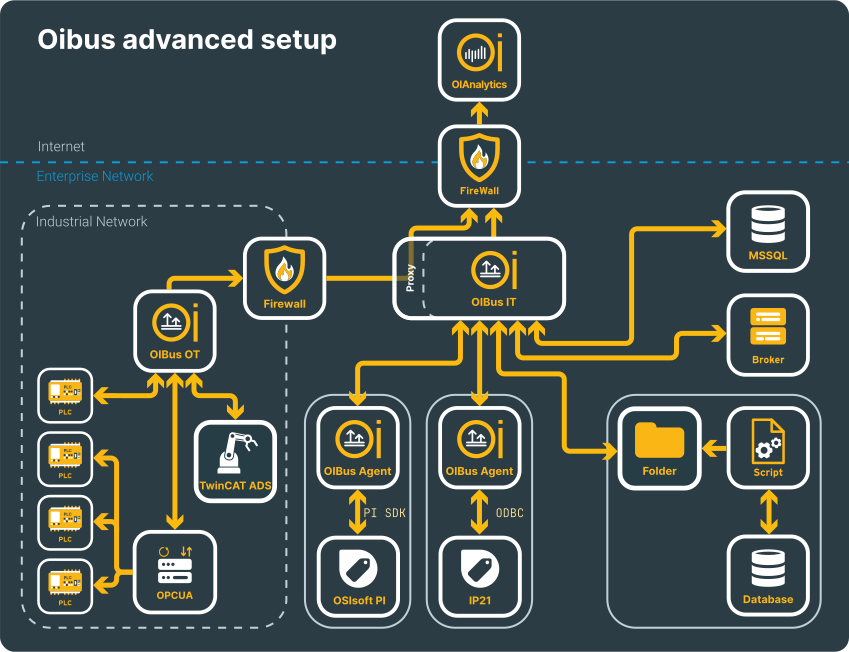

# Advanced Multi-Network Setup

## Overview

This use case shows a heterogeneous network with two isolated zones:

- **OT network** — the industrial network hosting PLCs
- **IT network** — the enterprise network with databases and cloud connectivity

  

    

  

Two OIBus instances are deployed: **OIBus OT** and **OIBus IT**. This limits the firewall opening between the two zones to a single connection: OIBus OT sends data to OIAnalytics through the proxy server running on OIBus IT.

Set up **OIBus IT** first — configure its proxy server and the required firewall rules before configuring OIBus OT.

## OIBus IT

### South Connectors

#### MSSQL

See the [MSSQL use case](./use-case-mssql) and the [connector documentation](../guide/south-connectors/mssql) for setup instructions.

#### MQTT

Subscribe to MQTT topics as described in the [MQTT connector page](../guide/south-connectors/mqtt).

#### Folder Scanner

OIBus can watch a folder and pick up files matching a regex pattern — useful when a script or another tool drops CSV files that OIBus cannot query directly. See the [Folder Scanner connector page](../guide/south-connectors/folder-scanner).

#### ODBC (with OIBus Agent)

The [ODBC connector](../guide/south-connectors/odbc) uses an [OIBus Agent](../guide/oibus-agent/installation) installed on the IP21 machine. See the [IP21 use case](./use-case-ip21) for setup details.

#### OSIsoft PI (with OIBus Agent)

The [OSIsoft PI connector](../guide/south-connectors/osisoft-pi) uses an [OIBus Agent](../guide/oibus-agent/installation) installed on or near the PI server. See the [OSIsoft PI use case](./use-case-pi) for setup details.

### North Connectors

#### OIAnalytics

[Register OIBus with OIAnalytics](../guide/installation/oianalytics) first, then enable the registration in the [North OIAnalytics connector](../guide/north-connectors/oianalytics).

### Proxy Server

Enable the [proxy server](../guide/engine/engine-settings#proxy-server) on OIBus IT and make sure the chosen port is available and open for inbound connections in the firewall.

## OIBus OT

OIBus OT collects data from PLCs in the industrial network and forwards it to OIAnalytics via the OIBus IT proxy.

### South Connectors

#### TwinCAT ADS

See the [TwinCAT ADS use case](./use-case-ads) — the ADS server is remote in this scenario.

#### OPC UA

See the [OPC UA use case](./use-case-opcua).

#### Modbus

See the [Modbus use case](./use-case-modbus).

### North Connectors

#### OIAnalytics

[Register OIBus OT with OIAnalytics](../guide/installation/oianalytics) and configure the proxy (the OIBus IT proxy server) in the registration settings. Enable the registration in the [North OIAnalytics connector](../guide/north-connectors/oianalytics) and confirm that the firewall allows the connection from OIBus OT to OIBus IT.
