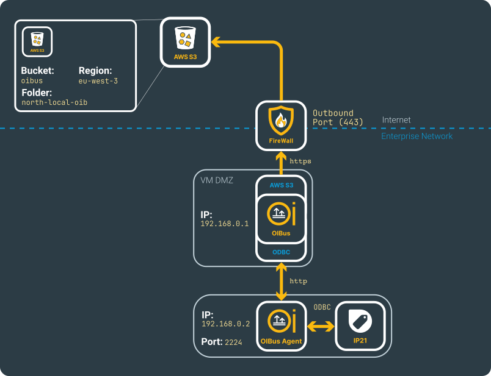
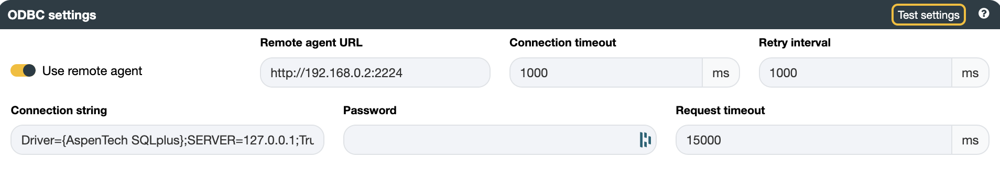
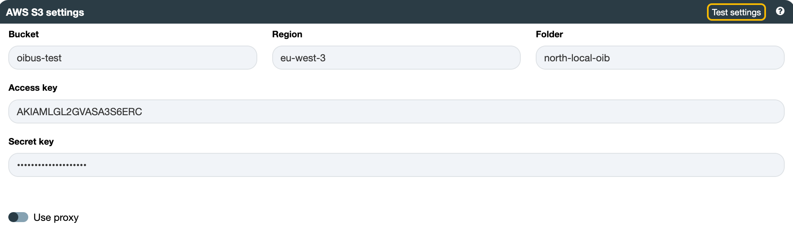

# Aspen InfoPlus.21® (IP21) → Amazon S3™

## Beforehand

AspenTech IP21 is a real-time data historian that collects, stores, and analyses time-series data from industrial processes. OIBus connects to IP21 via ODBC.

See the [North Amazon S3](../guide/north-connectors/aws-s3.md) and [South ODBC](../guide/south-connectors/odbc) connector pages for full configuration details.

This use case requires an [OIBus Agent](../guide/oibus-agent/installation). The example uses the following fictional network.

  

    

  

:::caution Install the Agent close to IP21
The Aspen SQLplus driver is sensitive to network latency. Install the OIBus Agent on the IP21 server, or at least on the same local network. Additional network hops or firewalls between the Agent and the historian can cause data collection issues and performance degradation.
:::

## South ODBC

ODBC connections can be managed in two ways:

- The internal [node-odbc](https://github.com/markdirish/node-odbc) JavaScript driver.
- The [OIBus Agent](../guide/oibus-agent/installation) with its C# ODBC implementation.

:::info
This use case uses the OIBus Agent — the recommended approach for IP21.
:::

Install the OIBus Agent on the IP21 machine, enable **Use remote agent** in the connector settings, and enter `http://192.169.0.2:2224` as the **Remote Agent URL**.

:::tip OIBus Agent port
Port 2224 is the default. You can change it during installation. Make sure the chosen port is open for inbound HTTP connections in your firewall.
:::

The connection string follows the standard ODBC format. The **AspenTech SQLplus** ODBC driver must be installed on the machine running the OIBus Agent.

  

    

  

:::tip Testing connection
Click **Test settings** to verify the connection before saving.
:::

### Items

The ODBC connector accepts SQL queries. See the [MSSQL item documentation](./use-case-mssql#sql-queries) for guidance on writing queries with `@StartTime` and `@EndTime` variables.

## North Amazon S3

You need the following before filling in the connector settings:

- Bucket: `oibus-test`
- Region: `eu-west-3`
- Folder: `north-local-oib` (leave empty to store files at the bucket root)
- Access key and secret key generated in Amazon S3

  

    

  

:::tip Testing connection
Click **Test settings** to verify the connection before saving.
:::
