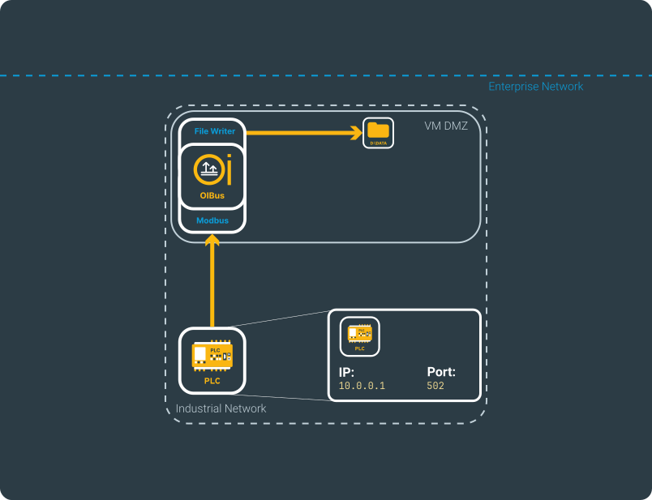
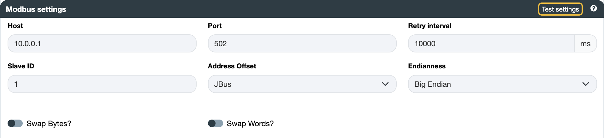
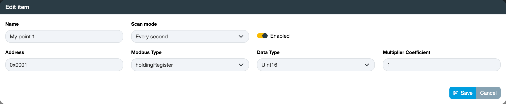
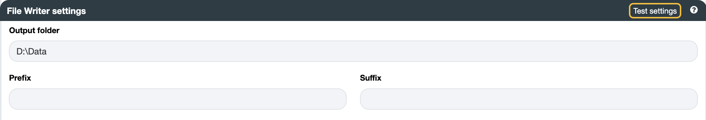

# Modbus → File Writer
## Beforehand
This use case is useful to properly test OIBus. You can use a Modbus Simulator.

Details regarding the configurations can be located on the [North File Writer](../guide/north-connectors/file-writer.md)
and [South Modbus](../guide/south-connectors/modbus.md) connectors pages.

This specific scenario is constructed around the depicted fictional network.

  

    

  

## South Modbus
Be sure to have the URL (or IP address) of the Modbus server and the access port (typically 502). Some servers (or 
masters) may have multiple clients (or slaves) connected. Be sure to know the slave ID to distinguish the target, or 
maintain it as 1 if there is only one slave.

In this example, the IP address is `10.0.0.1` and the port is `502`.

Based on the address schema of the PLC, opt for either JBus or Modbus offset to indicate whether register addresses
start at 0 or 1.

Additionally, note that PLCs may store retrieved values differently. Be sure to know the endianness, byte swapping, and 
word swapping.

  

    

  

:::tip Testing connection
You can verify the connection by testing the settings using the `Test settings` button.
:::

### Items
Include the addresses you intend to read. Consult the person responsible for the Modbus server to identify the available
addresses, their Modbus type, data type, and multiplier coefficient.
Choose a [scan mode](../guide/engine/scan-modes.md) to retrieve the data.

  

    

  

:::tip Massive import
For bulk item import, start by clicking the `Export` button to obtain a CSV file with the correct columns. Each line in
the file will correspond to a new item. Ensure that the names are unique.
:::

## North File Writer
Be sure to have the path to the folder that needs to be accessed. The user running OIBus must have the appropriate
access rights for that folder (here `D:\Data`)

:::info OIBus System user
When OIBus operates as a service on Windows, the default user is SYSTEM. You can modify this setting through the service
management tool by selecting OIBus and changing the user running the service. After saving the changes, make sure to 
restart the service.

OIBus has the capability to access remote folders. In such instances, recheck the user permissions for accessing the
remote folder. Keep in mind that SYSTEM users on Windows may not have access to remote folders.
:::

OIBus offers the capability to generate either files or JSON values. Files will be directly written as they are, while
JSON values will be converted into JSON files.

Additionally, you have the option to specify a prefix and suffix to be appended to each file written in the output folder.

  

    

  

:::tip Testing connection
You can verify the connection by testing the settings using the `Test settings` button.
:::