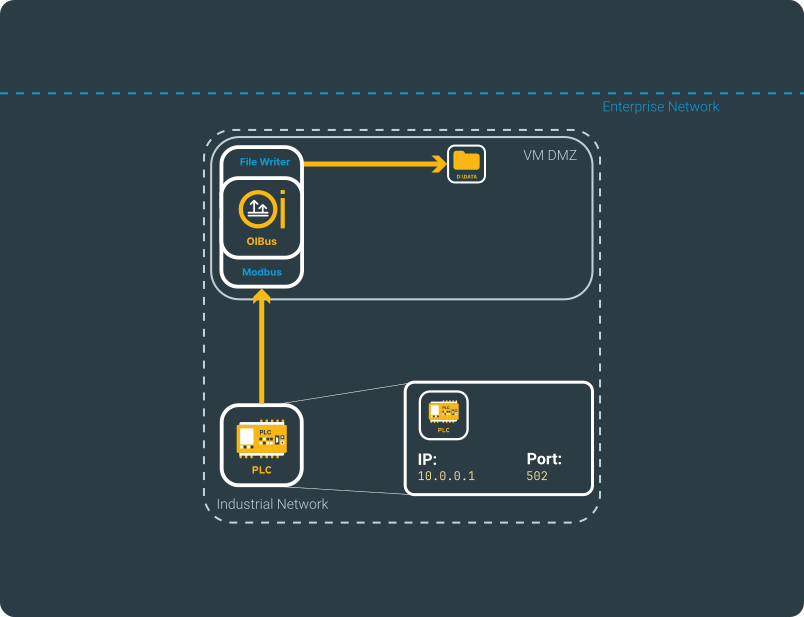
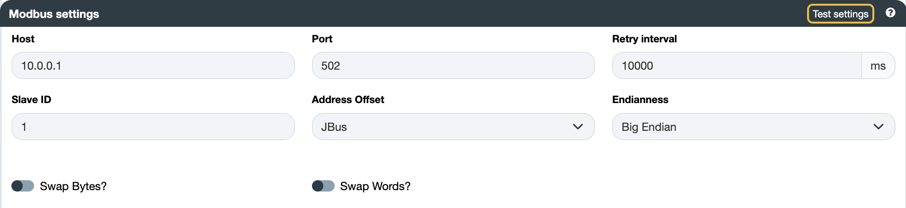
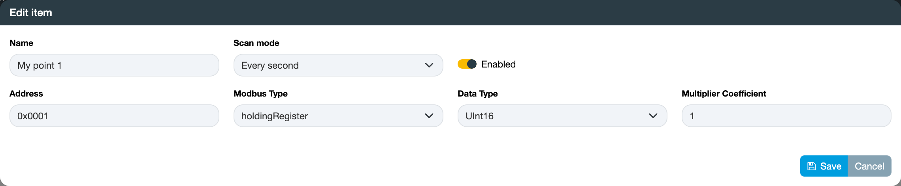
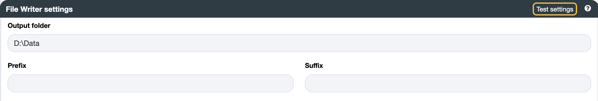

# Modbus → File Writer

## Beforehand

This use case is a good starting point for testing OIBus — you can use a Modbus simulator to try it without real hardware.

See the [North File Writer](../guide/north-connectors/file-writer.md) and [South Modbus](../guide/south-connectors/modbus.md) connector pages for full configuration details. The example uses the following fictional network.

  

    

  

## South Modbus

You need the IP address (or hostname) and port of the Modbus server (port 502 is the default). If the server has multiple slaves, you also need the slave ID of your target — use `1` when there is only one slave.

In this example, the IP address is `10.0.0.1` and the port is `502`.

Select **JBus** or **Modbus** address offset depending on whether register addresses start at 0 or 1 on your PLC. Also confirm the endianness, byte swapping, and word swapping with the PLC documentation or its administrator.

  

    

  

:::tip Testing connection
Click **Test settings** to verify the connection before saving.
:::

### Items

Add the register addresses you want to read. Ask the Modbus server administrator for the available addresses, their Modbus type, data type, and multiplier coefficient. Select a [scan mode](../guide/engine/scan-modes.mdx) to control the collection interval.

  

    

  

:::tip Bulk import
Click **Export** to download a CSV template with the correct columns, fill in one item per row, then import it back. Item names must be unique.
:::

## North File Writer

You need the path to the output folder and the OIBus service account must have write access to it (e.g. `D:\Data`).

:::info OIBus system user on Windows
When OIBus runs as a Windows service, the default account is **SYSTEM**. Change it via the Windows service manager if you need access to network shares or folders restricted to a specific user. Restart the service after changing the account. Note that the **SYSTEM** account does not have access to remote (UNC) paths by default.
:::

OIBus can write data as raw files or as JSON files. Files received from South connectors are written as-is; JSON values are serialised to JSON files. You can also add a prefix and suffix to every filename written to the output folder.

  

    

  

:::tip Testing connection
Click **Test settings** to verify the connection before saving.
:::
