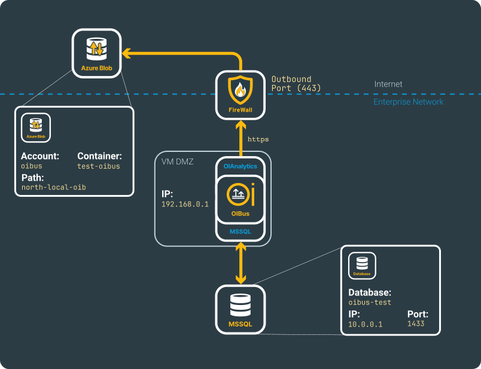

# MSSQL → Azure Blob
## Beforehand
This use case shows how to set up an SQL connector (here with MSSQL), particularly working on SQL queries with some tuning
and how to send the resulting CSV files into Azure Blob.

Details regarding the configurations can be located on the [North Azure Blob](../guide/north-connectors/azure-blob.md) and [South MSSQL](../guide/south-connectors/mssql.mdx) connectors pages.

This specific scenario is constructed around the depicted fictional network.

<div style={{ textAlign: 'center' }}>
  <div>

    

  </div>
</div>

## South MSSQL
Make sure you have the URL or IP address of the MSSQL server, along with its associated port, and a read-only user.

:::caution Read only user
While a read-only user is not mandatory, it is strongly recommended to prevent the insertion or update of data through 
a SQL query. South connectors are designed for accessing data, not for creating new entries.
:::

With the proposed schema, the following settings can be set:
- Host: `10.0.0.1`
- Port: `1433`
- Database: `oibus-test`


<div style={{ textAlign: 'center' }}>
  <div>

    

  </div>
</div>

:::tip Testing connection
You can verify the connection by testing the settings using the `Test settings` button.
:::

### SQL Queries
OIBus provides query variables such as `@StartTime` and `@EndTime`. However, their usage is not mandatory.

#### Without variable
In this example, a moving window interval can regularly retrieve the data without the need for such variables, between 
now and yesterday:

```SQL
SELECT data_name AS dataName, value, timestamp FROM table
WHERE timestamp > DATEADD(DAY,-1,GETDATE()) AND timestamp < GETDATE()
```

:::caution DateTime type
Ensure that you compare the date with a field of the same date type, such as a DateTime type. Use a 
[cast or convert function](https://learn.microsoft.com/en-us/sql/t-sql/functions/cast-and-convert-transact-sql?view=sql-server-ver16) to appropriately handle the field or your comparison date.
:::

In this scenario, the datetime fields section can still be employed to parse dates and output them in the appropriate format. 
Only the `timestamp` is a date time field, and we do not use it as a reference because it is not utilized with `@StartTime` or
`@EndTime`.

<div style={{ textAlign: 'center' }}>
  <div>

    

  </div>
</div>

#### With variables
The `@StartTime` variable captures the last maximum instant retrieved from a previous query. By default, for the initial 
query, it takes the current time minus one hour. The `@EndTime` variable is replaced by the current time.

To prevent overloading the server with a large query, you can divide the \[`@StartTime`, `@EndTime`\] interval into 
smaller chunks. This can be configured in the **History settings** section, from the connector settings:
- Max read interval (in seconds): If set to 60 seconds, and the interval is 1 hour, 60 sub-interval queries will be generated.
- Read delay (in milliseconds) between each sub-interval query.
- Overlap (in milliseconds) deduced a number of milliseconds from the `@StartTime` of the interval that will be chunked,
expanding the query interval while still allowing the retrieval of data before the last maximum instant retrieved.

<div style={{ textAlign: 'center' }}>
  <div>

    

  </div>
</div>

:::caution When to use overlap?
Overlap proves beneficial when certain retrieved data exhibit latency and are stored after the query has been executed.
In such cases, it allows for a slight extension of the requested interval.

Exercise caution if your query involves aggregation, as it might alter your data by shifting the time origin of the first 
interval.
:::

```SQL
SELECT timestamp, message, level FROM logs 
WHERE timestamp > @StartTime AND timestamp < @EndTime
```

##### Date time fields
One date time field can be added:
- Field name: timestamp
- Reference field: true
- Type: ISO 8601

The `timestamp` field contains a date-time in ISO-8601 format. It serves as a reference, implying that it will be 
stored in the maximum instant of the South cache.

##### Serialization
- Type: `csv`
- Filename: `sqlite-@CurrentDate.csv`
- Output date time format: `yyyy-MM-dd'T'HH:mm:ss.SSS'Z'`
- Output timezone: `Europe/Paris`
- Delimiter: `Comma ,`

<div style={{ textAlign: 'center' }}>
  <div>

    

  </div>
</div>

##### Result
Note that the filename with `@CurrentDate` will always be formatted `yyyy_MM_dd_HH_mm_ss_SSS`.

```csv title="CSV file sqlite-2024_01_23_10_38_50_063.csv"
timestamp;message;level
2024-01-23T11:38:36.282Z;"Error while connecting to the OPCUA server. Error: The connection may have been rejected by server,Err = (premature socket termination socket timeout : timeout=60000  ClientTCP_transport57)";error
2024-01-23T11:38:36.282Z;"South connector ""OPCUA"" (keOidHvw9qJ3CXAr1_zIF) disconnected";debug
2024-01-23T11:38:36.282Z;"Error while connecting to the OPCUA server. Error: The connection may have been rejected by server,Err = (premature socket termination socket timeout : timeout=60000  ClientTCP_transport56)";error
2024-01-23T11:38:36.282Z;"South connector ""Prosys HA"" (Mv8o0vr_nyh39-eF01Q2l) disconnected";debug
2024-01-23T11:38:40.007Z;Opening ./OIBus/data-folder/logs/logs.db SQLite database;debug
2024-01-23T11:38:40.007Z;"Sending ""SELECT timestamp, message, level FROM logs WHERE timestamp > @StartTime AND timestamp < @EndTime"" with @StartTime = 2024-01-23T10:38:17.083Z @EndTime = 2024-01-23T10:38:40.006Z";info
2024-01-23T11:38:40.059Z;Found 24 results for item SQLite log 2 in 52 ms;info
2024-01-23T11:38:40.063Z;"Writing 4913 bytes into CSV file at ""./OIBus/data-folder/cache/data-stream/south-GG6BT_CR31m1h1jMpm9ud/tmp/sqlite-2024_01_23_10_38_40_063.csv""";debug
2024-01-23T11:38:40.063Z;"Sending CSV file ""./OIBus/data-folder/cache/data-stream/south-GG6BT_CR31m1h1jMpm9ud/tmp/sqlite-2024_01_23_10_38_40_063.csv"" to Engine";debug
2024-01-23T11:38:40.063Z;"Add file ""./OIBus/data-folder/cache/data-stream/south-GG6BT_CR31m1h1jMpm9ud/tmp/sqlite-2024_01_23_10_38_40_063.csv"" to cache from South ""SQLite log""";debug
2024-01-23T11:38:40.063Z;"Caching file ""./OIBus/data-folder/cache/data-stream/south-GG6BT_CR31m1h1jMpm9ud/tmp/sqlite-2024_01_23_10_38_40_063.csv"" in North connector ""Console debug""...";debug
2024-01-23T11:38:40.064Z;"File ""./OIBus/data-folder/cache/data-stream/south-GG6BT_CR31m1h1jMpm9ud/tmp/sqlite-2024_01_23_10_38_40_063.csv"" cached in ""./OIBus/data-folder/cache/data-stream/north-FSyK0CdXNxVe0onCI1RA1/files/sqlite-2024_01_23_10_38_40_063-1706006320063.csv""";debug
2024-01-23T11:38:40.066Z;Next start time updated from 2024-01-23T10:38:17.083Z to 2024-01-23T10:38:36.282Z;debug
2024-01-23T11:38:40.067Z;"File ""./OIBus/data-folder/cache/data-stream/north-FSyK0CdXNxVe0onCI1RA1/files/sqlite-2024_01_23_10_38_40_063-1706006320063.csv"" moved to archive folder ""./OIBus/data-folder/cache/data-stream/north-FSyK0CdXNxVe0onCI1RA1/archive/sqlite-2024_01_23_10_38_40_063-1706006320063.csv""";debug
2024-01-23T11:38:46.283Z;Connecting to OPCUA on opc.tcp://oibus.rd.optimistik.fr:53530/OPCUA/SimulationServer;debug
```

In this example, the maximum instant saved for the `@StartTime` of the next query will be `2024-01-23T11:38:46.283Z`, 
injected into the request in ISO 8601 format.

:::tip SQLite log database
This query example can be used for the SQLite log database of OIBus `./logs/logs.db`.
:::

## North Azure Blob
Be sure to have the user credentials with access to an Azure Blob container with write access.

Create the Azure Blob North connector and populate the relevant fields:
- Account: `oibus`
- Container: `test-oibus`
- Path: `north-local-oib`

If **Path** is kept empty, the files will be stored at the root container.

<div style={{ textAlign: 'center' }}>
  <div>

    

  </div>
</div>

:::tip Testing connection
You can verify the connection by testing the settings using the `Test settings` button.
:::