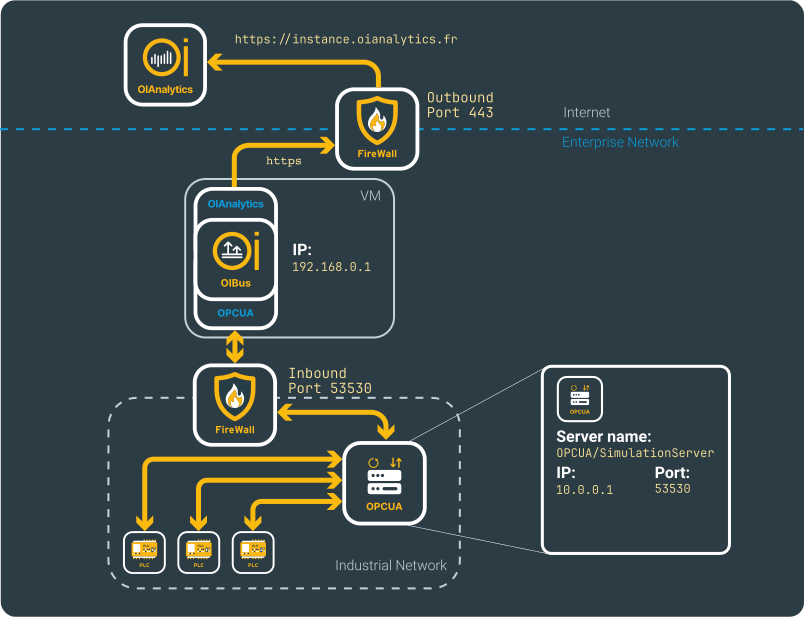
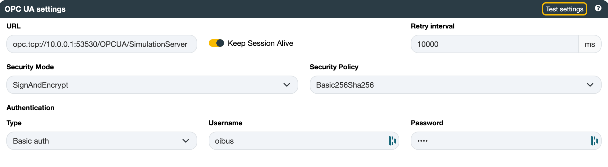
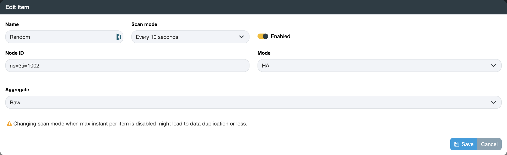

import NorthOIAnalytics from './_north_oianalytics.mdx';

# OPC UA™ → OIAnalytics®

## Beforehand

See the [North OIAnalytics®](../guide/north-connectors/oianalytics.md) and [South OPC UA™](../guide/south-connectors/opcua.mdx) connector pages for full configuration details.

Make sure to select OPC UA as your protocol — it is entirely different from [OPC Classic™](../guide/south-connectors/opc.mdx). The example uses the following fictional network.

<div style={{ textAlign: 'center' }}>
  <div>

    

  </div>
</div>

## South OPC UA

The OPC UA server URL follows this structure:

```
opc.tcp://<host>:<port>/<name>
```

- `host` — hostname or IP address of the server (e.g. `10.0.0.1`)
- `port` — port on which the server listens (e.g. `53530`)
- `name` — name assigned to the OPC UA server (e.g. `OPCUA/SimulationServer`)

Example: `opc.tcp://10.0.0.1:53530/OPCUA/SimulationServer`

Set the security mode your server requires. If it differs from **None**, also specify the security policy. Avoid **None** in production — use it only for testing. Obtain credentials or certificates from your IT team or the OPC UA server administrator.

<div style={{ textAlign: 'center' }}>
  <div>

    

  </div>
</div>

:::tip Testing connection
Click **Test settings** to verify the connection before saving.
:::

### Items

Add the node IDs you want to read. Ask the OPC UA server administrator for the list of available nodes.

Choose the access **mode** (DA or HA). In HA mode, OIBus retrieves all values recorded since the last query and can aggregate or resample them — check with the server administrator which aggregates are supported. If unsure, use the **Raw** aggregate. In DA mode, OIBus retrieves one value per item per scan.

Select a [scan mode](../guide/engine/scan-modes.mdx) to control the collection interval.

<div style={{ textAlign: 'center' }}>
  <div>

    

  </div>
</div>

:::tip Bulk import
Click **Export** to download a CSV template with the correct columns, fill in one item per row, then import it back. Item names must be unique.
:::

<NorthOIAnalytics></NorthOIAnalytics>
