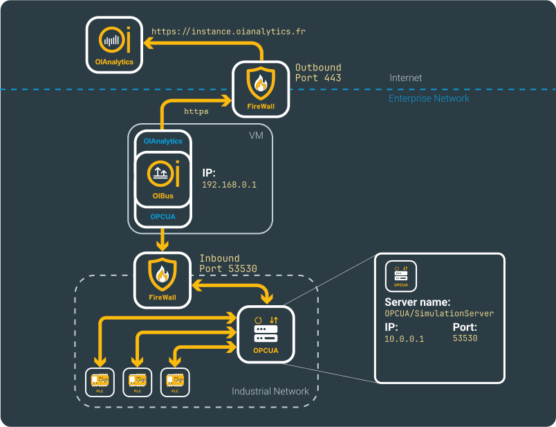

import NorthOIAnalytics from './_north_oianalytics.mdx';

# OPCUA → OIAnalytics
## Beforehand
Details regarding the configurations can be located on the [North OIAnalytics](../guide/north-connectors/oianalytics.md)
and [South OPCUA](../guide/south-connectors/opcua.md) connectors pages.

Additionally, ensure that the selected protocol for connection is OPCUA, distinguishing it from 
[OPCDA or OPCHDA](../guide/south-connectors/opc-hda.md), which represent entirely distinct technologies.

This specific scenario is constructed around the depicted fictional network.

<div style={{ textAlign: 'center' }}>
  <div>

    

  </div>
</div>

## South OPCUA
The complete URL format for the OPCUA server should adhere to the following structure:
```
opc.tcp://<host>:<port>/<name>
```

Here's a breakdown:
- `host` represents either the host name or IP address of the server (e.g., `10.0.0.1`).
- `port` specifies the port through which the server accepts connections (e.g., `53530`).
- `name` indicates the name assigned to the OPCUA server (e.g., `OPCUA/SimulationServer`).
For instance, in this example, the OPCUA server URL is `opc.tcp://10.0.0.1:53530/OPCUA/SimulationServer`.

Specify the security mode supported by your server. If it differs from None, provide details about the security policy
as well. Using `None` for authentication with OIBus is discouraged, except for testing purposes.

Ensure you have the necessary credentials or certificates for authentication, which can be obtained from your IT team
or the individual overseeing the OPCUA server.

<div style={{ textAlign: 'center' }}>
  <div>

    

  </div>
</div>

:::tip Testing connection
You can verify the connection by testing the settings using the `Test settings` button.
:::

### Items
Add the node ID you wish to read. Consult the person in charge of the OPCUA server to determine the available data points.

You have the option to choose the access `mode` (DA or HA). In HA mode, you can aggregate and resample the data. Ensure 
that the server supports the selected aggregate and resampling options. If in doubt, stick with the `Raw` aggregate.

Opt for a [scan mode](../guide/engine/scan-modes.md) to fetch the data. In HA mode, a list of values is retrieved for 
an item since the last value was obtained, while in DA mode, only one value is retrieved at the requested time for one item.

<div style={{ textAlign: 'center' }}>
  <div>

    

  </div>
</div>

:::tip Massive import
For bulk item import, start by clicking the `Export` button to obtain a CSV file with the correct columns. Each line in
the file will correspond to a new item. Ensure that the names are unique.
:::

<NorthOIAnalytics></NorthOIAnalytics>