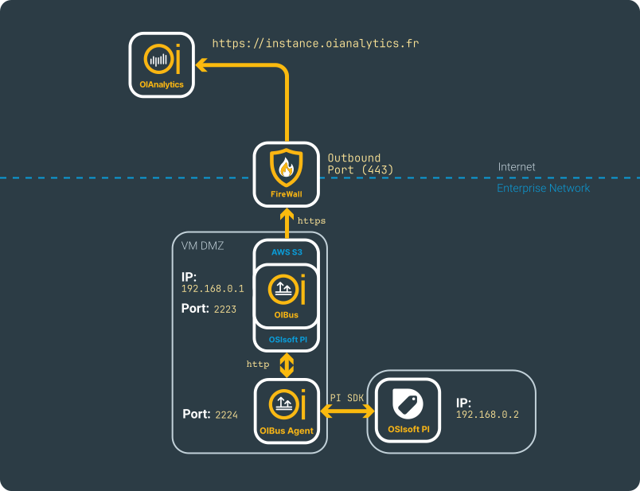
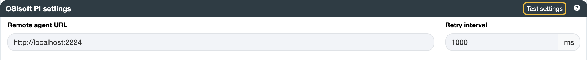
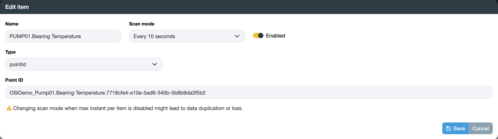
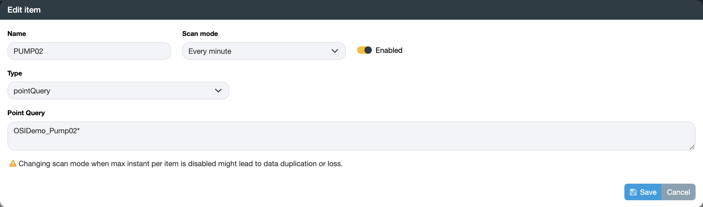

import NorthOIAnalytics from './_north_oianalytics.mdx';

# OSIsoft PI System™ → OIAnalytics®

## Beforehand

OSIsoft PI System™ is a real-time data management platform widely used in manufacturing, energy, and utilities to collect, store, and analyse time-series data from industrial processes.

See the [North OIAnalytics](../guide/north-connectors/oianalytics) and [South OSIsoft PI](../guide/south-connectors/osisoft-pi) connector pages for full configuration details.

This use case requires an [OIBus Agent](../guide/oibus-agent/installation). Install it either on the PI server itself or on another machine where the OSIsoft PI SDK is installed — see [OSIsoft PI SDK configuration](../guide/south-connectors/osisoft-pi#osisoft-pi-sdk-configuration) for details. The example uses the following fictional network.

  

    

  

## South PI

Enter the **Remote agent URL**. In this example: `http://localhost:2224`.

  

    

  

:::tip Testing connection
Click **Test settings** to verify the connection before saving.
:::

### Items

PI items can be of two types:

- **Point ID** — retrieve time-series values for a single PI point.
- **Query** — retrieve time-series values for all PI points matching a regex-like expression. The item name is used only for logging; the data is labelled with the actual PI point references.

#### Point ID

  

    

  

#### Query

  

    

  

<NorthOIAnalytics></NorthOIAnalytics>
