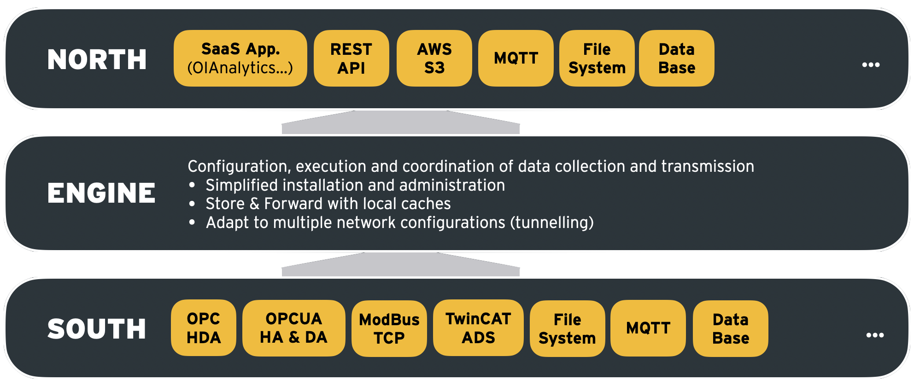

# 主要概念
## 开源、可扩展和灵活性
OIBus 是一种轻量级和灵活性的数据采集解决方案，用于简化工业环境中的数据恢复。
它从工业中遇到的各种来源收集数据，并将其传输到无论是本地还是云端的目标应用程序。

OIBus 是一个开源解决方案，提供极大的灵活性以解决各种用例。这个解决方案最初是为了提升OIAnalytics® 方案的能力而开发的，自2020年以来，Optimistik公司一直以[(EU-PL)](https://ec.europa.eu/info/european-union-public-licence_en)开源许可证提供并维护此方案。
其他解决方案提供商选择加入这一倡议，使得工业数据的收集不再是其数字化的障碍。

## 流处理解决方案
OIBus 以模块化方式构建，包括南端（从源系统收集数据）、北端（向目标系统传输）以及引擎（主要负责配置、编排和缓存）。

  

    

  

这种结构通过将大部分复杂性集中在引擎上，从而促进了该解决方案的可扩展性。因此，北端或南端模块的开发更加容易。

## 高级功能
OIBus 已支持许多工业数据源，并且可以通过其开源代码进行丰富。
- **工业信息系统**：具有各种协议的PLC、监控、历史记录仪（OPCUA-HA, OPCUA-HDA, OPC-HDA, TwinCAT ADS, ModBus等）
- **商业信息系统**：通过SQL查询访问商业信息系统（Oracle, Microsoft SQL Server, PostgreSQL, MySQL, MariaDB, SQLite等），文件检索（xls, csv等）
- **物联网传感器**：订阅物联网消息服务（MQTT, API等）
  OIBus 同时支持许多可以根据需要扩展的应用目标。
- **SaaS 应用程序**：OIAnalytics®, AWS S3, Azure Blob, REST API等
- **物联网平台**：订阅物联网消息服务（MQTT, API等）
- **数据库**：InfluxDB, TimeScale DB, MongoDB等
  此外，OIBus 设计之初就能承受大负载，并已在数据流量从10到10,000点每秒精度测量的许多工业现场使用。
  总的来说，OIBus 可以管理：
- 可靠、安全和优化的通信
- 存储和转发，以避免错过任何数据
- 通过HTTPS加固的通信
- 数据压缩
- 隧道和代理管理