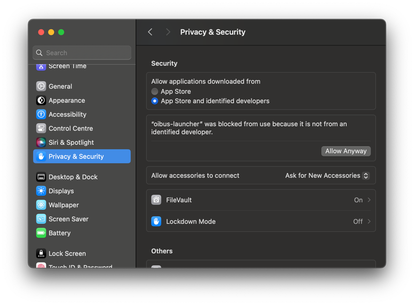

import DownloadButton from '../../../../../../src/components/DownloadButton';
import packageInfo from '../../../../../../package.json';

<h2 id="download-macos">下载</h2>

<div style={{ display: 'flex', justifyContent: 'space-around' }}>
  <DownloadButton
    link={`https://github.com/OptimistikSAS/OIBus/releases/download/v${packageInfo.version}/oibus-macos_x64-v${packageInfo.version}.zip`}
  >
    <div>
      <div>{`OIBus v${packageInfo.version}`}</div>
      <div>macOS (Intel)</div>
    </div>
  </DownloadButton>
  <DownloadButton
    link={`https://github.com/OptimistikSAS/OIBus/releases/download/v${packageInfo.version}/oibus-macos_arm64-v${packageInfo.version}.zip`}
  >
    <div>
      <div>{`OIBus v${packageInfo.version}`}</div>
      <div>macOS (Apple Silicon)</div>
    </div>
  </DownloadButton>
</div>

:::info
macOS 支持主要用于开发和测试。对于生产环境部署，请使用 Linux 或 Windows，因为在这些平台上 OIBus 可以安装为系统服务。
:::

## 运行 OIBus {#run-oibus}

1. 将下载的压缩包解压到你选择的位置。

2. 打开 **Terminal** 并导航到解压后的文件夹。

3. 启动 OIBus：

```bash
./oibus-launcher --config ~/oibus-data
```

将 `~/oibus-data` 替换为你想要存储 OIBus 配置和缓存文件的路径。

:::note

- 运行该二进制文件需要管理员权限。
- 该二进制文件必须从其自身所在的文件夹中执行。
  :::

## 允许应用执行 {#allow-app-execution}

macOS 的 Gatekeeper 会在首次启动时阻止未签名的二进制文件。你需要分别允许 `oibus-launcher`
和 `oibus`（启动器会将其作为子进程启动）：

1. 运行 `./oibus-launcher`——macOS 会显示安全警告并阻止执行。
2. 前往**系统设置 → 隐私与安全性**。
3. 在**安全性**部分，点击被阻止的二进制文件旁边的**仍要打开**。
4. 当第二个二进制文件被阻止时，重复上述步骤。

<div style={{ textAlign: 'center' }}></div>

## 访问 OIBus {#access-oibus}

OIBus 运行后，在浏览器中打开 `http://localhost:2223`，然后按照
[首次访问指南](./first-access.mdx)操作。
