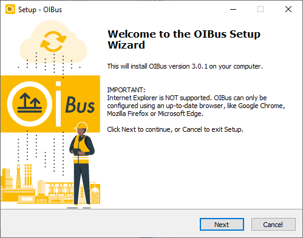
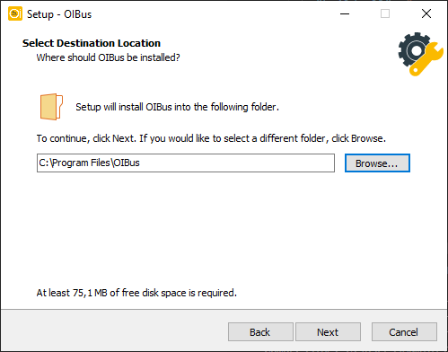
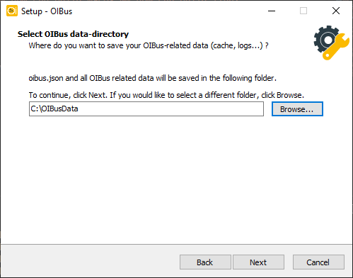
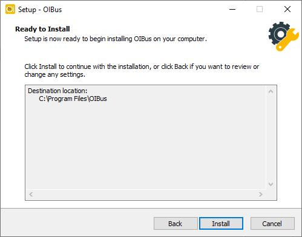

import DownloadButton from '../../../../../../src/components/DownloadButton';
import packageInfo from '../../../../../../package.json';
import Tabs from '@theme/Tabs';
import TabItem from '@theme/TabItem';

**选择最适合您需求的安装方式：**

- 使用**安装程序（Installer）**进行引导式、用户友好的安装。它还支持在同一台机器上并排运行
  多个 OIBus 实例。
- 高级用户或需要脚本化/无人值守部署的场景，请使用**脚本（Scripts）**方式（参见
  [自动化安装](./disk-image.mdx)）。

<Tabs>
  <TabItem value="windows-installer" label="Installer" default>
    <h2 id="download-windows-installer">下载</h2>
    <div style={{ display: "flex", justifyContent: "space-around" }}>
      <DownloadButton
        link={`https://github.com/OptimistikSAS/OIBus/releases/download/v${packageInfo.version}/oibus-win_x64-setup-v${packageInfo.version}.exe`}>
        <div>
          <div>{`OIBus v${packageInfo.version}（x64 安装程序）`}</div>
          <div>Windows (x64)</div>
        </div>
      </DownloadButton>
    </div>

    <h2 id="installation-steps-windows-installer">安装步骤</h2>

    1. **运行安装程序**

    启动下载好的安装程序。您将看到欢迎界面：
    <div style={{ textAlign: 'center' }}>
      
    </div>

    2. **接受许可协议**

    阅读并接受 **EU-PL 许可协议**以继续。
    <div style={{ textAlign: 'center' }}>
      
    </div>

    3. **选择服务名称并设置数据目录**

    **服务名称（Service Name）**用于将此 OIBus 安装标识为一个 Windows 服务。单个安装保持默认值
    （`OIBus`）即可；如需在同一台机器上并排运行多个 OIBus 实例，可为其指定一个唯一名称
    （仅限字母、数字、空格、点、连字符和下划线）。
    **数据目录（Data Directory）**是存储其配置、缓存和日志的位置：
    <div style={{ textAlign: 'center' }}>
      
    </div>

    :::tip
    为了数据安全，建议将数据文件夹放在**单独的磁盘**上（例如 `D:\OIBusData`）。这有助于避免系统盘
    出现磁盘空间问题，并提高可靠性。
    :::

    :::info
    每个 OIBus 实例都需要拥有各自独立的安装文件夹和数据目录。如果其中任意一个已被另一个实例占用，
    安装程序会报错并停止，要求您在此处（或下方的安装路径页面）选择不同的值。
    :::

    4. **设置初始变量**

    设置初始管理员用户名、密码，以及 OIBus 将监听的端口。每个实例都拥有各自独立的凭据，
    因此在与现有实例一起安装第二个实例时，通常需要修改的是这里的**端口**（它们不能共用同一端口）：
    <div style={{ textAlign: 'center' }}>
      
    </div>

    5. **选择安装路径**

    选择将安装 OIBus 二进制文件的目录。该路径会根据步骤 3 中的服务名称预先填充建议值
    （默认名称为 `OIBus`，否则为 `OIBus - <name>`），但您仍可以修改它——只需确保该文件夹
    未被其他实例占用即可：
    <div style={{ textAlign: 'center' }}>
      
    </div>

    6. **确认并安装**

    检查您的设置并确认以开始安装：
    <div style={{ textAlign: 'center' }}>
      
    </div>

    7. **完成安装**

    安装完成后，您将看到一个确认界面。

    <div style={{ textAlign: 'center' }}>
      
    </div>

    您可以确认 OIBus 是否已作为 Windows 服务正常运行。
    <div style={{ textAlign: 'center' }}>
      
    </div>

    二进制文件夹如下所示：
    <div style={{ textAlign: 'center' }}>
      
    </div>

    数据文件夹如下所示：
    <div style={{ textAlign: 'center' }}>
      
    </div>

    请前往[首次访问指南](./first-access.mdx)配置 OIBus。

    <h2 id="update-oibus-windows-installer">更新 OIBus</h2>

    - 使用 **OIBus Windows 安装程序**进行更新。
    - 使用与要升级的现有安装**相同的服务名称**——使用不同的名称会安装一个新的附加实例，
      而不是更新现有实例。
    - 指定当前的可执行文件和配置路径。
    - 选择**保留**或**替换**现有配置。
    - OIBus 服务会在更新期间短暂停止。
    - 更新后首次启动时，`oibus.db` 配置数据库会自动升级。

    <h2 id="uninstall-oibus-windows-installer">卸载 OIBus</h2>

    1. 导航到 OIBus 二进制文件夹。
    2. 以管理员身份运行 `unin000.exe` 并确认移除：
    <div style={{ textAlign: 'center' }}>
      
    </div>
    3. 系统会询问是否移除该实例的所有数据（缓存、错误、归档、日志、证书以及配置/凭据数据库）。
       选择"是"以外的任何选项都会保留数据文件夹不变：
    <div style={{ textAlign: 'center' }}>
      
    </div>

    :::caution
    选择移除所有数据将永久删除您的配置、凭据和日志。
    :::

    :::info 卸载共享安装文件夹
    如果多个 OIBus 实例安装在同一个二进制文件夹中，卸载操作会移除它们所共同依赖的文件。
    在这种情况下，在进行任何操作之前，会出现一个列出所有受影响实例的警告，随后每个实例
    都会依次被停止并提供数据移除选项。
    :::

  </TabItem>

  <TabItem value="windows-scripts" label="Scripts">
    <h2 id="download-windows-scripts">下载</h2>

    <div style={{ display: "flex", justifyContent: "space-around" }}>
      <DownloadButton
        link={`https://github.com/OptimistikSAS/OIBus/releases/download/v${packageInfo.version}/oibus-win_x64-v${packageInfo.version}.zip`}>
        <div>
          <div>{`OIBus v${packageInfo.version}（zip 压缩包）`}</div>
          <div>Windows (x64)</div>
        </div>
      </DownloadButton>
    </div>

    <h2 id="installation-steps-windows-scripts">安装步骤</h2>

    1. **解压 Zip 压缩包**

    将下载的文件解压到您希望安装 OIBus 的目录中（例如 `C:\Program Files\OIBus`）。

    2. **运行安装脚本**
    在解压后的文件夹中打开一个**管理员终端**并运行：
    ``` commandline title="Usage"
    install.bat -c "[your-data-folder-path]"
    ```

    | 参数 | 说明 | 默认值 |
    |------|-------------|---------|
    | `-c` | OIBus 数据文件夹路径（缓存、日志、配置） | 如省略则会提示输入 |
    | `-n` | Windows 服务名称——使用唯一名称可在同一台机器上运行多个 OIBus 实例 | `OIBus` |
    | `-u` | 首次安装时写入 `oibus.init.json` 的管理员用户名 | 省略（则应用 OIBus 默认值） |
    | `-p` | 首次安装时写入 `oibus.init.json` 的管理员密码 | 省略（则应用 OIBus 默认值） |
    | `-port` | OIBus 监听的端口，首次安装时写入 `oibus.init.json` | 省略（则应用 OIBus 默认值） |

    :::info
    `-u`、`-p` 和 `-port` 仅在 `oibus.db` 尚不存在时（即首次安装时）使用。它们会被写入数据文件夹中的
    `oibus.init.json` 文件，并由 OIBus 在首次启动时应用。
    未指定的参数不会写入该文件——OIBus 将对这些值使用内置默认值。
    在后续安装或更新时，该文件不会被重新创建，因此这些参数不再生效。
    :::

    :::tip
    - 如果您省略 `-c` 参数，脚本将提示您输入数据路径。
    - 为了数据安全，建议将数据文件夹放在**单独的磁盘**上（例如 `D:\OIBusData`）。这有助于
    避免系统盘出现磁盘空间问题，并提高可靠性。
    :::

    :::info
    每个 OIBus 实例都需要拥有各自独立的安装文件夹和数据目录。`install.bat` 会在安装任何内容之前
    检查这一点，如果其中任意一个已属于另一个实例，则会报错退出。
    :::

    **示例：**
    ``` commandline title="Example with terminal outputs"
    install.bat -c "D:\OIBusData" -u "admin" -p "password" -port 2223
    > Administrator permissions required. Detecting permission...
    > Stopping OIBus service...
    > Installing OIBus as Windows service...
    > The "OIBus" service has been successfully installed!
    > Configuration of the "AppDirectory" parameter value for the "OIBus" service.
    > nssm set OIBus AppNoConsole 1
    > Starting OIBus service...
    > OIBus: START: Operation successful.
    > Creating go.bat
    > echo Stopping OIBus service... You can restart it from the Windows Service Manager
    > nssm.exe stop OIBus
    > "C:\Users\Administrator\Downloads\oibus-win_x64\oibus-launcher.exe" --config "D:\OIBusData"
    ```

    请前往[首次访问指南](./first-access.mdx)配置 OIBus。

    <h2 id="update-oibus-windows-scripts">更新 OIBus</h2>

    1. 从 zip 压缩包中解压新文件。
    2. 打开 **Windows 服务管理器**并停止 OIBus 服务。
    3. 用新文件替换 OIBus 可执行文件目录中的旧文件。
    4. 重启 OIBus 服务。
    5. 首次启动时，`oibus.db` 配置数据库会自动升级。

    :::info
    如果您改为重新运行 `install.bat` 进行更新，请使用与现有实例**相同的 `-n`** 值——使用不同的名称
    会安装一个新的附加实例，而不是更新现有实例。
    :::

    <h2 id="uninstall-oibus-windows-scripts">卸载 OIBus</h2>

    在**管理员终端**中运行以下命令：
    ```` commandline title="Example with terminal outputs"
    uninstall.bat -n "OIBus"
    > Administrator permissions required. Detecting permission...
    > Stopping OIBus service...
    > Do you wish to remove all data for service OIBus (cache, logs...)? (y/N)
    > Removing OIBus service...
    ````

    系统会询问是否移除所有数据（缓存、错误、归档、日志、证书以及配置/凭据数据库）。
    输入 `Y`/`y` 以外的任何内容都会保留数据文件夹不变。

    :::caution
    选择移除所有数据将永久删除您的配置、凭据和日志。
    :::

  </TabItem>
</Tabs>
