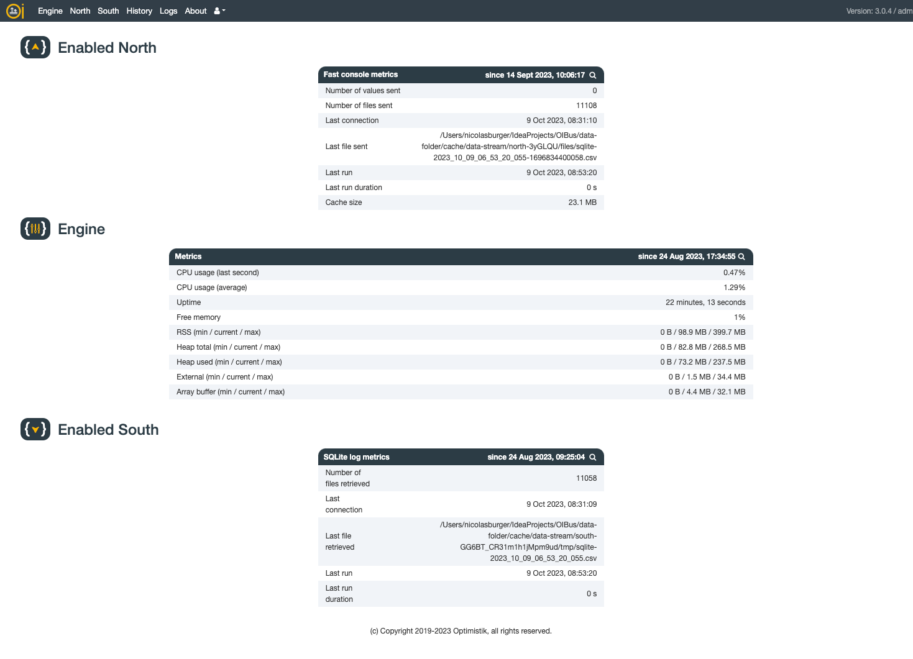
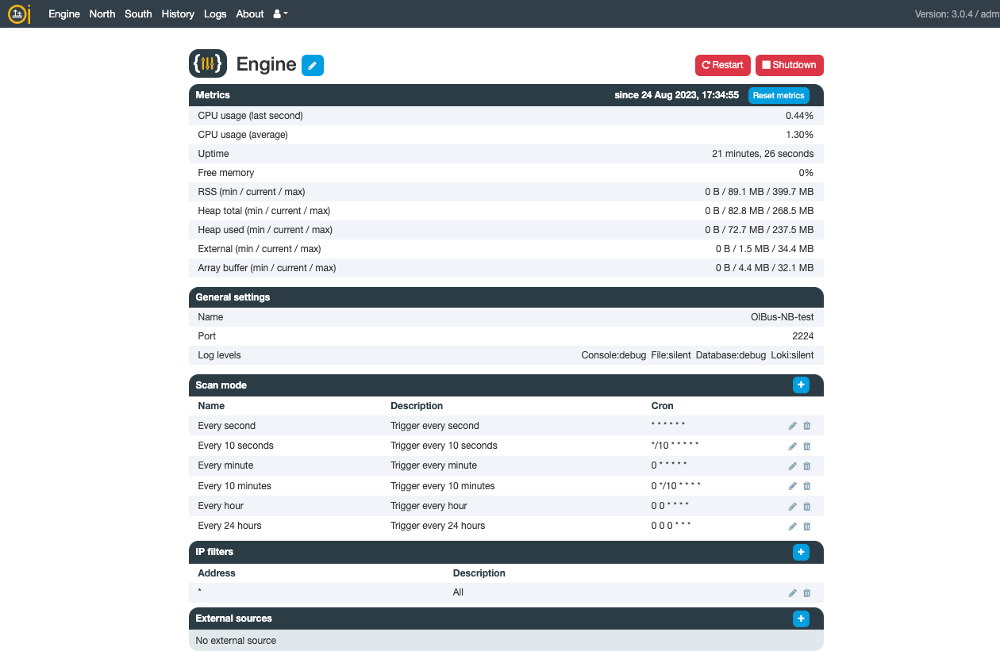
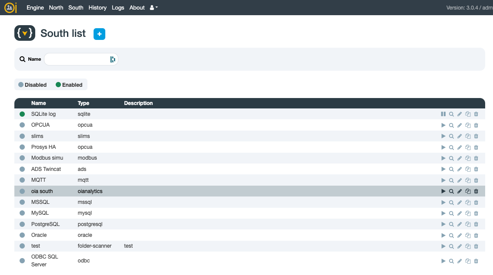
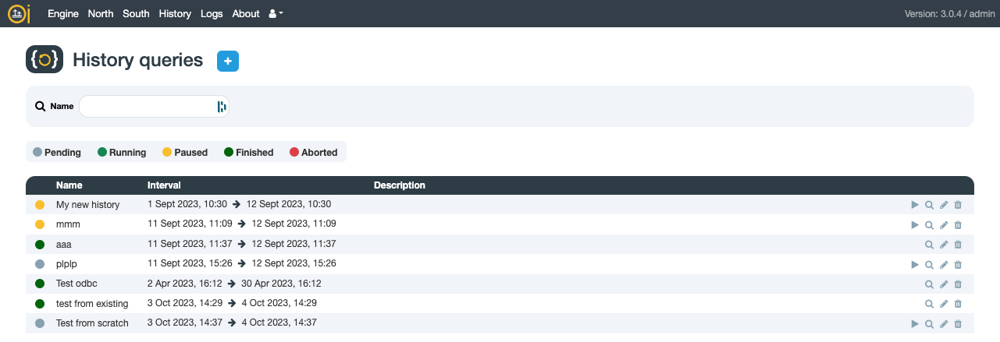
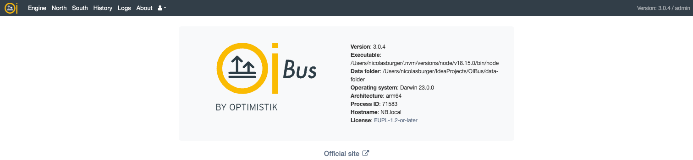

# First access
OIBus configuration interface is available on `http://localhost:2223`.

:::caution Default access
By default, the user is **admin** and the password is **pass**.

We strongly advise to change the password in the [user settings](#user-settings).
:::

## OIBus pages
### Home page
The OIBus home page show enabled connectors and the engine with their associated metrics.

  

The magnifying glass icon redirect you to the display page of the connector or of the engine.

### Engine
The engine page allows you to set logger, [Scan Modes](../engine/scan-modes.md), [IP Filters](../engine/ip-filters.md)
and [External Sources](../engine/external-sources.md).

  

The restart button and the shutdown button has an effect on the engine only, not on the service. It means it will shut down
the connectors, but not the web service, which allows you to still access the OIBus interface.

When installing OIBus, remember to choose an appropriate name. The _Engine name_ is important mainly if you use several
OIBus and send the logs to a remote [loki instance](../engine/engine-settings.md#loki).

### North
To add a North connector, simply click the "+" button.

On the list's right-hand side, you have the options to activate/deactivate a connector, access its display page or
editing form, create a duplicate, or delete it.

  

### South
To add a South connector, simply click the "+" button.

On the list's right-hand side, you have the options to activate/deactivate a connector, access its display page or
editing form, create a duplicate, or delete it.

  

### History
To add a North connector, simply click the "+" button. You can then either create a History query from scratch or
by importing existing South or North settings.

On the list's right-hand side, you have the options to activate/deactivate a connector, access its display page or
editing form, create a duplicate, or delete it.

  

### Logs
The log page automatically refreshes every 10 seconds. You have the ability to filter the logs based on dates, log level,
log type (logs generated by South, North, engine, etc.), scope (the connector or history query responsible for the log),
or the content of the log message.

  

### About
Information about the OIBus process and link to the documentation.

  

### User settings
You can modify your password and select the timezone for how you'd like dates to appear in the interface.

  

