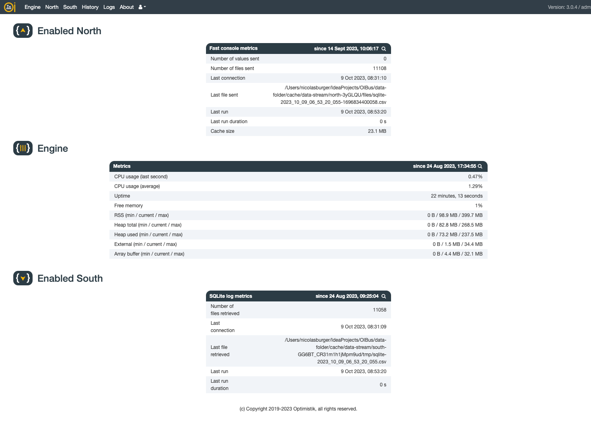
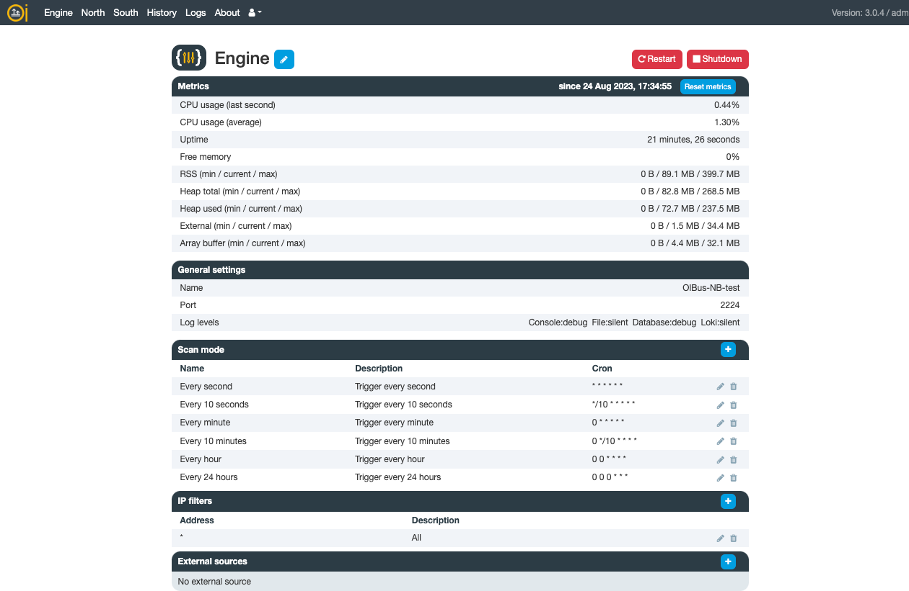
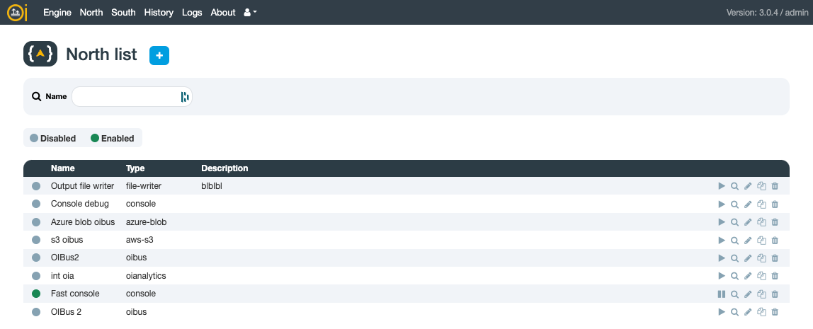
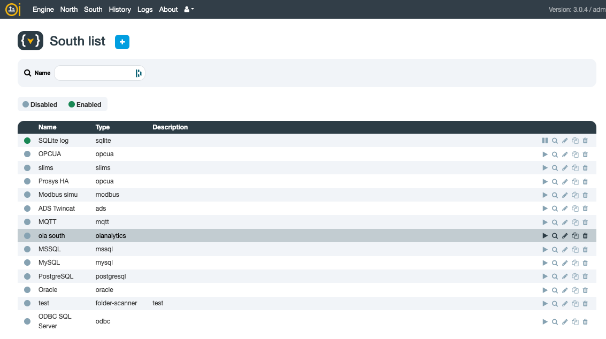
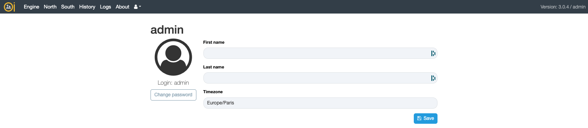

# 首次访问

OIBus 运行后，打开浏览器并访问 `http://localhost:2223`。

:::caution 默认凭据
默认登录名为 **admin**，密码为 **pass**。

首次登录后请立即在[用户设置](#user-settings)部分修改密码。
:::

:::note 端口配置
如果默认端口 **2223** 与其他服务冲突，可以在[引擎设置](../engine/engine-settings.mdx#port)中修改。
:::

## 主页 {#home-page}

主页提供了 OIBus 实例的实时概览：已启用的北向连接器及其实时指标排在最前面，其次是引擎状态，然后是已启用的南向连接器。

点击任意连接器或引擎旁边的**放大镜**图标，可打开其展示页面，查看详细的指标和缓存状态。

## 引擎 {#engine}

引擎页面是 OIBus 全局设置的控制中心。你可以在此处配置：

- 常规设置（名称）
- [Web 服务器设置](../engine/engine-settings.mdx#web-server)（端口、身份验证时长）
- [代理服务器](../engine/engine-settings.mdx#proxy-server)
- [日志参数](../engine/engine-settings.mdx#logging-parameters)
- [扫描模式](../engine/scan-modes.mdx)
- [IP 过滤器](../engine/ip-filters.mdx)
- 证书
- 转换器

页面顶部的 **OIAnalytics** 按钮会打开 [OIAnalytics 注册](./oianalytics.mdx)设置。

:::note 重启按钮
**重启**按钮会停止 OIBus 进程。只有当 OIBus 在 **OIBus 启动器**（`oibus-launcher`）下运行时——这也是已安装系统服务的运行方式——它才会自动重新启动：启动器会检测到 OIBus 进程已退出并再次启动它。

如果 `oibus` 二进制文件是直接启动的（例如从终端启动，未使用启动器），点击重启按钮只会停止进程，而不会自动重新拉起它。
:::

:::tip 允许远程访问
要从另一台机器访问 OIBus，请添加一条 IP 过滤规则——也可以通过 curl 进行自动化配置。
详情请参见 [IP 过滤器](../engine/ip-filters.mdx)。
:::

### 引擎指标 {#engine-metrics}

引擎展示页面显示 OIBus 进程的实时资源使用情况，自上次重置指标以来持续跟踪（此页面提供**重置指标**按钮）：

| 指标                             | 说明                                      |
| -------------------------------- | ----------------------------------------- |
| **CPU 使用率（最近一秒）**       | 最近一秒的 CPU 使用率。                   |
| **CPU 使用率（平均值）**         | 自上次重置指标以来的滚动平均 CPU 使用率。 |
| **正常运行时间**                 | 自 OIBus 进程上次启动以来经过的时间。     |
| **可用内存**                     | 系统当前可用内存的百分比。                |
| **RAM 使用率（最小/当前/最大）** | 自指标重置以来 OIBus 进程占用的常驻内存。 |
| **堆总量（最小/当前/最大）**     | 为 JavaScript 堆分配的总内存。            |
| **已用堆内存（最小/当前/最大）** | 堆中实际使用的内存。                      |
| **外部内存（最小/当前/最大）**   | 原生扩展（如 C++ 绑定）使用的内存。       |
| **数组缓冲区（最小/当前/最大）** | 为二进制数据缓冲区分配的内存。            |

## 北向连接器 {#north-connectors}

北向连接器定义了 OIBus 发送数据的目的地。点击 **+** 添加新连接器，并从可用类型中进行选择。

列表中的每个连接器右侧都提供以下操作：

- **启用/禁用**——在不删除连接器的情况下将其开启或关闭
- **展示**——打开连接器的监控页面（指标、缓存状态、最近的发送记录）
- **编辑**——修改连接器的设置
- **复制**——以新名称创建该连接器的副本
- **删除**——永久移除该连接器

:::tip
有关缓存设置、限流和转换器的详细信息，请参见[北向连接器指南](../north-connectors/common-settings.md)。
:::

## 南向连接器 {#south-connectors}

南向连接器定义了 OIBus 读取数据的数据源。点击 **+** 添加新连接器，并从可用协议中进行选择。

列表中的每个连接器右侧都提供以下操作：

- **启用/禁用**——在不删除连接器的情况下将其开启或关闭
- **展示**——打开连接器的监控页面（指标、最近扫描时间、订阅状态）
- **编辑**——修改连接器的设置
- **复制**——以新名称创建该连接器的副本
- **删除**——永久移除该连接器

:::tip
有关扫描模式、条目和基于订阅的协议的详细信息，请参见[南向连接器指南](../south-connectors/common-settings.md)。
:::

## 历史查询 {#history-queries}

历史查询会通过一个南向连接器重放某个时间范围内的数据，并将其转发给一个北向连接器。
点击 **+** 创建新的历史查询。

根据当前状态的不同，列表中的每个历史查询右侧都提供以下操作：

- **开始/暂停/恢复/重启**——控制查询的执行
- **展示**——打开查询的监控页面（进度、指标）
- **编辑**——修改查询的设置
- **复制**——创建该查询的副本
- **删除**——永久移除该查询

:::tip
有关时间范围配置和执行控制的详细信息，请参见[历史查询指南](../history-queries.md)。
:::

## 日志 {#logs}

日志页面显示 OIBus 的运行时日志，每 10 秒自动刷新一次。

使用过滤器缩小显示范围：

| 过滤器       | 说明                                                                                |
| ------------ | ----------------------------------------------------------------------------------- |
| **日期范围** | 仅显示特定时间窗口内的日志。                                                        |
| **级别**     | 按严重级别过滤，以可点击的标签形式选择：`trace`、`debug`、`info`、`warn`、`error`。 |
| **范围类型** | 按类别过滤，同样以可点击的标签形式选择：引擎、南向、北向或历史查询。                |
| **范围**     | 将日志限定于特定的南向连接器、北向连接器或历史查询。                                |
| **条目**     | 将日志限定于特定的南向/历史查询条目。                                               |
| **分组**     | 将日志限定于特定的南向条目分组。                                                    |
| **消息**     | 在日志消息内容中进行自由文本搜索。                                                  |

日志详细程度是按目标（控制台、文件、数据库、Loki、Syslog、OIAnalytics）分别配置的，见
[引擎设置 → 日志参数](../engine/engine-settings.mdx#logging-parameters)。

## 关于 {#about}

**关于**页面显示 OIBus 版本、启动器版本以及运行时环境详情（可执行文件路径、
数据文件夹、操作系统、体系结构、进程 ID、主机名），并附有许可证链接以及指向
OIBus 官方网站的链接。

在报告问题或检查与 OIAnalytics 的兼容性时，可使用此页面确认确切的版本号。

## 用户设置 {#user-settings}

**用户设置**页面可让你更新账户的姓名，设置界面中所有日期和时间显示所使用的
时区，选择界面语言，并修改登录密码。

| 设置     | 说明                                                  |
| -------- | ----------------------------------------------------- |
| **名字** | 用户的名字。                                          |
| **姓氏** | 用户的姓氏。                                          |
| **时区** | 选择界面中显示的所有日期/时间值所使用的时区。         |
| **语言** | 选择界面语言：**English**、**Français** 或 **中文**。 |
| **密码** | 修改当前用户的登录密码（通过单独的对话框）。          |

:::note 更改语言会重新加载页面
保存不同的**语言**后，OIBus 会在片刻后重新加载以应用该更改。该选择会保存到你的用户账户中，
因此下次登录时（无论使用哪个浏览器或设备）都会保持生效，而不仅仅局限于当前浏览器。它还会
决定内嵌文档的**帮助**链接会打开哪种语言的文档。
:::
