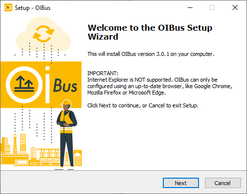
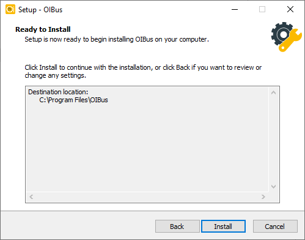
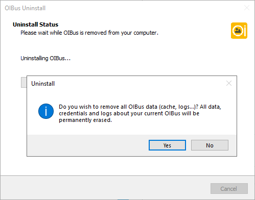

import DownloadButton from "../../../../../../src/components/DownloadButton";
import packageInfo from '../../../../../../package.json'


# Windows
## Download
<div style={{ display: "flex", justifyContent: "space-around" }}>
  <DownloadButton link={`https://github.com/OptimistikSAS/OIBus/releases/download/v${packageInfo.version}/oibus-setup-win_x64-v${packageInfo.version}.exe`}>
    <div>
      <div>{`OIBus v${packageInfo.version} (安装程序)`}</div>
      <div>Windows (x64)</div>
    </div>
  </DownloadButton>
  <DownloadButton link={`https://github.com/OptimistikSAS/OIBus/releases/download/v${packageInfo.version}/oibus-win_x64-v${packageInfo.version}.zip`}>
    <div>
      <div>{`OIBus v${packageInfo.version} (压缩包)`}</div>
      <div>Windows (x64)</div>
    </div>
  </DownloadButton>
</div>

## 安装
### 使用Windows安装程序
1. 运行Windows安装程序，您应该会看到以下欢迎屏幕：

<div style={{textAlign: 'center'}}>

  

</div>


2. 接受EU-PL许可证。

3. 选择您想要安装二进制文件的路径。

<div style={{textAlign: 'center'}}>

  

</div>

4. 选择您想存储缓存、日志和配置文件的目录

<div style={{textAlign: 'center'}}>

  

</div>

5. 确认设置并等待安装程序提取并复制文件到指定文件夹。

<div style={{textAlign: 'center'}}>

  

</div>

6. 最后一个屏幕将确认安装程序过程的完成。

:::caution
浏览器支持 请注意Internet Explorer不被支持。
:::

在[首次访问页面](./first-access.mdx)上熟悉OIBus界面。

### 使用安装批处理脚本
``` commandline title="Usage"
install.bat <data-path>
```

``` commandline title="Example with terminal outputs"
install.bat C:\OIBusData
> Administrator permissions required. Detecting permission...
> Stopping OIBus service...
> Installing OIBus as Windows service...
> The "OIBus" service has been successfully installed!
> Configuration of the "AppDirectory" parameter value for the "OIBus" service.
> nssm set OIBus AppNoConsole 1
> Starting OIBus service...
> OIBus: START: Operation successful.
> Creating go.bat
> echo Stopping OIBus service... You can restart it from the Windows Service Manager
> nssm.exe stop OIBus
> "C:\Users\Administrator\Downloads\oibus-win_x64\oibus.exe" --config "C:\OIBusData"
```

:::tip
如果您不提供数据路径参数，脚本将在执行过程中提示您输入。
:::

在[首次访问页面](./first-access.mdx)上熟悉OIBus界面。

## 卸载
### 使用Windows卸载程序
导航至二进制文件夹并以管理员权限执行`unin000.exe`文件。

<div style={{textAlign: 'center'}}>

  

</div>

<div style={{textAlign: 'center'}}>

  

</div>


### 使用卸载批处理脚本
```` title="Example with terminal outputs"
uninstall.bat
Administrator permissions required. Detecting permission...
Stopping OIBus service...
Removing OIBus service...
````

:::caution
数据文件夹需要手动删除。
:::

## 更新
### 使用Windows安装程序
如果您希望更新OIBus，您可以利用OIBus Windows安装程序并指明当前的可执行文件和配置 路径。您可以选择保留现有的配置文件或替换它。

在更新过程中，OIBus服务将会短暂中断。

在更新后首次启动时，配置数据库`oibus.db`将会自动升级到 最新版本

### 使用二进制文件(从zip文件)
从zip压缩文件解压文件后：

1. 打开Windows服务管理器。
2. 停止OIBus服务。
3. 将zip文件的内容复制并粘贴到OIBus可执行文件目录中，替换任何现有文件。
4. 重新启动OIBus服务。

在更新后首次启动时，配置数据库`oibus.db`将会自动升级到 最新版本。

