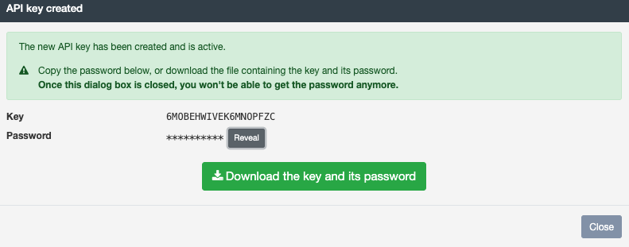

# OIAnalytics®

**OIAnalytics® 北向连接器**将文件和值发送到 **OIAnalytics® SaaS 应用程序**，同时支持 **JSON 有效负载**和**基于文件的
数据**。

OIAnalytics® 可以处理：

- **JSON 时间值有效负载**：来自南向协议（例如 OPC UA、MQTT）的格式化数据点。
- **文件**：原样传输（压缩或未压缩）。支持的格式包括 CSV、TXT 和 XLSX。

OIAnalytics® 内置**文件解析器**，无需预处理。解析直接在 SaaS 应用程序中配置。

**示例用例**：

- **实时分析**：发送 JSON 有效负载以进行即时处理。
- **历史数据存储**：传输文件用于归档和分析。
- **集成**：与 OIAnalytics® 的仪表盘、警报和分析工具结合使用。

## 特定设置 {#specific-settings}

| 设置                       | 描述                                                                     | 示例值   |
| -------------------------- | ---------------------------------------------------------------------------- | ---------- |
| **使用 OIAnalytics 注册**  | 使用[OIAnalytics 注册](../installation/oianalytics.mdx)中的连接设置。       | 启用/禁用 |
| **超时**                   | 报告连接失败之前的持续时间（秒）。                                           | `30`       |
| **压缩数据**                | 如果数据尚未压缩则进行压缩。为文件添加 `.gz` 扩展名并压缩 JSON 有效负载。   | 启用/禁用 |

### 手动配置（未使用注册时） {#manual-configuration-if-registration-is-not-used}

| 设置                       | 描述                                                     | 示例值                              |
| -------------------------- | ------------------------------------------------------------ | -------------------------------------- |
| **主机**                   | OIAnalytics® SaaS 应用程序的主机名。                        | `https://optimistik.oianalytics.com`  |
| **接受未授权证书**         | 如果 HTTP 查询通过会剥离证书的防火墙，请启用此选项。         | 启用/禁用                             |

#### 身份验证 {#authentication}

| 设置             | 描述                                                                     | 示例值                                                                                                       |
| ---------------- | ---------------------------------------------------------------------------- | ------------------------------------------------------------------------------------------------------------- |
| **身份验证**     | 身份验证方法。                                                               | `Access key/Secret`、`Azure Active Directory with client secret`、`Azure Active Directory with certificate`  |
| **访问密钥**     | 访问密钥。Access key/Secret 方式必填。                                       | `my-access-key`                                                                                               |
| **密钥**         | 秘密密钥。Access key/Secret 方式必填。                                       | `••••••••`                                                                                                    |
| **租户 ID**      | Azure AD 租户 ID。AAD 方式必填。                                             | `xxxxxxxx-xxxx-xxxx-xxxx-xxxxxxxxxxxx`                                                                        |
| **客户端 ID**    | 应用程序（客户端）ID。AAD 方式必填。                                         | `xxxxxxxx-xxxx-xxxx-xxxx-xxxxxxxxxxxx`                                                                        |
| **客户端密钥**   | 应用程序客户端密钥。Azure Active Directory with client secret 方式必填。     | `••••••••`                                                                                                    |
| **证书**         | 应用程序证书。Azure Active Directory with certificate 方式必填。             | （从列表中选择）                                                                                              |
| **范围**         | OAuth2 范围。Azure Active Directory with certificate 方式必填。             | `https://example.com/.default`                                                                                |

#### 代理配置 {#proxy-configuration}

如果您的网络基础设施要求请求通过代理服务器才能到达 OIAnalytics®，请启用**使用代理**并在下方配置代理详细信息。

| 设置           | 描述                             | 示例值                             |
| -------------- | -------------------------------- | ----------------------------------- |
| **使用代理**   | 通过代理服务器路由请求。         | 启用/禁用                           |
| **代理 URL**   | 代理服务器的 URL。               | `http://proxy.example.com:8080`     |
| **代理用户名** | 用于代理身份验证的用户名（如需要）。 | `proxy_user`                      |
| **代理密码**   | 用于代理身份验证的密码（如需要）。 | `••••••••`                        |

## 将 OIBus 连接到 OIAnalytics® {#connecting-oibus-to-oianalytics}

### 推荐方法：OIAnalytics 注册 {#recommended-approach-oianalytics-registration}

1. 在 OIAnalytics® 上**注册 OIBus**，以实现无缝集成和安全通信。
2. 在北向连接器设置中启用**使用 OIAnalytics 注册**。
   - 这消除了手动传输 API 密钥的需要，提升了安全性。

:::tip OIBus 在 OIAnalytics® 中的注册
有关完整的注册流程，请参阅 [OIAnalytics 注册指南](../installation/oianalytics.mdx)。
:::

### 备选方法：API 密钥身份验证 {#alternative-approach-api-key-authentication}

如果您选择不在 OIAnalytics® 上注册 OIBus，则需要获取一个 API 密钥：

1. 在 OIAnalytics® 中，导航到**配置 → 用户**。
2. 选择用户并点击**密钥图标**以生成 API 密钥。
3. 复制并安全保存 **API 密钥**及其关联的密码。
4. 在 OIBus 中输入该 API 密钥和秘密密钥。

:::danger 密码找回
该密码在生成 API 密钥期间**仅显示一次**。如果遗失，您必须生成新的 API 密钥。
:::

:::tip API 用户管理

- 在 OIAnalytics® 中创建一个具有独占 API 访问权限的**专用 API 用户**。
- 为每个 OIBus 实例分配一个**唯一的 API 密钥**，以便于管理和保障安全。

:::

## 数据格式 {#data-format}

- OIBus **时间值**以 **JSON 有效负载**的形式发送到 OIAnalytics®。
- OIAnalytics® 直接在时间值的 `pointId` 字段中引用外部数据（无需文件解析器）。
